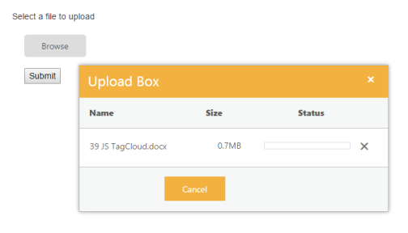

# Synchronous Upload 

This features allow you to upload and remove the files synchronously.When multiple files are chosen in Synchronous upload,all files will be uploaded only on form submission.Multitasking is not possible here.To achieve this, set the AsyncUpload property to ‘false’. The data type is Boolean.

N> By default, UploadBox widget works with asynchronous upload option only.

The following steps guide you in uploading the file synchronously.

1. In the VIEW page, create a form with action and post method and then add the script into the form to configure the UploadBox element.



// In the CSHTML page, create a form with action and post method and then add the UploadBox element.

@using (Html.BeginForm("Index","Home",FormMethod.Post))

{    

    @Html.EJ().Uploadbox("uploadbox").AsyncUpload(false)

    <input type="submit" value="Submit" />

}



Once the form is submitted by using Submit button, it triggers the post method and the files can be saved by using the below code.



     public ActionResult Index()
        {
            if (string.IsNullOrEmpty((string)TempData["status"]))
                ViewBag.status = string.Empty;
            else
                ViewBag.status = (string)TempData["status"];
            return View();
        }
        [HttpPost]
        public ActionResult Index(IEnumerable<HttpPostedFileBase> uploadbox)
        {
            if (uploadbox != null)
            {
                if (uploadbox != null)
                {
                    foreach (var file in uploadbox)
                    {
                        var fileName = Path.GetFileName(file.FileName);
                        var destinationPath = Path.Combine(Server.MapPath("~/App_Data"), fileName);
                        file.SaveAs(destinationPath);
                    }
                    TempData["status"] = "Successfully Uploaded";
                    return RedirectToAction("FileUploadFeatures");
                }
                else
                {
                    TempData["status"] = "Select a file to upload";
                    return RedirectToAction("FileUploadFeatures");
                }

            }
            return View();
        }



Refer [here](https://mvc.syncfusion.com/demos/web/upload/synchronousupload) for online demo

The following screenshot displays the output.

