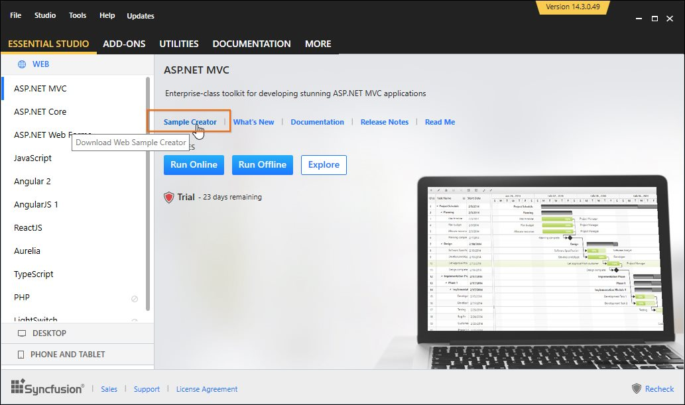

# Utilities

The Syncfusion MVC Extension provides you with quick access so that you can create or configure the Syncfusion MVC projects. The Syncfusion ASP.NET MVC Extensions has following features.

* Syncfusion Sample Creator for ASP.NET MVC
* Syncfusion Project Conversion for ASP.NET MVC
* Syncfusion Project Migration for ASP.NET MVC

## Project Conversion

Project Conversion is a Visual Studio add-in that converts an existing ASP.NET MVC Project into a Syncfusion ASP.NET MVC Project by adding the required assemblies and resource files.

For more details - [View](https://help.syncfusion.com/extension/aspnet-mvc-extension/project-conversion)

## Project Migration

Project Migration is a Visual Studio add-in that helps migrate the existing Syncfusion ASP.NET MVC (Web) project from one Syncfusion version to another Syncfusion version.

For more details - [View](https://help.syncfusion.com/extension/aspnet-mvc-extension/project-migration)

## Sample Creator

Sample Creator is the utility that allows you to create Syncfusion ASP.NET MVC Projects along with the samples based on Controls and Features selection.

Sample Creator can be download from the Syncfusion Dashboard. After installing the complete Essential Studio suite or ASP.NET MVC setup, follow the given steps:

1. Launch the Syncfusion Dashboard
2. Navigate to the “ASP.NET MVC” tab available on the left side.
3. Click the “SAMPLE CREATOR” button. It downloads the corresponding version of Syncfusion Web Sample Creator setup. When you have already installed the Syncfusion Web Sample Creator setup then it will launch the “Sample Creator” utility instead of downloading.

For more details - [View](https://help.syncfusion.com/extension/aspnet-mvc-extension/sample-creator)