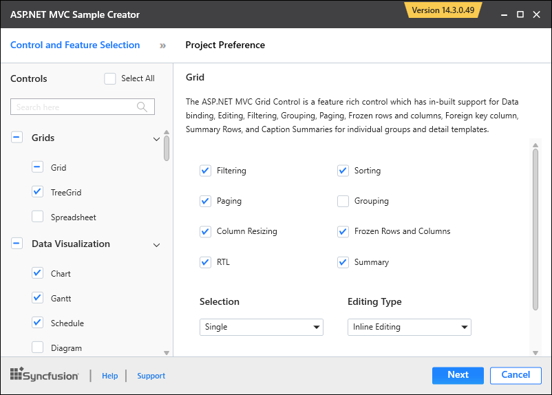
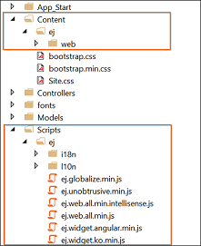

# Utilities

The Syncfusion MVC Extension provides you with quick access so that you can create or configure the Syncfusion MVC projects. The Syncfusion ASP.NET MVC Extensions has following features.

* Syncfusion Sample Creator for ASP.NET MVC
* Syncfusion Project Conversion for ASP.NET MVC
* Syncfusion Project Migration for ASP.NET MVC

## Project Conversion

Project Conversion is a Visual Studio add-in that converts an existing ASP.NET MVC Project into a Syncfusion ASP.NET MVC Project by adding the required assemblies and resource files.

For more details - [View](https://help.syncfusion.com/extension/aspnet-mvc-extension/project-conversion)

## Project Migration

Project Migration is a Visual Studio add-in that helps migrate the existing Syncfusion ASP.NET MVC (Web) project from one Syncfusion version to another Syncfusion version.

For more details - [View](https://help.syncfusion.com/extension/aspnet-mvc-extension/project-migration)

## Sample Creator

Sample Creator is the utility that allows you to create Syncfusion ASP.NET MVC Projects along with the samples based on Controls and Features selection.

### Create Syncfusion MVC Project from Sample Creator

Sample Creator can be download from the Syncfusion Dashboard. After installing the complete Essential Studio suite or ASP.NET MVC setup, follow the given steps:

1. Launch the Syncfusion Essential Studio Dashboard and select the ASP.NET MVC platform. Select the **Sample Creator** button to launch the Sample Creator Wizard. Refer the following screenshot for more information. 

   

2. Syncfusion Sample Creator Wizard displaying the **Controls and its Feature Selection** section. 

   

#### Controls Selection

 Listed here are the Syncfusion ASP.NET MVC controls so you can choose the required controls. And the controls are grouped product wise.

 

#### Feature Selection

Based on the controls, the Feature is enabled to choose the features of the corresponding controls.

#### Project Configuration

You can configure the following project details in the Sample Creator.

* MVC Version – Choose the required MVC Version. 
* Language – Select the language, either C# or VB.
* VS Version – Choose the Project version
* .NET Framework – Choose the .NET Framework version.
* View Engine – Select either Razor or ASPX. By default, Syncfusion supports only Razor view engine for ASP.NET MVC projects.
* Compress Style Sheets – Option to compress style sheets.
* Compress Scripts – Option to compress the scripts.
* Name – Name your Syncfusion MVC Application.
* Location – Choose the target location of your project.
* Theme Selection – Choose the required theme. The Theme Preview section shows the controls preview before create the Syncfusion project.

When you click the Create button, the new Syncfusion ASP.NET MVC project is created. The following is added in the project:

* Added the required Controller and View files in the project.
  
  

* Included the required Syncfusion ASP.NET MVC scripts and themes files.
  
  

* The required Syncfusion assemblies are added for selected controls under Project Reference.
 
  

* Configure the Web.Config file by adding the Syncfusion reference assemblies.

  

* Once the project is created you can open the project by clicking the Yes button. Refer the following screenshot for more information.

  