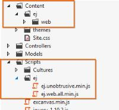
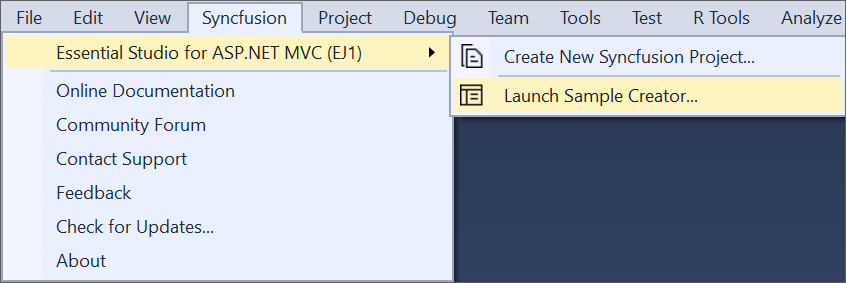
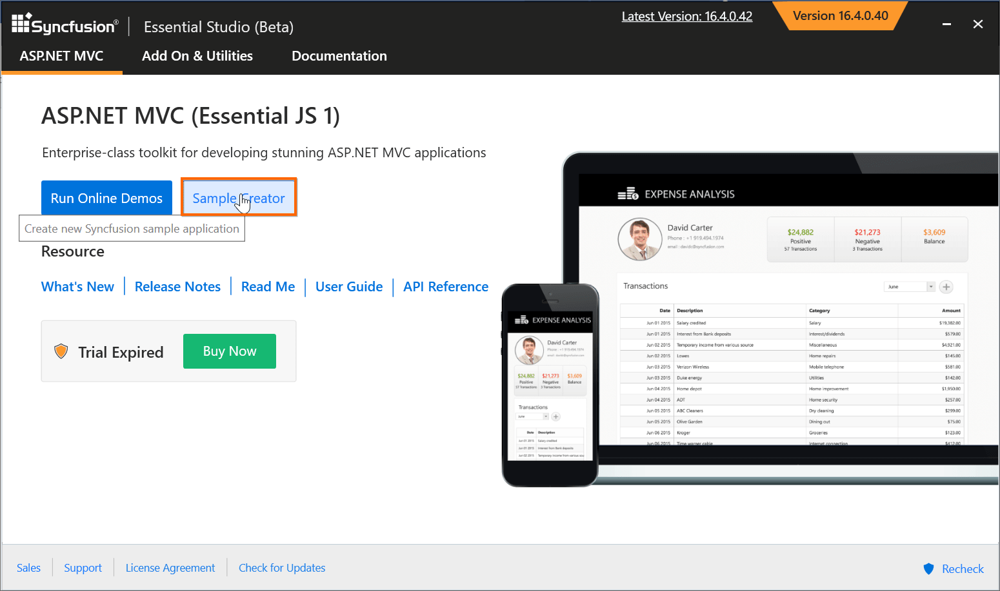
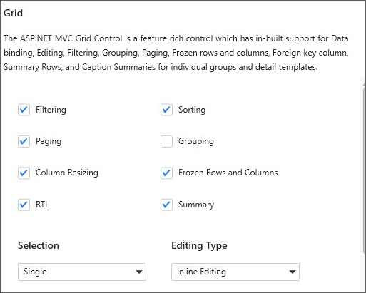

# Utilities

The Syncfusion MVC Extension provides you quick access, so that you can create or configure the Syncfusion MVC projects. The Syncfusion ASP.NET MVC Extensions has the following features.

* Syncfusion Sample Creator for ASP.NET MVC
* Syncfusion Project Conversion for ASP.NET MVC
* Syncfusion Project Migration for ASP.NET MVC

## Project Conversion

The Project Conversion is a Visual Studio add-in that converts an existing ASP.NET MVC Project into a Syncfusion ASP.NET MVC Project by adding the required assemblies and resource files.

### Convert into Syncfusion ASP.NET MVC (Web) project

The following steps help you to use the Syncfusion Project Conversion in the existing ASP.NET MVC (Web) Project.

1. Open an existing Microsoft MVC Project or create a new Microsoft MVC Project.
2. To open Project Conversion Wizard, follow either one of the options below: 

   **Option 1:**  
   Click **Syncfusion Menu** and choose **Essential Studio for ASP.NET MVC (EJ1) > Convert to Syncfusion ASP.NET MVC Application…** in **Visual Studio**.

   

   N> In Visual Studio 2019, Syncfusion menu available under Extension in Visual Studio menu.

   **Option 2:**  
   Right-click the Project from Solution Explorer, select **Syncfusion Essential JS 1**, and choose **Convert to Syncfusion MVC (Essential JS 1) Application...** Refer to the following screenshot for more information.

   

3. Project Conversion Wizard opens so that you can configure the project.

   

   The following configurations are used in the Project Conversion Wizard.
   
   **Assemblies From:**

   Choose the assembly location:

	1. Added From GAC: Refer to the assemblies from the Global Assembly Cache.
	2. Added from Installed Location: Refer to the assemblies from the Syncfusion Installed locations.
    3. Add Referenced Assemblies to Solution: Copy and refer to the assemblies from project's solution file lib directory.

   
    
   **Choose the Theme:**
   
   The master page of project will be updated based on the selected theme. The Theme Preview section shows the controls preview before converting to a Syncfusion project.
   
   
   
   **Choose CDN Support:**

   The master page of the project will be updated based on the required Syncfusion CDN links.
   
   
   
   **Choose Copy Global Resources:**
    
   The localization culture files will be shipped into Scripts\ej\i18n directory of the project.
   
   

4. Choose the required controls from Components section and Click the **Convert** button to convert it into a Syncfusion Project.

   
   
5. The **Project Backup** dialog will be opened. Click yes, to backup the current project before converting it to Syncfusion project. Click No to convert the project to Syncfusion project without backup.
   
   

6. The required Syncfusion Reference Assemblies, Scripts and CSS are included in the MVC Project. For more information, refer to the following screenshots.

   

   

   

### Rendering Control after Syncfusion ASP.NET MVC (Web) Conversion:

Once you convert your ASP.NET MVC project to Syncfusion ASP.NET MVC Project, perform the following steps to render the Syncfusion Controls to your project.
1. The CSS, Scripts, Syncfusion References, and required Web.config file entries are added to your project by Syncfusion ASP.NET MVC Conversion.

2. Add the required Script and CSS files references in the master page (_Layout.cshtml/Layout.vbhtml file). For more information, please refer to the following screenshot.

   

3. Now, include the Syncfusion controls to your project. For more information, refer to the following screenshot.

   

4. Run the project and the following output will be displayed.

   

## Project Migration

The Project Migration is a Visual Studio add-in that helps to migrate the existing Syncfusion ASP.NET MVC (Web) project from one Syncfusion version to another Syncfusion version.

The following steps help you to migrate from one version to another version of your existing Syncfusion ASP.NET MVC(web) application.

1.To open Migration Wizard, follow either one of the options below: 

   **Option 1:**  
   Click **Syncfusion Menu** and choose **Essential Studio for ASP.NET MVC (EJ1) > Migrate Project…** in **Visual Studio**.

   

   N> In Visual Studio 2019, Syncfusion menu available under Extension in Visual Studio menu.

   **Option 2:**  
   Right-click the **Syncfusion ASP.NET MVC Application** from Solution Explorer and select **Syncfusion Essential JS 1**. Choose **Migrate the Essential JS 1 Project to Another Version...**

   

2. The Project Migration window appears. You can choose the required Syncfusion version that is installed in the machine, that can be either Syncfusion ASP.NET MVC.

   

3. The Project Migration window allows you to configure the following options:

   * Essential Studio Version: Select any version from the list of Installed Versions.
	  
   * Assemblies From: Add the assembly to project from the following locations.
	  
	    1. Added From GAC: Refer the assemblies from the Global Assembly Cache.
		  2. Added from Installed Location: Refer to the assemblies from the Syncfusion Installed locations.
      3. Add Referenced Assemblies to Solution: Copy and refer to the assemblies from project's solution file lib directory.

4. Click the Migrate Button and the **Project Backup** dialog will be opened. Click Yes to backup the current project before migrating the Syncfusion project. Click No to migrate the project to required Syncfusion version without backup.

     
      
5. The Syncfusion Reference Assemblies, Scripts and CSS are updated to the corresponding version in the project.

## Sample Creator

Sample Creator is the utility that allows you to create Syncfusion ASP.NET MVC Projects along with the samples based on Controls and Features selection.

### Create Syncfusion MVC Project from Sample Creator

Sample Creator can be download from the Syncfusion Dashboard. After installing the complete Essential Studio suite or ASP.NET MVC setup, follow the given steps:

1. To launch ASP.NET MVC (Essential JS 1) Sample Creator application, follow either one of the options below: 

   **Option 1:**  
   Click **Syncfusion Menu** and choose **Essential Studio for ASP.NET MVC (EJ1) > Launch Sample Creator…** in **Visual Studio**.

   

   N> In Visual Studio 2019, Syncfusion menu available under Extension in Visual Studio menu.

   **Option 2:**  
   Launch the Syncfusion Essential Studio Dashboard and select the ASP.NET MVC (Essential JS 1)/ASP.NET MVC (Classic) platform. Select the Sample Creator button to launch the ASP.NET MVC (Essential JS 1) Sample Creator application. Refer to the following screenshot for more information.
 
   

2. Syncfusion Sample Creator Wizard displays the **Controls and its Feature Selection** section.

   

#### Controls Selection

 The Syncfusion ASP.NET MVC controls are listed here and you can choose the required controls. The controls are grouped product wise.

 

#### Feature Selection

Based on the controls, the Feature is enabled to choose the features of the corresponding controls.

#### Project Configuration

You can configure the following project details in the Sample Creator.

* MVC Version: Choose the required MVC Version.
* Language: Select the language, either C# or VB.
* VS Version: Choose the Project version.
* .NET Framework: Choose the .NET Framework version.
* View Engine: Select either Razor or ASPX. By default, Syncfusion supports only Razor view engine for ASP.NET MVC projects.
* Compress Style Sheets: Option to compress style sheets.
* Compress Scripts: Option to compress the scripts.
* Name: Name your Syncfusion MVC Application.
* Location: Choose the target location of your project.
* Theme Selection: Choose the required theme. The Theme Preview section shows the controls preview before creating the Syncfusion project.

When you click the Create button, the new Syncfusion ASP.NET MVC project is created. The following is added in the project:

* Added the required Controller and View files in the project.
  
  

* Included the required Syncfusion ASP.NET MVC scripts and themes files.
  
  

* The required Syncfusion assemblies are added for selected controls under Project Reference.
 
  

* Configure the Web.Config file by adding the Syncfusion reference assemblies.

  

* Once the project is created you can open the project by clicking the Yes button. Refer to the following screenshot for more information.

  