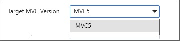

# Create Project

Syncfusion provides the **Visual Studio Project Templates** for the Syncfusion ASP.NET MVC platform to create the Syncfusion ASP.NET MVC Web Application with the Essential JS 1 components.

Use the following steps to create the **Syncfusion ASP.NET MVC (Essential JS 1) Web Application** through the Visual Studio Project Template:

1. To create the Syncfusion ASP.NET MVC (Essential JS 1) project, follow either one of the options below:

   **Option 1:**  
    Click **Syncfusion Menu** and choose **Essential Studio for ASP.NET MVC (EJ1) > Create New Syncfusion Project…** in **Visual Studio**.

    

    N> In Visual Studio 2019, Syncfusion menu is available under Extensions in Visual Studio menu.

   **Option 2:**  
   Choose **File > New > Project** and navigate to **Syncfusion > Web > Syncfusion ASP.NET MVC (Essential JS 1) Application** in **Visual Studio**.
   
   

2. Name the **Project**, choose the destination location, and set the .NET Framework of the project, and then click **OK**. The Project Configuration Wizard appears.  

3. Choose the options to configure the Syncfusion ASP.NET MVC (Essential JS 1) application by using the following Project Configuration dialog.

   

   **Project Configurations**

   **Target MVC Version:** Choose the required MVC Version.

   

   **View Engine:** Choose the View Engine of the Sample.

   

   **Theme:** Choose the required theme.

   

   **Language:** Select the language, either C# or VB.

   

   **Assemblies From:** Choose the assembly location, from where the assembly is added to the project.

   

   **Use CDN Support:** The master page of the project will be updated based on required Syncfusion CDN links.

   

   **Copy Global Resources:** If choose Copy Global Resources option, the Syncfusion localization culture files will be shipped to project from Installed Location.

   

   N> Copy Global Resources option will disable when choose CDN option.

4. When you do not choose the **Add Samples** option, then the Syncfusion ASP.NET MVC project is created with required assemblies, CSS, and Script files only.

   

   By choosing the **Add Samples** option, you can add the code for the selected controls features.

   

5. Click Create, the Syncfusion ASP.NET MVC (Essential JS 1) Application will be created.

6. Controller and View files have been added to the project based on the control selected.

   

7. The required Syncfusion Assembly references, Scripts, CSS, and required Web.config entries have been added to the project

   

   

   

8. Then, Syncfusion licensing registration required message box will be shown, if you installed the trial setup or NuGet packages since Syncfusion introduced the licensing system from 2018 Volume 2 (v16.2.0.41) Essential Studio release. Navigate to the  [help topic](https://help.syncfusion.com/common/essential-studio/licensing/license-key#how-to-generate-syncfusion-license-key), which is shown in the licensing message box to generate and register the Syncfusion license key to your project. Refer to this [blog](https://blog.syncfusion.com/post/Whats-New-in-2018-Volume-2-Licensing-Changes-in-the-1620x-Version-of-Essential-Studio.aspx) post for understanding the licensing changes introduced in Essential Studio.

   

