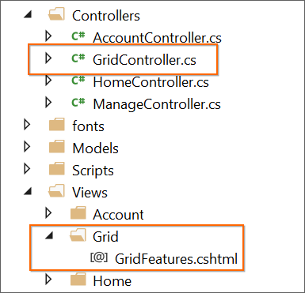

# Create Samples

The Syncfusion Sample Creator is a utility that allows you to create the Syncfusion ASP.NET MVC (Essential JS 1) Projects with sample code of required Syncfusion component features and configuration of Syncfusion controls.

Use the following steps to create the Syncfusion ASP.NET MVC (Essential JS 1) Application through the Sample Creator utility:

1. To launch ASP.NET MVC (Essential JS 1) Sample Creator application, follow either one of the options below: 

   **Option 1**  
   Click **Syncfusion Menu** and choose **Essential Studio for ASP.NET MVC (EJ1) > Launch Sample Creator…** in **Visual Studio**.

   

   N> In Visual Studio 2019, Syncfusion menu is available under Extensions in Visual Studio menu.

   **Option 2**  
   Launch the Syncfusion ASP.NET MVC (Essential JS 1) Control Panel. Select the Sample Creator button to launch the ASP.NET MVC (Essential JS 1) Sample Creator application. Refer to the following screenshot for more information.
 
   

2. ASP.NET MVC (Essential JS 1) Sample Creator lists the Syncfusion controls and its features. 

   

   **Controls Selection:** Choose the required controls. The controls are grouped with Syncfusion products, and the controls are grouped product wise.

   

   **Feature Selection:** Based on the controls, the feature is enabled to choose the features of the corresponding controls.

   

   **Project Configuration**

   1. You can configure the following project details in the Sample Creator.

      * **MVC Version:** Choose the required MVC Version. 
      * **Language:** Select the language, either C# or VB.
      * **VS Version:** Choose the Visual Studio version and Framework.
      * **View Engine:** By default, Syncfusion supports only Razor view engine for ASP.NET MVC projects.
      * **Name:** Name your Syncfusion ASP.NET MVC (Essential JS 1) Application.
      * **Location:** Choose the target location of your project.
      * **Theme Selection:** Choose the required theme. This section shows the controls preview before creating the Syncfusion project.

      

   2. Click **Create** button. After creating the project, open the project by clicking **Yes**. If you click **No**, the corresponding location of the project will be opened. Refer to the following screenshot for more information.

      

   3. The new Syncfusion ASP.NET MVC (Essential JS 1) project is created with the resources.

      * Added the required Controller and View files in the project.

        

      * Included the required Syncfusion ASP.NET MVC (Essential JS 1) scripts and theme files.

        

      * The required Syncfusion assemblies are added for selected controls under Project Reference.

        

      * Configure the Web.Config file by adding the Syncfusion reference assemblies.

        
