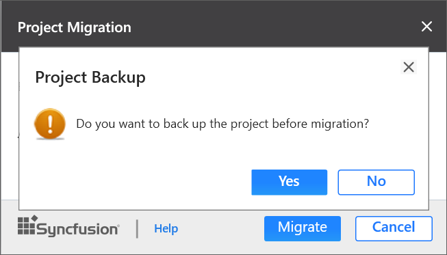

# Upgrade Project

Syncfusion Project Migration is a Visual Studio add-in that allows you to migrate the existing Syncfusion ASP.NET MVC Web Application from one Essential Studio version to another version.

Use the following steps to migrate your existing Syncfusion ASP.NET MVC Web Application:

1. To open Migration Wizard, follow either one of the options below: 

   **Option 1**  
   Click **Syncfusion Menu** and choose **Essential Studio for ASP.NET MVC (EJ1) > Migrate Project…** in **Visual Studio**.

   

   N> In Visual Studio 2019, Syncfusion menu is available under Extensions in Visual Studio menu.

   **Option 2**  
   Right-click the **Syncfusion ASP.NET MVC Application** from Solution Explorer and select **Syncfusion Essential JS 1**. Choose **Migrate the Essential JS 1 Project to Another Version...**

   

2. The **Project Migration** window appears. You can choose the required Essential Studio version that is installed in the machine.

   

3. The Project Migration window allows you to configure the following options.

   **i. Essential Studio Version:** Select a version from the list of installed Syncfusion versions.
	  
   **ii. Assemblies From:** Choose the assembly location, from where the assembly is added to the project.
	  
    

4. Click the **Migrate** Button. The **Project Backup** dialog appears. In the dialog, if click **Yes**, it will backup the current project before migrating the Syncfusion project. If click **No**, it will migrate the project to required Syncfusion version without backup. 

     
      
5. The Syncfusion reference assemblies, Scripts, CSS, and Web.Config entries are updated to the corresponding version in the project.
