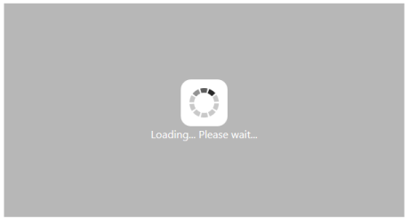
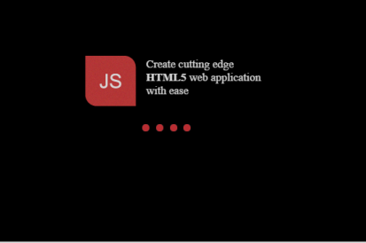
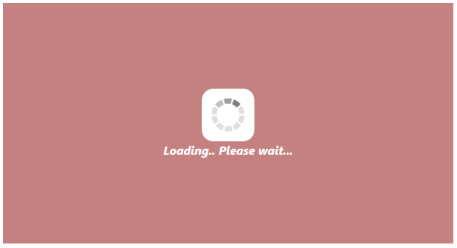

## Appearance and Styling 

Custom Text

WaitingPopup control provides support for Custom Text to mention any message inside the pop-up panel.  You can specify a custom text through the option Text that displays when the Waiting Popup is loading.

The following steps explains you the configuration of the custom text for WaitingPopup control.

1. In the VIEW page, add a helper element to render WaitingPopup widget.

[CSHTML]

&lt;div id="target"&gt;

        @Html.EJ().WaitingPopup("target").ShowOnInit(true).Text("Loading... Please wait...")

&lt;/div&gt;

2. Add the following styles to render WaitingPopup widget.

[css]

&lt;style type="text/css" class="cssStyles"&gt;

    #control {

        height: 320px;

        width: 600px;

    }

&lt;/style&gt;

Execute the above code to render the following output.

{  | markdownify }
{:.image }

_Figure 9: Custom Text in WaitingPopup_

Template

WaitingPopup widget provides support for Template to customize the appearance of it by including HTML content instead of the default image.

The following steps explains you on how to define template to display a text and image for WaitingPopup control.

1. In the VIEW page, add a helper element to configure WaitingPopup widget.

[CSHTML]

&lt;div id="target"&gt;

    @Html.EJ().WaitingPopup("target").ShowOnInit(true).Template("#content")

    &lt;div id="content"&gt;

        &lt;div class="block"&gt;

            &lt;div class="logo"&gt;&lt;/div&gt;

            &lt;div class="txt"&gt;

                
Create cutting edge &lt;/p&gt;

                &lt;p&gt;<b>HTML5</b> web application &lt;/p&gt;

                
with ease &lt;/p&gt;

            &lt;/div&gt;

        &lt;/div&gt;

        &lt;div class="loader"&gt;&lt;/div&gt;

    &lt;/div&gt;

&lt;/div&gt;

2. In CSS, you can configure the custom styles for WaitingPopup.

{  | markdownify }
{:.image }
_Note: Images for this sample are available ‘installed location /Content/images’ and we need to define images in mentioned CSS. Henceforth the images will display._

[Stylesheet]

&lt;style type="text/css" class="cssStyles"&gt;

    #waitingPopUp {

        height: 320px;

        width: 600px;

        margin: 0 auto;

    }

        .block {

        height: 76px;

    }

    .logo {

        background-image: url("../Image/js_logo.png");

        float: left;

        height: 100%;

        width: 77px;

        margin-right: 15px;

    }

    .txt {

        float: left;

        font-size: 17px;

        height: 100%;

        text-align: left;

    }

    .txt p {

        margin: 0;

    }

    .loader {

        background: url("../Image/load dark.gif") no-repeat scroll -5px 18px transparent;

        height: 40px;

        width: 100%;

    }

    #content {

        cursor: default;

        height: 112px;

        width: 275px;

    }

&lt;/style&gt;

Execute the above code to render the following output.

{  | markdownify }
{:.image }

_Figure 10: WaitingPopup with Custom Template_

CSS Class

You can use the CSS class to customize the WaitingPopup control appearance. Define a CSS class as per requirement and assign the class name to CssClass property.

The following steps allows you to configure CSS class for an auto-complete textbox.

1. In the VIEW page, add a helper element to configure WaitingPopup widget.

[CSHTML]

&lt;div id="target"&gt;

 @Html.EJ().WaitingPopup("target").ShowOnInit(true).CssClass("custom").Text("Loading... Please wait...")&lt;/div&gt;

2. Define CSS class for customizing the WaitingPopup widget.

[CSS]

&lt;style type="text/css" class="cssStyles"&gt;

    /*Customize the panel property*/

    #waitingPopUp {

        height: 320px;

        width: 600px;

        margin: 0 auto;

    }

    /* Customize the WaitingPopup */

    .customStyle{

        background-color:darkred;

        font-style:italic;

        font-weight:bolder;

        opacity:0.5;

    }

&lt;/style&gt;

The following screenshot displays the output for the above code.

{  | markdownify }
{:.image }

_Figure 11: WaitingPopup with customized CSS_

