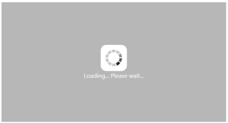
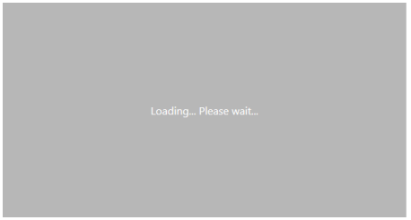

## Behavior and Settings

Automatic Initializing WaitingPopup widget

WaitingPopup widget contains ShowOnInit property that allows the popup to display over a target on page load automatically. By default, ShowOnInit property is set as false.

The following steps explains you on how to display the WaitingPopup on page load.

1. In an VIEW page, add a helper element to render WaitingPopup widget.

[CSHTML]

    @Html.EJ().WaitingPopup("target").ShowOnInit(true)

2. Add the following styles to render WaitingPopup widget.

[css]

The following screenshot illustrates the WaitingPopup when ShowOnInit is set to “true”.

{{ '' | markdownify }}
{:.image }

_Figure 5: WaitingPopup with enabled showOnInit property_

Enable / Disable Popup Indicator

You can show or hide the popup indicator of WaitingPopup widget using ShowImage property. By default, ShowImage property is set as true.

The following steps explains you to enable / disable popup indicator in WaitingPopup widget.

1. In the VIEW page, add a helper element to render WaitingPopup widget.

[CSHTML]

Enable popup indicator:

    @Html.EJ().WaitingPopup("target").ShowOnInit(true).ShowImage(true).Text("Loading... Please wait...")

Disable popup indicator:

   @Html.EJ().WaitingPopup("target").ShowOnInit(true).ShowImage(false).Text("Loading... Please wait...")

2. Add the following styles to render WaitingPopup widget.

[css]

Execute the above code to render the following output.

{{ '' | markdownify }}
{:.image }

_Figure 6: Enabled popup indicator WaitingPopup widget_

{{ '' | markdownify }}
{:.image }

_Figure 7: Disabled popup indicator WaitingPopup widget_

Show / Hide WaitingPopup

Using Show() and Hide() methods, you can display or hide the WaitingPopup widget over the target area.

The following steps explains you to show / hide the WaitingPopup widget.

1. In the VIEW page, add a helper element to render WaitingPopup widget.

<table>
<tr>
<td>
[CSHTML]
    @Html.EJ().WaitingPopup("target").ShowOnInit(true)
</td></tr>
<tr>
<td>
[JavaScript]Show WaitingPopup:Hide WaitingPopup:</td></tr>
</table>

2. Add the following styles to render WaitingPopup widget.

[css]

The following screenshot illustrates a WaitingPopup when Show() method is invoked.

{{ '' | markdownify }}
{:.image }

_Figure 8: WaitingPopup with Show() method_

