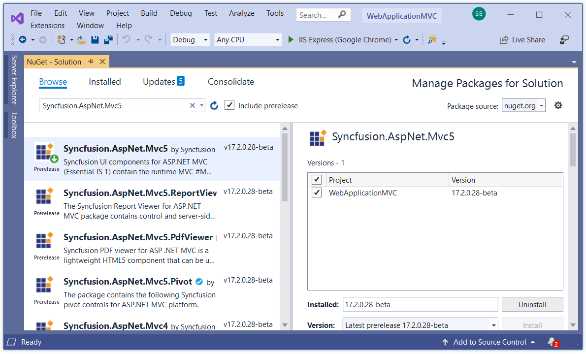

# Getting Started

> Starting with v16.2.0.x, if you reference Syncfusion assemblies from trial setup or from the NuGet feed, you also have to include a license key in your projects. Please refer to this [link](https://help.syncfusion.com/common/essential-studio/licensing/license-key) to know about registering Syncfusion license key in your ASP.NET MVC application to use our components.

## Configuring EJ MVC in Visual Studio 2019

This section describes how to configure the Syncfusion ASP.NET MVC components into the ASP.NET MVC applications using Visual Studio 2019.

To add our Syncfusion MVC controls into the new ASP.NET MVC5 application by making use of the **Syncfusion** **Nuget** **Packages**, refer to the following steps.

* Open Visual Studio 2019 and Create a new ASP.NET Web Application project and click on the **Next** button.

* Name your project and configure its settings and after click on the **Create** button.

* Select **MVC** project template, then click on **Create** button.

* A new project MVC application has been created successfully using Visual Studio 2019 (IDE).

*  After project creation, install the Syncfusion Packages in your application.

* Select the **Tools->Nuget Package Manager->Package Manager settings** the dialog window will open.

* Navigate to the **Nuget Package Manager->Package Sources** from the options dialog.

* Click the Add button to create the new package sources.

* Select the newly created Package Source and rename the source name using the Name input box.

  **Name**: Name of the package that listed in Available package sources 

  **Source**: Syncfusion ASP.NET Core NuGet Package feed URL

    * The Syncfusion ASP.NET Core NuGet Package can be installed from [https://www.nuget.org/packages/Syncfusion.EJ.AspNet.Core](https://www.nuget.org/packages/Syncfusion.EJ.AspNet.Core)

* Select the Update and then click the OK button. The package’s source get added to the list of available package sources.
    
* Right click your project references and then select “**Manage NuGet Package**” option. In this window choose the “**Syncfusion Packages registered name**” from the package source dropdown. And check the “**include prerelease**” option.

* Now, our Syncfusion Packages will list in this window. Select and install the “**Syncfusion.EJ.AspNet.Core**” package from this list.

* Then the packages will get installed and it will be automatically referred to your application.

*  While initial creation, by default, the **Unobtrusive** setting is enabled in your applications **web.config** file. Change its value to **false** in your application as shown in the following:

   ~~~ cshtml

	<appSettings>
		<add key="ClientValidationEnabled" value="true" />
		<add key="UnobtrusiveJavaScriptEnabled" value="false" />
	</appSettings>

   ~~~

* Add the script manager code in the **_Layout.cshtml** file present within the **~/Views/Shared** folder of your application. Add it before the closing body tag in the _Layout.cshtml file.

   ~~~ cshtml
	<body>
        @RenderSection("scripts", required: false)
        @Html.EJ().ScriptManager()
    </body>

   ~~~	

> If **unobtrusive** is set to true in the application, the script manager can be excluded, as the control is initialized using HTML5 attributes. Also for control rendering, you need to include **ej.unobtrusive.min.js** file along with ej.web.all.min.js in **_Layout.cshtml** page. Refer to the [unobtrusive section](https://help.syncfusion.com/aspnetmvc/unobtrusive).

* Syncfusion specific stylesheets are loaded into the **Content** folder of your application, include the below specified theme reference **(default-theme/ej.web.all.min.css)** file in the **~/Views/Shared/_Layout.cshtml** file, within the head section as this file contains the default theme styles applied for all the Syncfusion MVC controls.

   ~~~ cshtml
   
	<head>
	    <title>@ViewBag.Title</title>
	    @Styles.Render("~/Content/ej/web/default-theme/ej.web.all.min.css")
	</head>

   ~~~

* It is mandatory to include the reference to the required JavaScript files in your **_Layout.cshtml**, so as to render the Syncfusion MVC controls properly. 	 
   
   ~~~ cshtml
   
	<head>
		<meta charset="utf-8" />
		<title>@ViewBag.Title - My ASP.NET MVC Application</title>
		@Styles.Render("~/Content/ej/web/bootstrap-theme/ej.web.all.min.css")
	</head>

	<body>
		@Scripts.Render("~/bundles/jquery")
		@Scripts.Render("~/bundles/bootstrap")  
		@Scripts.Render("~/Scripts/jsrender.min.js")
		@Scripts.Render("~/Scripts/ej/web/ej.web.all.min.js")  
		@RenderSection("scripts", required: false)
		@Html.EJ().ScriptManager();
	</body>

   ~~~	
   
	The order of reference for the script files made in the above section should be maintained. Any change in order reference may cause rendering issues in EJ Controls. 
   
	If your application contains duplicate/multiple references to the jQuery files, remove it as the explicit reference to the **jquery-{version}.js** script file that is added to the application as specified above.

* Now you can add the control **DatePicker** in the **Index.cshtml** file present within **~/Views/Home** folder.
	
   ~~~ cshtml
   
    @Html.EJ().DatePicker("MyFirstDatepicker")

   ~~~	

* Compile and execute the application. You can able to see the below output in the browser.

