# Getting Started

The similar ways are followed for integrating the Syncfusion ASP.NET MVC controls into MVC 3, MVC 4 & MVC 5 applications, and the only thing that makes it a little bit different is the reference assembly’s version chosen for each of the target MVC application. 

There are three ways for embedding our controls into ASP.NET MVC application:

* Integration using Syncfusion Project Template
* Through Syncfusion NuGet Packages
* Through Manual Integration into the new/existing Application

The procedure that are followed in manual integration process is entirely automated, when we create an application using Syncfusion Project template.

## MVC3 Application

### Using Syncfusion Project Template

The Syncfusion Project Template can be used in two ways, either for integrating the Syncfusion MVC controls into a new or existing ASP.NET MVC3 application. 

The very first step that you need to ensure is whether you have installed **MVC** **Extension** in your machine. In case, if you have not done so, install the setup of MVC Extension from [here](http://www.syncfusion.com/downloads/extension).

N> Before installing the MVC extension setup, make sure that you have installed the Essential Studio package in your system.

Before making use of the **Syncfusion** **Project** **Template**, you also need to ensure whether the latest version of **Nuget** **Package** **Manager** is installed in the Visual Studio. To ensure this, Open the Visual Studio and click on **Tools** -> **Extension** **Manager**, you can see the pop-up similar to the one shown below,

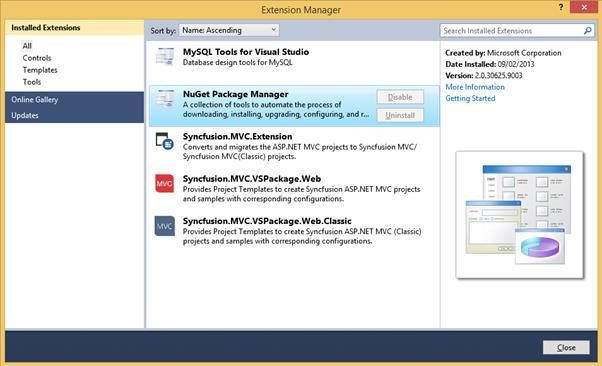

After the successful installation of the MVC extension, you can make use of the **Project** **Configuration** **Wizard** in Visual Studio to create the Syncfusion MVC application with the required Syncfusion MVC controls. 

N> The **Project** **Configuration** **Wizard** which gets integrated into the Visual Studio, automates the process of Configuration and Reference of Syncfusion assemblies within the newly created application. It also automate the process of adding all the required scripts and CSS references in your application, based on the Syncfusion controls that we choose in the Wizard.     

#### Integration of Syncfusion MVC components into the new MVC3 Application using Project Configuration Wizard

To add our Syncfusion MVC controls (here, **DatePicker** control is taken for example) into the new ASP.NET MVC3 application using **Syncfusion** **Project** **Configuration** **Wizard**, follow the below steps -

Start the Visual Studio 2010 and select **File** -> **New** -> **Project**. As you have installed MVC extension in your machine, you can see the Syncfusion Project template in the **New** **Project** pop-up, as shown in the below image,

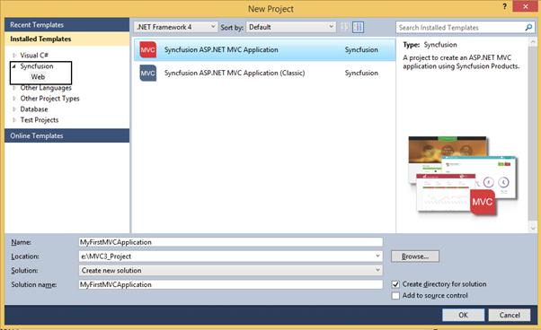

Name the application meaningfully and click **OK**, which opens the **Project** **Configuration** **Wizard** pop-up as shown below,

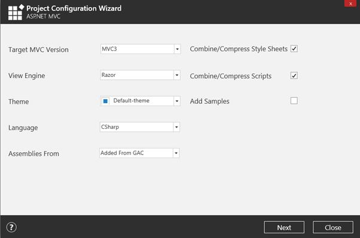

In the Wizard, choose the required project configuration settings from the provided options. Since you need to create a MVC3 application, therefore select **Target** **MVC** **Version** as **MVC3** and keep the **Razor** option as default selection for **View** **Engine**. Also make appropriate selection for **Theme** to be applied for the Syncfusion controls, on which **Language** the application to be created, (**Assemblies** **From**) where the assemblies are needed to be referred either from GAC or installed location. Also specify, whether or not to Combine/Compress the StyleSheets and Scripts in your project.

By default, **Add** **Samples** option in the wizard is unchecked, therefore if you need the sample for a particular control with its specific features to be automatically generated in your application, then you need to **check** that option. Here, we have kept it unchecked and are using the control code manually in the **index.cshtml** page.

Once the appropriate selection is done, now click on **Next**, which will navigate to the next window containing the list of Syncfusion MVC controls and its important features list.

Choose the required control name from the controls list and then click on **Create**, as shown below –

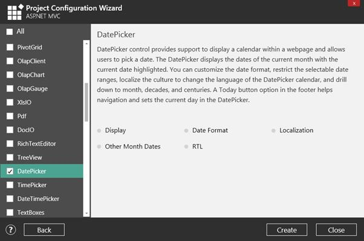

Now you can notice in the **References**, **Scripts** and **Content** folder of your application that all the required assemblies, scripts and CSS files are located into your project and also gets configured automatically in the **web.config** file. The script and CSS reference has also been automatically referred in the **_Layout.cshtml** page.

The new Syncfusion MVC application is created successfully and now add the below **DatePicker** code in the **Index.cshtml** file present within **~/Views/Home** folder.



    @Html.EJ().DatePicker("MyFirstDatePicker")



Simply build and run the project by pressing F5, so that you can now see the output similar to the below screenshot in your web browser,

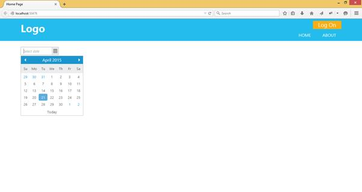

Thus the **DatePicker** control is rendered successfully with its default appearance.

### Through Syncfusion NuGet Packages

To add our Syncfusion MVC controls into the new ASP.NET MVC3 application by making use of the **Syncfusion** **Nuget** **Packages**, refer the following steps -  

#### Creation of First MVC application

Start the Visual Studio 2010. Create a new MVC application by selecting **File** -> **New** -> **Project** and save it with a meaningful name as shown below,

In the next step, it will prompt you for the Project Template and View engine selection. Keep the **Razor** option as selected for the **View** **engine** and select the **Internet** **Application** option from the available template names and then click **OK**.

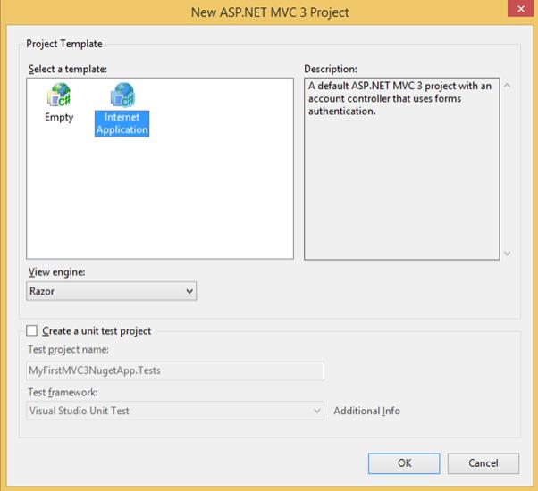

The above two steps allows you to create your initial MVC project successfully. Now you can build and run your application by pressing Ctrl+F5, which shows something similar to the following screenshot in your web browser,

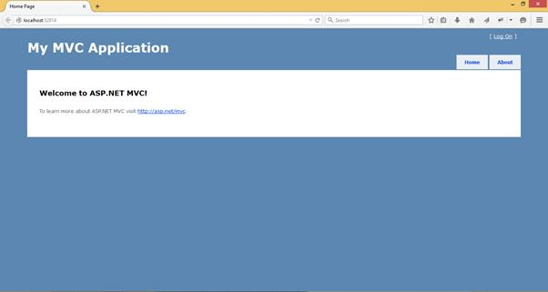

#### Configuring Syncfusion NuGet Packages

The steps to download and configure the required Syncfusion NuGet Packages in Visual Studio are as follows,

Download the Syncfusion NuGet Packages for **ASP.NET** **MVC** & **JavaScript** from [here](http://nuget.syncfusion.com/login) and save it in your system. The downloaded file is a zip formatted file, therefore unzip the folders and copy only the below specified packages present within it. Create a new folder namely **Nuget** **Packages** in any of the particular location in your system and place the below specified files into it,

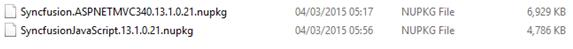

N> For rendering Syncfusion MVC components within the MVC application, the script and stylesheet references are mandatory. Therefore it is necessary to download **Syncfusion** **Nuget** **Packages** for both ASP.NET MVC and JavaScript.

In Visual Studio, navigate to **Tools** -> **Library** **Package** **Manager** -> **Package** **Manager** **Settings**, the **Options** pop-up will appear on the screen as below,

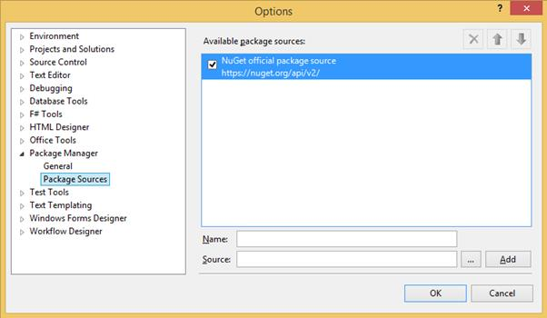

Select **Package** **Manager** -> **Package** **Sources** in the above pop-up and click on the 
button to navigate to the location where the above collection of NuGet packages are located (namely, within the **Nuget** **Packages** folder) in your system.

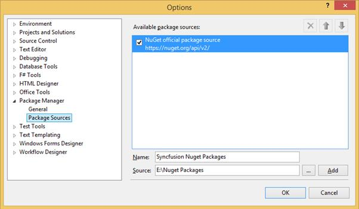

N> The **Source** textbox in the above image denotes the location of the NuGet packages in your machine and the **Name** section, allows you to provide a unique name which we will refer in the package installation section later.

Now click the **Add** button and the package name will be listed in the **Available** **package** **sources** list as shown below and then Click **OK**.

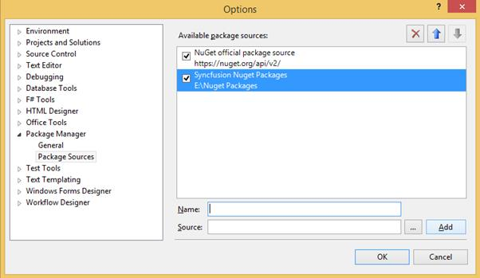

The configuration part of Syncfusion NuGet packages ends here and now it is necessary to proceed with its installation.

#### Installing NuGet into your project

The following steps will help you to add the references of the **Syncfusion** assemblies, required scripts and CSS files into your Project.

Right click on your project in the solution explorer and select **Manage** **Nuget** **Packages** options from the sub-menu that pop-up on the screen. Select the **Syncfusion** **Nuget** **Packages** within the **Online** tab, which will display the list of available packages in it, as shown below.

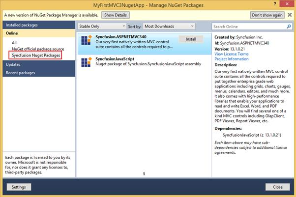

Install the **Syncfusion.ASPNETMVC340** (based on your target MVC application version (MVC3) and the .NET Framework (4.0) used in the sample application) package now, which automatically installs the **SyncfusionJavaScript** package together.

The below image depicts that the NuGet Packages for **JavaScript** and **ASP.NET** **MVC** (with MVC3 & .NET Framework version 4.0) has been successfully installed into your project.

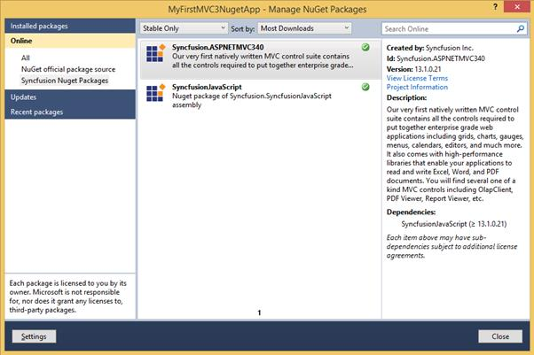

Once the package installation is completed, all the required assembly references, scripts and CSS files will be automatically added to your application. Also, it configures the **web.config** file automatically. The remaining changes that you need to do in your application are as follows. 

#### Unobtrusive Setting in Web.config file

The **Unobtrusive** setting is enabled in your application’s web.config file by default, while initial creation. You need to change its value to **false** in your application as shown below,



<appSettings>
    <add key="ClientValidationEnabled" value="true" />
    <add key="UnobtrusiveJavaScriptEnabled" value="false" />
</appSettings>



If suppose, you require the **Unobtrusive** to set to **true** in your application, then you need to include the **ej.unobtrusive.min.js** file as a reference to your application.

#### Adding Script Manager to ~/Views/Shared/_Layout.cshtml

Since, the Unobtrusive setting in the web.config file is disabled now, therefore it is necessary to add the script manager in your application to render the controls properly. 

You need to add the script manager code in the **_Layout.cshtml** file present within the **~/Views/Shared** folder of your application. Add it before the closing body tag in the _Layout.cshtml file.



<body>
    … 
    … 
    @RenderSection("scripts", required: false) 
    @Html.EJ().ScriptManager()
</body>



N> The main reason for referring the Script manager in _Layout file is that, it can be referred as common by all the View files present within your application. If **unobtrusive** is set to true in the application, then the script manager can be excluded, as the control is initialized using HTML5 attributes.

#### Adding reference to the required StyleSheets

Since the stylesheets are automatically loaded into the **Content** folder of your application, include the below specified reference to the **ej.web.all.min.css** file in the **~/Views/Shared/_Layout.cshtml** file, within the head section – as this file contains the styles applied for all the Syncfusion MVC controls.



<head>
    <title>@ViewBag.Title</title>
    … …
    <link href="@Url.Content("~/Content/ej/web/default-theme/ej.web.all.min.css")" rel="stylesheet" />
</head>



#### Adding reference to the required JavaScript files

It is mandatory to include the reference to the required JavaScript files in your project, so as to render the Syncfusion MVC controls properly. This should be done within the **_Layout.cshtml** file, as we did previously for CSS files. 

Add the below script references in the **~/Views/Shared/_Layout.cshtml** file, within the head section,



<head>
    <meta charset="utf-8" />
    <title>@ViewBag.Title - My ASP.NET MVC Application</title>
    … …
    <link href="@Url.Content("~/Content/ej/web/default-theme/ej.web.all.min.css")" rel="stylesheet" />
</head>

<body>
    … …
    
    
    
    
    @Html.EJ().ScriptManager() 
    @RenderSection("scripts", required: false)
</body>



N> The order of the reference to the script files made in the above section should be maintained in the same manner as mentioned above.

I> If your application contains duplicate/multiple references to the jQuery files, remove it – as the explicit reference to the **jquery-1.10.2.min.js** script file is added to the application as specified above.

#### Adding Syncfusion MVC control

After performing the above steps, now you can add the control code as mentioned below,

Add the below **DatePicker** code in the **Index.cshtml** file present within **~/Views/Home** folder.



    @Html.EJ().DatePicker("MyFirstDatePicker")



Simply build and run the project by pressing F5, so that you can now see the output similar to the below screenshot,

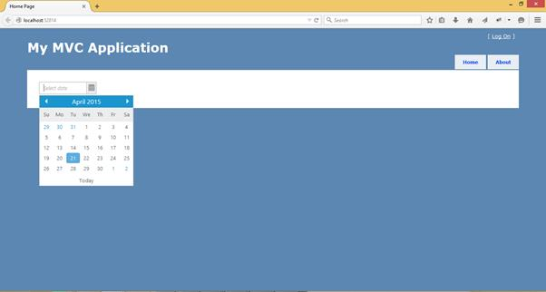

### Manual Integration of Syncfusion MVC components into new/existing MVC applications

Here, the MVC3 application is created using Visual Studio 2010 to depict the required screenshots.

#### Creation of new MVC Application

If you are in need of adding our components into a new MVC3 Application, then follow the below steps,

Start the Visual Studio 2010. Create a new MVC application by selecting **File**->**New**->**Project** and save it with a meaningful name as below,

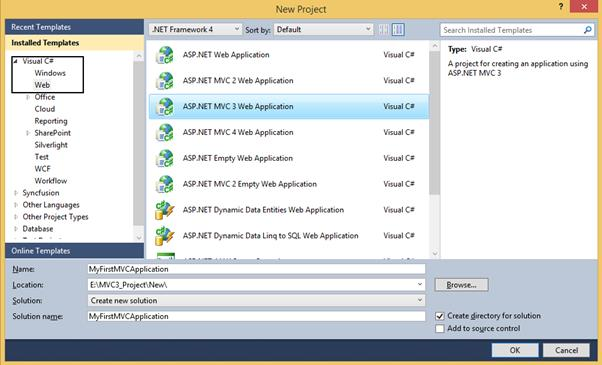

In the next step, it will prompt you for the Template and View engine selection. 

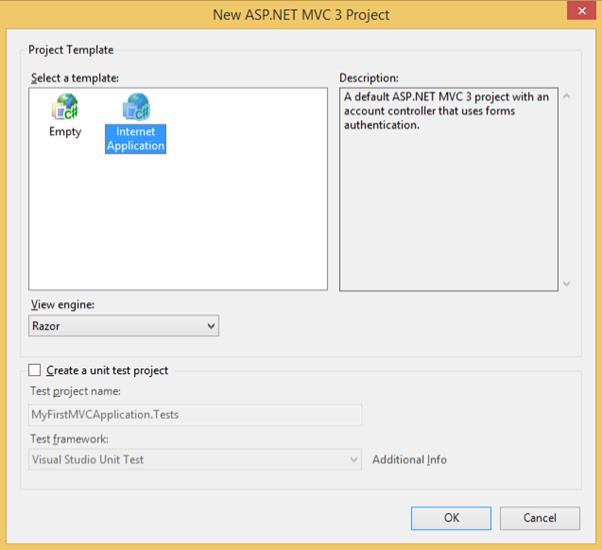

The above two steps will make you to create your initial MVC project successfully. Now you can build and run your application by pressing Ctrl+F5, which shows something similar to the following screenshot in your web browser,

You have successfully created your first simple MVC3 application and now it is time to add some other essential things to your application, so that you can make use of our Syncfusion controls into it.

#### For existing applications

In case, if you want to manually integrate the Syncfusion MVC components into your existing MVC3 application, then just open your existing project in Visual Studio by **File** -> **Open** -> **Project/Solution** and follow the below specified steps in it.

#### Assembly Reference

Refer the following three assemblies in your newly created/ existing MVC application, which will allow you to make use of any of the Syncfusion MVC controls within it.

* Syncfusion.EJ
* Syncfusion.EJ.Mvc

The reference to the Syncfusion assemblies can be added to your MVC application in either of the following ways, 

* Referring from GAC
* Referring from the installed location

##### Referring from GAC

Once you have installed the Essential Studio package in your system, the Syncfusion assemblies are automatically registered in the GAC. You can easily add the reference assemblies to your project by choosing **Add** **Reference** option as shown below,

Now the **Add** **Reference** pop-up will appear on the screen. In that pop-up, select the required assemblies from the **.NET** tab, by choosing the appropriate versions (**{{ site.40esreleaseversion }}** version for **Syncfusion.EJ** assembly and **{{ site.mvc3releaseversion }}** version for **Syncfusion.EJ.Mvc**). The version to be chosen for the reference assemblies is based on the Framework and the MVC versions used in the application. 

##### Steps for adding reference assemblies from the installed location

Add the reference assemblies to your project by choosing **Add** **Reference** option as shown below,

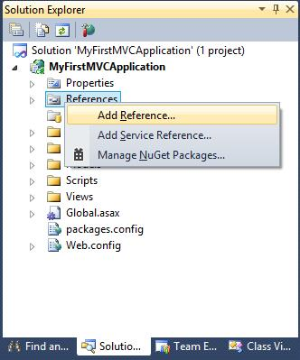

Now the **Add** **Reference** pop-up will appear on the screen. Select the **Browse** tab in it and navigate to the installed location of the Syncfusion Essential Studio package in your system. (As depicted in the below image.)

`(installed location)\Syncfusion\Essential Studio\{{ site.releaseversion }}\precompiledassemblies\{{ site.releaseversion }}`

_**For** **example**, If you have installed the Essential Studio package within **C:\Program Files (x86),** then navigate to the below location,_
`C:\Program Files (x86)\Syncfusion\Essential Studio\{{ site.releaseversion }}\precompiledassemblies\{{ site.releaseversion }}`

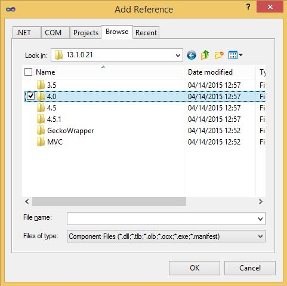

N> In the above image, the **MVC** folder contains all the assemblies required for the MVC controls differentiated under the different MVC version category (**MVC3**, **MVC4**, **MVC5**). **Syncfusion.EJ.Mvc** **dll** is available within this folder.

The other folders **3.5**, **4.0**, **4.5**, **4.5.1** in the above image denotes the .NET Framework versions that your application uses. Based on your application’s framework version used, you can choose assemblies from it. The common assembly **Syncfusion.EJ** is available within these folders.

Now add the **Syncfusion.EJ.Mvc** Assembly to your application from the below specified location, (since you are working on the **MVC3** application, therefore navigate further into the folder MVC\MVC3, from the previously mentioned location – refer the below images)

`(installed location)\Syncfusion\Essential Studio\{{ site.releaseversion }}\precompiledassemblies\{{ site.releaseversion }}\MVC\MVC3`

_**For** **example**, If you have installed the Essential Studio package within **C:\Program Files (x86),** then navigate to the below location,_
`C:\Program Files (x86)\Syncfusion\Essential Studio\{{ site.releaseversion }}\precompiledassemblies\{{ site.releaseversion }}\MVC\MVC3`

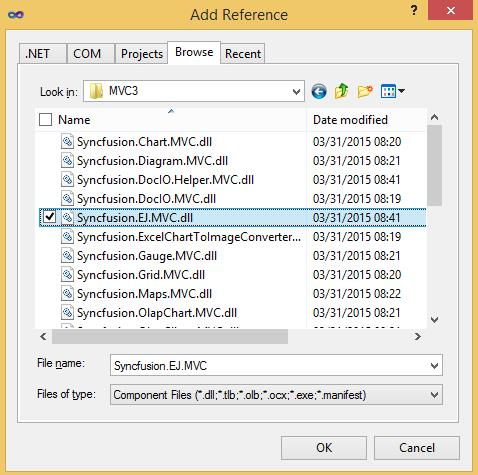

Now you need to add the **Syncfusion.EJ** assembly to your application from the below specified location, (since MVC3 assemblies (_System.Web.Mvc,System.Web.Razor etc_) uses the .NET Framework version 4.0 for compilation purpose we also need to refer the same Framework to avoid assembly conflict issues, therefore navigate to the folder **4.0** and select the above base assemblies, in the previously mentioned location – refer the below images)

`(installed location)\Syncfusion\Essential Studio\{{ site.releaseversion }}\precompiledassemblies\{{ site.releaseversion }}\4.0`

_**For** **example**, If you have installed the Essential Studio package within **C:\Program Files (x86),** then navigate to the below location,_
 `C:\Program Files (x86)\Syncfusion\Essential Studio\{{ site.releaseversion }}\precompiledassemblies\{{ site.releaseversion }}\4.0`

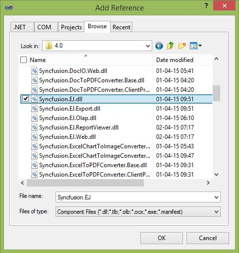

Once the assembly selection is done, click **OK** to add the selected references to your project. You can view the assembly references added to your application, in the solution explorer as shown below,

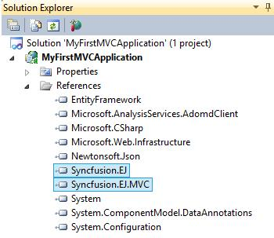

#### Registering Syncfusion Assemblies within the Application’s Root Web.config

In your application’s root web.config file, add the below assembly information within the <**assemblies**> tag.



<system.web>
    <compilation debug="true" targetFramework="4.0">
        <assemblies>
            <add assembly="Syncfusion.EJ, Version={{ site.40esreleaseversion }}, Culture=neutral, PublicKeyToken=3d67ed1f87d44c89" />
            <add assembly="Syncfusion.EJ.Mvc, Version={{ site.mvc3releaseversion }}, Culture=neutral, PublicKeyToken=3d67ed1f87d44c89" />
        </assemblies>
    </compilation>
    <authentication mode="Forms">
        …
</system.web>



#### Registering namespaces within Web.config

Now you need to register the below mentioned two namespaces in the **web.config** file present within the **Views** folder as well as the **Root** directory of your application.

* Syncfusion.JavaScript
* Syncfusion.MVC.EJ



<namespaces>
    <add namespace="System.Web.Mvc" />
    <add namespace="System.Web.Mvc.Ajax" />
    <add namespace="System.Web.Mvc.Html" />
    <add namespace="System.Web.Optimization" />
    <add namespace="System.Web.Routing" />
    <add namespace="Syncfusion.JavaScript" />
    <add namespace="Syncfusion.MVC.EJ" />
</namespaces>



#### Unobtrusive Setting in Web.config file

The **Unobtrusive** setting is enabled in your application’s web.config file by default, while initial creation. You need to change its value to **false** in your application as shown below,



<appSettings>
    <add key="ClientValidationEnabled" value="true" />
    <add key="UnobtrusiveJavaScriptEnabled" value="false" />
</appSettings>



If suppose, you require the Unobtrusive to set to true in your application, then you need to include the **ej.unobtrusive.js** file as a reference to your application. 

#### Adding Script Manager to ~/Views/Shared/_Layout.cshtml

Since, the Unobtrusive setting in the web.config file is disabled now, therefore it is necessary to add the script manager in your application to render the controls properly. You need to add the script manager code in the **_Layout.cshtml** file present within the **~/Views/Shared** folder of your application. Add it before the closing body tag in the _Layout.cshtml file.



<body>
    … 
    … 
    @RenderSection("scripts", required: false) 
    @Html.EJ().ScriptManager()
</body>



N> The main reason for referring the Script manager in _Layout file is that, it can be referred as common by all the View files present within your application. If **unobtrusive** is set to true in the application, then the script manager can be excluded, as the control is initialized using HTML5 attributes.

#### Adding the required StyleSheets

To render the Syncfusion MVC controls with its unique style and theme, it is necessary to refer the required CSS files into your application. You need to copy all the required CSS files into your application from the following location,

`(installed location)\Syncfusion\Essential Studio\{{ site.releaseversion }}\JavaScript\assets\css\web`

_**For** **example**, If you have installed the Essential Studio package within **C:\Program Files (x86),** then navigate to the below location,_
`C:\Program Files (x86)\Syncfusion\Essential Studio\{{ site.releaseversion }}\JavaScript\assets\css\web`

When you navigate to the above location, you can find the files shown in the below image, which you need to copy entirely and paste it into your root application. 

Before pasting it into your application, create a folder named `ej/web` within the `Content` folder of your application and place all the copied files into it as shown below,

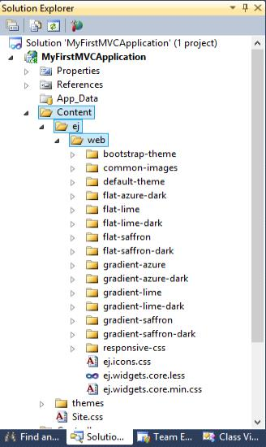

N> The **common-images** folder is needed to be copied into your application mandatorily, as it includes all the common font icons and other images required for the control to render.

Once the stylesheets are added in your application, include the below specified reference to the **ej.web.all.min.css** file in the **~/Views/Shared/_Layout.cshtml** file, within the head section – as this file contains the styles applied for all the Syncfusion MVC controls.



<head>
    <meta charset="utf-8" />
    <title>@ViewBag.Title - My ASP.NET MVC Application</title>
    … …
    <link href="@Url.Content("~/Content/ej/web/default-theme/ej.web.all.min.css")" rel="stylesheet" />
</head>



#### Adding the required JavaScript files

Adding the required JavaScript files into your application plays an important role, without which the Syncfusion controls cannot be created. It requires the following mandatory common script files,

* jQuery-1.10.2.min.js 
* jquery.easing.1.3.min.js
* jsrender.min.js

Apart from the above common scripts, it is also necessary to refer the **ej.web.all.min.js** file in your application, which contains all JavaScript components scripts in minified format.

You need to copy the above specified 4 external script files into your application from the following location,

`(installed location)\ Syncfusion\Essential Studio\{{ site.releaseversion }}\JavaScript\assets\external`

_**For** **example**, If you have installed the Essential Studio package within **C:\Program Files (x86),** then navigate to the below location,****_
`C:\Program Files (x86)\Syncfusion\Essential Studio\{{ site.releaseversion }}\JavaScript\assets\external`

When you navigate to the above location, you can find the common script files as shown in the below image, where you need to copy only the required script files and paste it into the **Scripts** folder of your root application. 

Now navigate to the below location and copy the **ej****.****web****.****all****.****min****.****js** file from the listed files.

`(installed location)\ Syncfusion\Essential Studio\{{ site.releaseversion }}\JavaScript\assets\scripts\web`

_**For** **example**, If you have installed the Essential Studio package within **C:\Program Files (x86),** then navigate to the below location,_
`C:\Program Files (x86)\Syncfusion\Essential Studio\{{ site.releaseversion }}\JavaScript\assets\scripts\web`

Now, create a folder named `ej` within the `Scripts` folder of your application and place the copied file **ej.web.all.min.js** file into it as shown below,

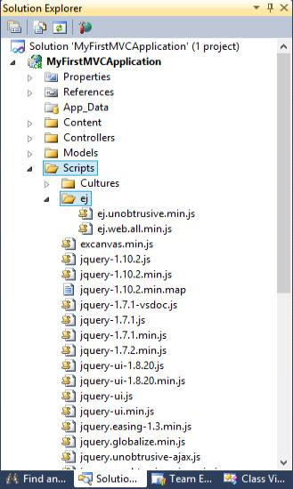

Once the scripts are added in your application, now it is necessary to include the reference to it in your project. This should be done within the _Layout.cshtml file, as we did previously for CSS files. 

Add the below script references in the **~/Views/Shared/_Layout.cshtml** file, within the head section,



<head>
    <meta charset="utf-8" />
    <title>@ViewBag.Title - My ASP.NET MVC Application</title>
    … …
    <link href="@Url.Content("~/Content/ej/web/default-theme/ej.web.all.min.css")" rel="stylesheet" />
</head>

<body>
    … …
    
    
    
    
    @Html.EJ().ScriptManager() 
    @RenderSection("scripts", required: false)
</body>



N> The order of the reference to the script files made in the above section should be maintained in the same manner as mentioned above.

I> If your application contains duplicate/multiple references to the jQuery files, remove it – as the explicit reference to the **jquery-1.10.2.min.js** script file is added to the application as specified above.

#### CDN Link reference

If you want to refer the CDN links instead of the direct script and CSS references in your application, then you need to make use of the below references in the **_Layout.cshtml** file,



<head>
    <meta charset="utf-8" />
    <title>@ViewBag.Title - My ASP.NET MVC Application</title>
    … …
    <link href="http://cdn.syncfusion.com/{{ site.releaseversion }}/js/web/flat-azure/ej.web.all.min.css" rel="stylesheet" />
</head>

<body>
    … …
    
    
    
    
    @Html.EJ().ScriptManager() 
    @RenderSection("scripts", required: false)
</body>



#### Adding Syncfusion MVC control

All the required settings are added successfully to your application and finally, now it is time to add our Syncfusion control into it. To do so, we are going to showcase initially, how to add the **DatePicker** control into your application. It is so simple, as you just need to place the following code within the **Index.cshtml** (removing all the unwanted content within it) file, which is present within the **~/Views/Home** folder.



    @Html.EJ().DatePicker("MyFirstDatePicker")



Now build and run the application by pressing F5, you can see something similar to the below screenshot in your web browser,

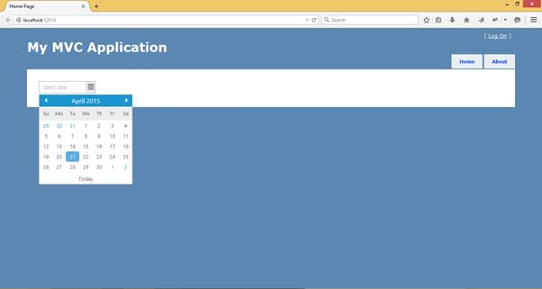

The DatePicker is rendered with its default appearance. You can then use its various properties to set its value and also make use of its available events to trigger when necessary.

## MVC 4 Application

### Using Syncfusion Project Template

The Syncfusion Project Template can be used in two ways, either for integrating the Syncfusion MVC controls into a new or existing ASP.NET MVC4 application.

The very first step that you need to ensure is whether you have installed **MVC** **Extension** in your machine. In case, if you have not done so, install the setup of MVC Extension from [here](http://www.syncfusion.com/downloads/extension).

N> Before installing the MVC extension setup, make sure that you have installed the Essential Studio package in your system.

Before making use of the **Syncfusion** **Project** **Template**, you also need to ensure whether the latest version of **Nuget** **Package** **Manager** is installed in the Visual Studio. To ensure this, Open the Visual Studio and click on **Tools** -> **Extensions** and **Updates**, you can see the pop-up similar to the one shown below,

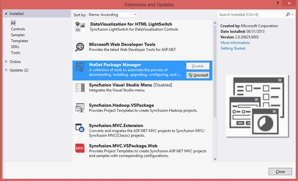

After the successful installation of the MVC extension, you can make use of the **Project** **Configuration** **Wizard** in Visual Studio to create the Syncfusion MVC application with the required Syncfusion MVC controls. 

N> The **Project** **Configuration** **Wizard** which gets integrated into the Visual Studio, automates the process of Configuration and Reference of Syncfusion assemblies within the newly created application. It also automate the process of adding all the required scripts and CSS references in your application, based on the Syncfusion controls that we choose in the Wizard.     

#### Integration of Syncfusion MVC components into the new MVC4 Application using Project Configuration Wizard

To add our Syncfusion MVC controls (here, **DatePicker** control is taken for example) into the new ASP.NET MVC4 application using **Syncfusion** **Project** **Configuration** **Wizard**, follow the below steps -

Start the Visual Studio 2012 and select **File** -> **New** -> **Project**. As you have installed MVC extension in your machine, you can see the Syncfusion Project template in the **New** **Project** pop-up, as shown in the below image,

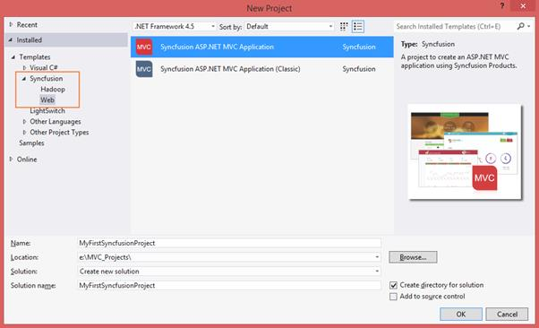

Name the application meaningfully and click **OK**, which opens the **Project** **Configuration** **Wizard** pop-up as shown below,

In the Wizard, choose the required project configuration settings from the provided options. Since you need to create a MVC4 application, therefore select **Target** **MVC** **Version** as **MVC4** and keep the **Razor** option as default selection for **View** **Engine**. Also make appropriate selection for **Theme** to be applied for the Syncfusion controls, on which **Language** the application to be created, (**Assemblies** **From**) where the assemblies are needed to be referred either from GAC or installed location. Also specify, whether or not to Combine/Compress the StyleSheets and Scripts in your project.

By default, **Add** **Samples** option in the wizard is unchecked, therefore if you need the sample for a particular control with its specific features to be automatically generated in your application, then you need to **check** that option. Here, we have kept it unchecked and are using the control code manually in the **index.cshtml** page.

Once the appropriate selection is done, now click on **Next**, which will navigate to the next window containing the list of Syncfusion MVC controls and its important features list.

Choose the required control name from the controls list and then click on **Create**, as shown below –

Now you can notice in the **References**, **Scripts** and **Content** folder of your application that all the required assemblies, scripts and CSS files are located into your project and also gets configured automatically in the **web.config** file. The script and CSS reference has also been automatically referred in the **_Layout.cshtml** page.

The new Syncfusion MVC application is created successfully and now add the below **DatePicker** code in the **Index.cshtml** file present within **~/Views/Home** folder.



    @Html.EJ().DatePicker("MyFirstDatePicker")



Simply build and run the project by pressing F5, so that you can now see the output similar to the below screenshot in your web browser,

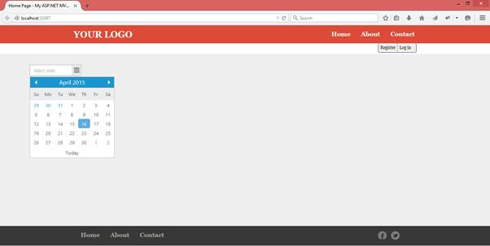

Thus the **DatePicker** control is rendered successfully with its default appearance.

### Through Syncfusion NuGet Packages

To add our Syncfusion MVC controls into the new ASP.NET MVC4 application by making use of the **Syncfusion** **Nuget** **Packages** – refer the below steps.

#### Creation of First MVC application

Start the Visual Studio 2012. Create a new MVC application by selecting **File** -> **New** -> **Project** and save it with a meaningful name as shown below,

In the next step, it will prompt you for the Template and View engine selection. Keep the **Razor** option as selected for the View engine and select the **Internet** **Application** option from the available template names and then click **OK**.

The above two steps allows you to create your initial MVC project successfully. Now, you can build and run your application by pressing Ctrl+F5, which shows something similar to the following screenshot in your web browser,

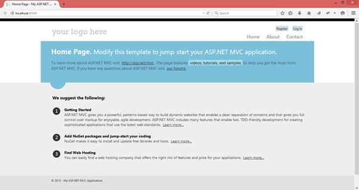

#### Configuring Syncfusion NuGet Packages

The steps to download and configure the required Syncfusion NuGet Packages in Visual Studio are as follows, 

Download the Syncfusion NuGet Packages for **ASP.NET** **MVC** & **JavaScript** from [here](http://nuget.syncfusion.com/login) and save it in your system. The downloaded file is a zip formatted file, therefore unzip the folders and copy only the below specified packages present within it. Create a new folder namely **Nuget** **Packages** in any of the particular location in your system and place the below specified files into it,

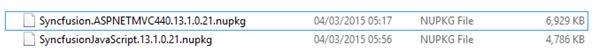

N> For rendering Syncfusion MVC components within the MVC application, the script and stylesheet references are mandatory. Therefore it is necessary to download **Syncfusion** **Nuget** **Packages** for both ASP.NET MVC and JavaScript.

In Visual Studio, navigate to **Tools** -> **Library** **Package** **Manager** -> **Package** **Manager** **Settings**, the **Options** pop-up will appear on the screen as below,

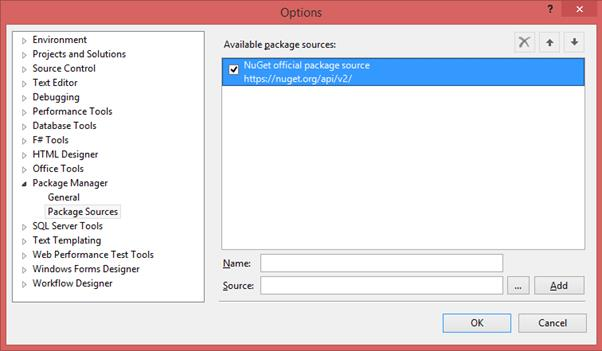

Select **Package** **Manager** -> **Package** **Sources** in the above pop-up and click on the 
button to navigate to the location where the above collection of NuGet packages are located (namely, within the **Nuget** **Packages** folder) in your system.

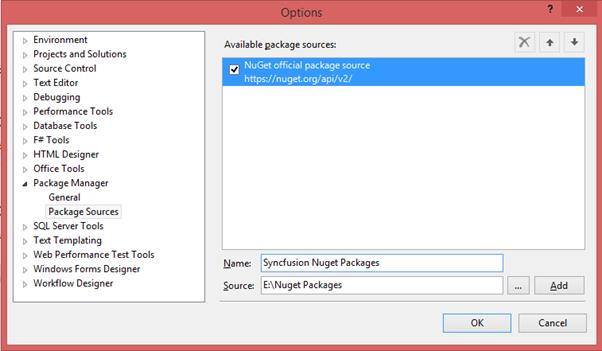

N> The **Source** textbox in the above image denotes the location of the NuGet packages in your machine and the **Name** section, allows you to provide a unique name which we will refer in the package installation section later.

Now click the **Add** button and the package name will be listed in the **Available** **package** **sources** list as shown below and then Click **OK**.

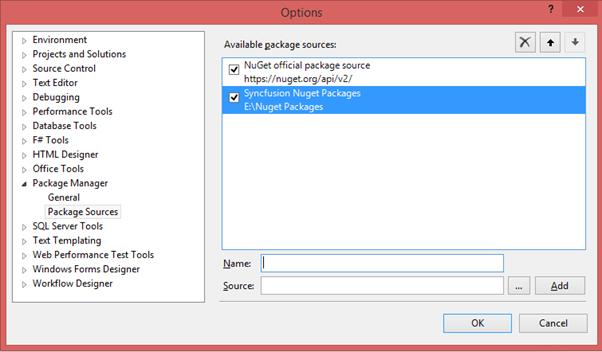

The configuration part of Syncfusion NuGet packages ends here and now it is necessary to proceed with its installation.

#### Installing NuGet into your project

The following steps will help you to add the references of the **Syncfusion** assemblies, required scripts and CSS files into your Project.

Right click on your project in the solution explorer and select **Manage** **Nuget** **Packages** options from the sub-menu that pop-up on the screen. Select the **Syncfusion** **Nuget** **Packages** within the **Online** tab, which will display the list of available packages in it, as shown below.

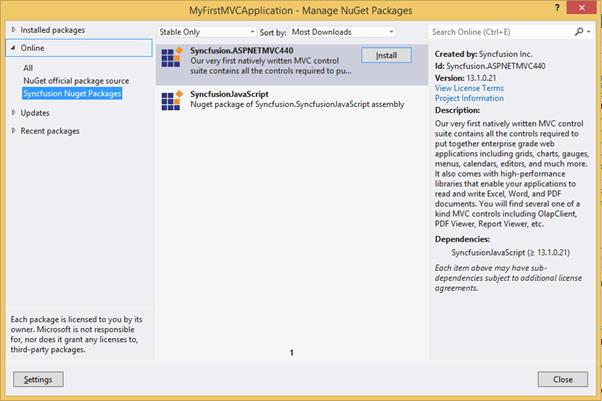

Install the **SyncfusionASPNETMVC440** (based on your target MVC application version (MVC4) and the .NET Framework (4.0) used in the sample application) package now, which automatically installs the **SyncfusionJavaScript** package together.

The below image depicts that the NuGet Packages for **JavaScript** and **ASP.NET** **MVC** (with MVC4 & .NET Framework version 4.0) has been successfully installed into your project.

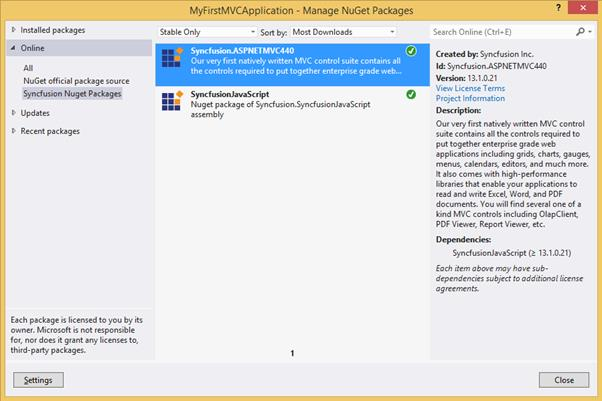

Once the package installation is completed, all the required assembly references, scripts and CSS files will be automatically added to your application. Also, it configures the **web.config** file automatically. The remaining changes that you need to do in your application are as follows. 

#### Unobtrusive Setting in Web.config file

The **Unobtrusive** setting is enabled in your application’s web.config file by default, while initial creation. You need to change its value to **false** in your application as shown below,



<appSettings>
    <add key="webpages:Version" value="2.0.0.0" />
    <add key="webpages:Enabled" value="false" />
    <add key="PreserveLoginUrl" value="true" />
    <add key="ClientValidationEnabled" value="true" />
    <add key="UnobtrusiveJavaScriptEnabled" value="false" />
</appSettings>



If suppose, you require the **Unobtrusive** to set to **true** in your application, then you need to include the **ej.unobtrusive.min.js** file as a reference to your application.

#### Adding Script Manager to ~/Views/Shared/_Layout.cshtml

Since, the Unobtrusive setting in the web.config file is disabled now, therefore it is necessary to add the script manager in your application to render the controls properly. 

You need to add the script manager code in the **_Layout.cshtml** file present within the **~/Views/Shared** folder of your application. Add it before the closing body tag in the _Layout.cshtml file.



<body>
    …
    … 
    @RenderSection("scripts", required: false) 
    @Html.EJ().ScriptManager()
</body>



N> The main reason for referring the Script manager in _Layout file is that, it can be referred as common by all the View files present within your application. If **unobtrusive** is set to true in the application, then the script manager can be excluded, as the control is initialized using HTML5 attributes.

#### Adding reference to the required StyleSheets

Since the stylesheets are automatically loaded into the Content folder of your application, include the below specified reference to the **ej.web.all.min.css** file in the **~/Views/Shared/_Layout.cshtml** file, within the head section – as this file contains the styles applied for all the Syncfusion MVC controls.



<head>
    <meta charset="utf-8" />
    <title>@ViewBag.Title - My ASP.NET MVC Application</title>
    <link href="~/favicon.ico" rel="shortcut icon" type="image/x-icon" />
    <meta name="viewport" content="width=device-width" /> 
    … 
    …
    <link href="@Url.Content("~/Content/ej/web/default-theme/ej.web.all.min.css")" rel="stylesheet" />
</head>



#### Adding reference to the required JavaScript files

It is mandatory to include the reference to the required JavaScript files in your project, so as to render the Syncfusion MVC controls properly. This should be done within the **_Layout.cshtml** file, as we did previously for CSS files. 

Add the below script references in the **~/Views/Shared/_Layout.cshtml** file, within the head section,



<head>
    <meta charset="utf-8" />
    <title>@ViewBag.Title - My ASP.NET MVC Application</title>
    … …
    <link href="@Url.Content("~/Content/ej/web/default-theme/ej.web.all.min.css")" rel="stylesheet" />
</head>

<body>
    … 
    …
    
    
    
    
    @Html.EJ().ScriptManager() 
    @RenderSection("scripts", required: false)
</body>



N> The order of the reference to the script files made in the above section should be maintained in the same manner as mentioned above.

I> Since the **jquery-1.10.2.min.js** file is referred explicitly in the application, therefore make sure that your application doesn’t refer to any other jQuery versions multiple times, which will cause the script error. Make sure that the jQuery scripts are not again referred through bundles in **_Layout.cshtml** file. 

#### Adding Syncfusion MVC control

After performing the above steps, now you can add the control code as mentioned below in the **Index.cshtml** file present within **~/Views/Home** folder.



    @Html.EJ().DatePicker("MyFirstDatePicker")



Simply build and run the project by pressing F5, so that you can now see the output similar to the below screenshot.

### Manual Integration of Syncfusion MVC components into new/existing MVC applications

Here, the MVC 4 application is created using Visual Studio 2012 to depict the required screenshots.

#### Creation of new MVC Application

If you are in need of adding our MVC components into a new MVC4 Application, then follow the below steps.

Start the Visual Studio 2012. Create a new MVC application by selecting **File**->**New**->**Project** **and** save it with a meaningful name as below,

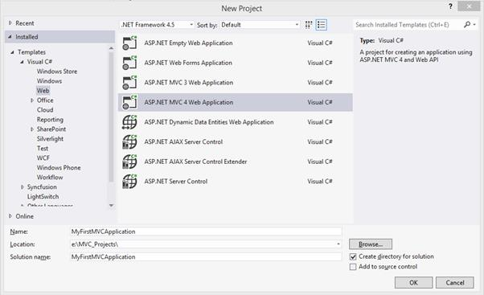

In the next step, it will prompt you for the Template and View engine selection. Keep the **Razor** option as selected for the View engine and select the **Internet** **Application** option from the available template names and then click **OK**.

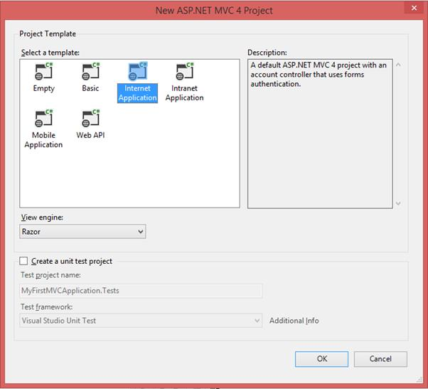

The above two steps will make you to create your initial MVC project successfully. Now you can build and run your application by pressing Ctrl+F5, which shows something similar to the following screenshot in your web browser,

You have successfully created your first simple MVC4 application and now it is time to add some other essential things to your application, so that you can make use of our Syncfusion controls into it.

#### For existing applications

In case, if you want to manually integrate the Syncfusion MVC components into your existing MVC4 application, then just open your existing project in Visual Studio by **File** -> **Open** -> **Project/Solution** and follow the below specified steps in it.

#### Assembly Reference

Refer the following three assemblies in your newly created/ existing MVC application, which will allow you to make use of any of the Syncfusion MVC controls within it.

* Syncfusion.EJ
* Syncfusion.EJ.Mvc

The reference to the Syncfusion assemblies can be added to your MVC application in either of the following ways, 

* Referring from GAC
* Referring from the installed location

##### Referring from GAC

Once you have installed the Essential Studio package in your system, the Syncfusion assemblies are automatically registered in the GAC. You can easily add the reference assemblies to your project by choosing **Add** **Reference** option as shown below,

Now the **Reference** **Manager** pop-up will appear on the screen. In that pop-up, select the required assemblies from the **Extensions** tab as below, by choosing the appropriate versions (**{{ site.40esreleaseversion }}**). The version to be chosen for the reference assemblies is based on the Framework and the MVC versions used in the application.

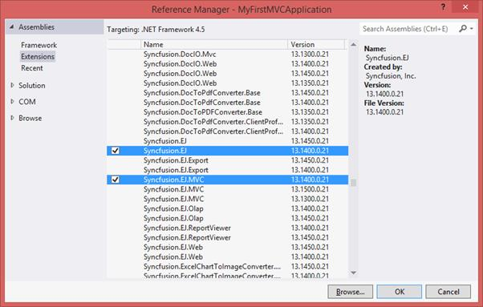

##### Steps for adding reference assemblies from the installed location

Add the reference assemblies to your project by choosing **Add** **Reference** option as shown below,

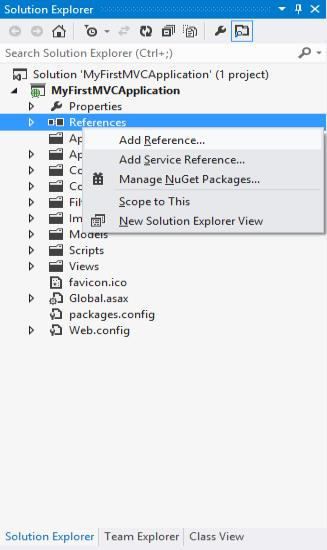

Now the **Reference** **Manager** pop-up will appear on the screen. Select the **Browse** tab in it and navigate to the installed location of the Syncfusion Essential Studio package in your system. (As depicted in the below image.)

`(installed location)\Syncfusion\Essential Studio\{{ site.releaseversion }}\precompiledassemblies\{{ site.releaseversion }}`

_**For** **example**, If you have installed the Essential Studio package within **C:\Program Files (x86),** then navigate to the below location,_ 
`C:\Program Files (x86)\Syncfusion\Essential Studio\{{ site.releaseversion }}\precompiledassemblies\{{ site.releaseversion }}`

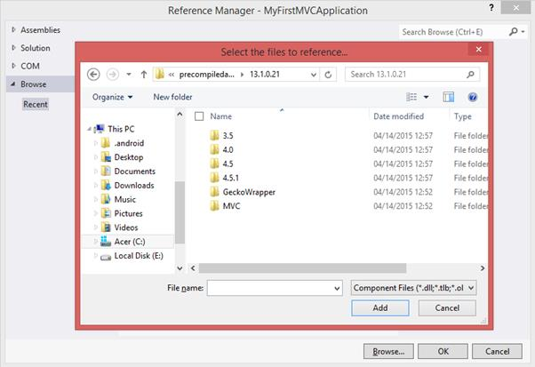

N> In the above image, the **MVC** folder contains all the assemblies required for the MVC controls differentiated under the different MVC version category (**MVC3**, **MVC4**, **MVC5**). **Syncfusion.EJ.Mvc** **dll** is available within this folder.

The other folders **3.5**, **4.0**, **4.5**, **4.5.1** in the above image denotes the .NET Framework versions that your application uses. Based on your application’s Framework version used, you can choose assemblies from it. The common assembly **Syncfusion.EJ** is available within these folders.

Now add the **Syncfusion.EJ.Mvc** Assembly to your application from the below specified location, (since you are working on the MVC 4 application, therefore navigate further into the folder MVC\MVC4, from the previously mentioned location – refer the below images)

`(installed location)\Syncfusion\Essential Studio\{{ site.releaseversion }}\precompiledassemblies\{{ site.releaseversion }}\MVC\MVC4`

_**For** **example**, If you have installed the Essential Studio package within **C:\Program Files (x86),** then navigate to the below location,_ 
`C:\Program Files (x86)\Syncfusion\Essential Studio\{{ site.releaseversion }}\precompiledassemblies\{{ site.releaseversion }}\MVC\MVC4`

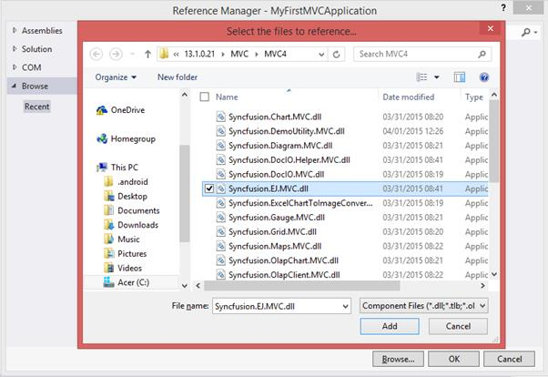

Now you need to add the **Syncfusion.EJ** assembly to your application from the below specified location, (since MVC4 assemblies (_System.Web.Mvc,System.Web.Razor etc_) uses the .NET Framework version 4.0 for compilation purpose we also need to refer the same Framework to avoid assembly conflict issues, therefore navigate to the folder **4.0** and select the above base assemblies, in the previously mentioned location – refer the below images)

`(installed location)\Syncfusion\Essential Studio\{{ site.releaseversion }}\precompiledassemblies\{{ site.releaseversion }}\4.0`

_**For** **example**, If you have installed the Essential Studio package within **C:\Program Files (x86),** then navigate to the below location,_ 
`C:\Program Files (x86)\Syncfusion\Essential Studio\{{ site.releaseversion }}\precompiledassemblies\{{ site.releaseversion }}\4.0`

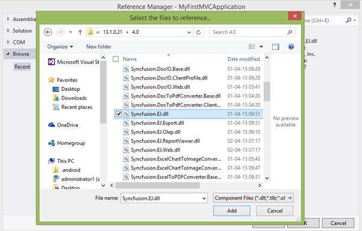

Once the assembly selection is done, click OK to add the selected references to your project. You can view the assembly references added to your application, in the solution explorer as shown below,

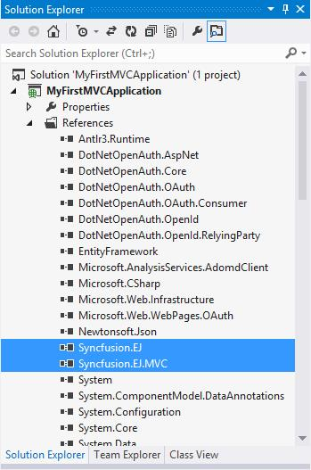

#### Registering Syncfusion Assemblies within the Application’s Root Web.config

In your application’s root web.config file, add the below assembly information within the <**assemblies**> tag.



<system.web>
    <compilation debug="true" targetFramework="4.0">
        <assemblies>
            <add assembly="Syncfusion.EJ, Version={{ site.40esreleaseversion }}, Culture=neutral, PublicKeyToken=3d67ed1f87d44c89" />
            <add assembly="Syncfusion.EJ.Mvc, Version={{ site.40esreleaseversion }}, Culture=neutral, PublicKeyToken=3d67ed1f87d44c89" />
        </assemblies>
    </compilation>
    <authentication mode="Forms">
        …
</system.web>



#### Registering namespaces within Web.config

Now you need to register the below mentioned two namespaces in the **web.config** file present within the **Views** folder as well as the **Root** directory of your application.

* Syncfusion.JavaScript
* Syncfusion.MVC.EJ



<namespaces>
    <add namespace="System.Web.Mvc" />
    <add namespace="System.Web.Mvc.Ajax" />
    <add namespace="System.Web.Mvc.Html" />
    <add namespace="System.Web.Optimization" />
    <add namespace="System.Web.Routing" />
    <add namespace="Syncfusion.JavaScript" />
    <add namespace="Syncfusion.MVC.EJ" />
</namespaces>



#### Unobtrusive Setting in Web.config file

The **Unobtrusive** setting is enabled in your application’s web.config file by default, while initial creation. You need to change its value to **false** in your application as shown below,



<appSettings>
    <add key="webpages:Version" value="2.0.0.0" />
    <add key="webpages:Enabled" value="false" />
    <add key="PreserveLoginUrl" value="true" />
    <add key="ClientValidationEnabled" value="true" />
    <add key="UnobtrusiveJavaScriptEnabled" value="false" />
</appSettings>



If suppose, you require the Unobtrusive to set to true in your application, then you need to include the **ej.unobtrusive.min.js** file as a reference to your application. We’ll see about this in a detailed section later.

#### Adding Script Manager to ~/Views/Shared/_Layout.cshtml

Since, the Unobtrusive setting in the web.config file is disabled now, therefore it is necessary to add the script manager in your application to render the controls properly. 

You need to add the script manager code in the **_Layout.cshtml** file present within the **~/Views/Shared** folder of your application. Add it before the closing body tag in the _Layout.cshtml file.



<body>
    … 
    … 
    @RenderSection("scripts", required: false) 
    @Html.EJ().ScriptManager()
</body>



N> The main reason for referring the Script manager in _Layout file is that, it can be referred as common by all the View files present within your application. If **unobtrusive** is set to true in the application, then the script manager can be excluded, as the control is initialized using HTML5 attributes.

#### Adding the required StyleSheets

To render the Syncfusion MVC controls with its unique style and theme, it is necessary to refer the required CSS files into your application. You need to copy all the required CSS files into your application from the following location,

`(installed location)\Syncfusion\Essential Studio\{{ site.releaseversion }}\JavaScript\assets\css\web`

_**For** **example**, If you have installed the Essential Studio package within **C:\Program Files (x86),** then navigate to the below location,_
`C:\Program Files (x86)\Syncfusion\Essential Studio\{{ site.releaseversion }}\JavaScript\assets\css\web`

When you navigate to the above location, you can find the files shown in the below image, which you need to copy entirely and paste it into your root application. 

Before pasting it into your application, create a folder named `ej/web` within the `Content` folder of your application and place all the copied files into it as shown below,

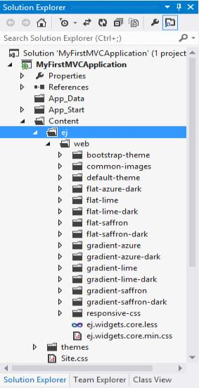

N> The **common-images** folder is needed to be copied into your application mandatorily, as it includes all the common font icons and other images required for the control to render.

Once the stylesheets are added in your application, include the below specified reference to the **ej.web.all.min.css** file in the **~/Views/Shared/_Layout.cshtml** file, within the head section – as this file contains the styles applied for all the Syncfusion MVC controls.



<head>
    <meta charset="utf-8" />
    <title>@ViewBag.Title - My ASP.NET MVC Application</title>
    <link href="~/favicon.ico" rel="shortcut icon" type="image/x-icon" />
    <meta name="viewport" content="width=device-width" /> 
    … 
    …
    <link href="@Url.Content("~/Content/ej/web/default-theme/ej.web.all.min.css")" rel="stylesheet" />
</head>



#### Adding the required JavaScript files

Adding the required JavaScript files into your application plays an important role, without which the Syncfusion controls cannot be created. It requires the following mandatory common script files,

* jQuery-1.10.2.min.js 
* jquery.easing.1.3.min.js
* jsrender.min.js

Apart from the above common scripts, it is also necessary to refer the **ej.web.all.min.js** file in your application, which contains all JavaScript components scripts in minified format.

You need to copy the above specified 4 external script files into your application from the following location,

`(installed location)\ Syncfusion\Essential Studio\{{ site.releaseversion }}\JavaScript\assets\external` 

_**For** **example**, If you have installed the Essential Studio package within **C:\Program Files (x86),** then navigate to the below location,_
`C:\Program Files (x86)\Syncfusion\Essential Studio\{{ site.releaseversion }}\JavaScript\assets\external`

When you navigate to the above location, you can find the common script files as shown in the below image, where you need to copy only the required script files and paste it into the **Scripts** folder of your root application. 

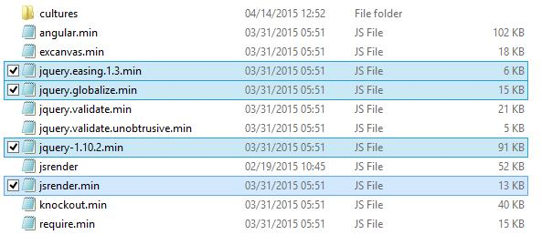

Now navigate to the below location and copy the **ej.web.all.min.js** file from the listed files.

`(installed location)\ Syncfusion\Essential Studio\{{ site.releaseversion }}\JavaScript\assets\scripts\web`

_**For** **example**, If you have installed the Essential Studio package within **C:\Program Files (x86),** then navigate to the below location,_
`C:\Program Files (x86)\Syncfusion\Essential Studio\{{ site.releaseversion }}\JavaScript\assets\scripts\web`

Now, create a folder named `ej/web` within the `Scripts` folder of your application and place the copied file **ej.web.all.min.js** file into it as shown below,

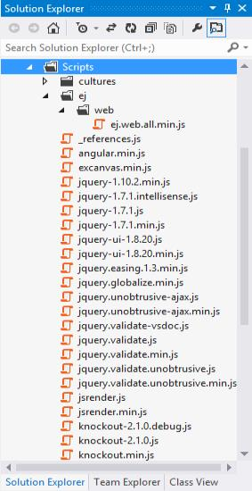

Once the scripts are added in your application, now it is necessary to include the reference to it in your project. This should be done within the _Layout.cshtml file, as we did previously for CSS files. 

Add the below script references in the **~/Views/Shared/_Layout.cshtml** file, within the head section,



<head>
    <meta charset="utf-8" />
    <title>@ViewBag.Title - My ASP.NET MVC Application</title>
    … 
    …
    <link href="@Url.Content("~/Content/ej/web/default-theme/ej.web.all.min.css")" rel="stylesheet" />
</head>

<body>
    … 
    …
    
    
    
    
    @Html.EJ().ScriptManager() 
    @RenderSection("scripts", required: false)
</body>



N> The order of the reference to the script files made in the above section should be maintained in the same manner as mentioned above.

I> Since the **jquery-1.10.2.min.js** file is referred explicitly in the application, therefore make sure that your application doesn’t refer to any other jQuery versions multiple times, which will cause the script error. Make sure that the jQuery scripts are not again referred through bundles in **_Layout.cshtml** file. 

#### CDN Link reference

If you want to refer the CDN links instead of the direct script and CSS references in your application, then you need to make use of the below references in the _Layout.cshtml file,



<head>
    <meta charset="utf-8" />
    <title>@ViewBag.Title - My ASP.NET MVC Application</title>
    … 
    …
    <link href="http://cdn.syncfusion.com/{{ site.releaseversion }}/js/web/flat-azure/ej.web.all.min.css" rel="stylesheet" />
</head>

<body>
    … 
    …
    
    
    
    
    @Html.EJ().ScriptManager() 
    @RenderSection("scripts", required: false)
</body>



#### Adding Syncfusion MVC control

All the required settings are added successfully to your application and finally, now it is time to add our Syncfusion control into it. To do so, we are going to showcase initially, how to add the **DatePicker** control into your application. It is so simple, as you just need to place the following code within the **Index.cshtml** (removing all the unwanted content within it) file, which is present within the **~/Views/Home** folder.



    @Html.EJ().DatePicker("MyFirstDatePicker")



Now build and run the application by pressing F5, you can see something similar to the below screenshot in your web browser.

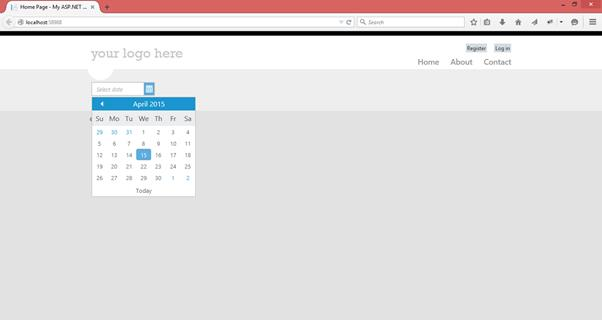

The DatePicker is rendered with its default appearance. You can then use its various properties to set its value and also make use of its available events to trigger when necessary.

## MVC 5 Application

### Using Syncfusion Project Template

The Syncfusion Project Template can be used in two ways, either for integrating the Syncfusion MVC controls into a new or existing ASP.NET MVC5 application. 

The very first step that you need to ensure is whether you have installed **MVC** **Extension** in your machine. In case, if you have not done so, install the setup of MVC Extension from [here](http://www.syncfusion.com/downloads/extension). 

N> Before installing the MVC extension setup, make sure that you have installed the Essential Studio package in your system.

Before making use of the **Syncfusion** **Project** **Template**, you also need to ensure whether the latest version of **Nuget** **Package** **Manager** is installed in the Visual Studio. To ensure this, Open the Visual Studio and click on **Tools** -> **Extensions** **and** **Updates**, you can see the pop-up similar to the one shown below,

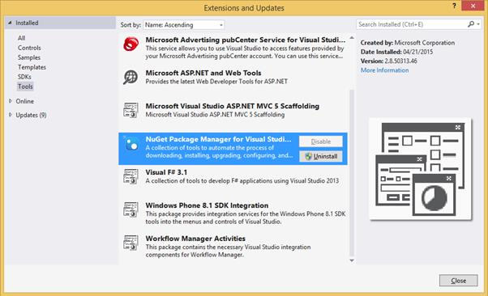

After the successful installation of the MVC extension, you can make use of the **Project** **Configuration** **Wizard** in Visual Studio to create the Syncfusion MVC application with the required Syncfusion MVC controls. 

N> The **Project** **Configuration** **Wizard** which gets integrated into the Visual Studio, automates the process of Configuration and Reference of Syncfusion assemblies within the newly created application. It also automate the process of adding all the required scripts and CSS references in your application, based on the Syncfusion controls that we choose in the Wizard.     

#### Integration of Syncfusion MVC components into the new MVC5 Application using Project Configuration Wizard

To add our Syncfusion MVC controls (here, **DatePicker** control is taken for example) into the new ASP.NET MVC 5 application using **Syncfusion** **Project** **Configuration** **Wizard**, follow the below steps -

Start the Visual Studio 2013 and select **File** -> **New** -> **Project**. As you have installed MVC extension in your machine, you can see the Syncfusion Project template in the **New** **Project** pop-up, as shown in the below image,

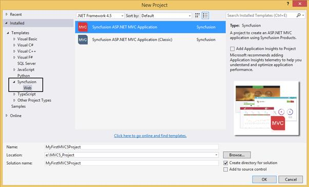

Name the application meaningfully and click **OK**, which opens the **Project** **Configuration** **Wizard** pop-up as shown below,

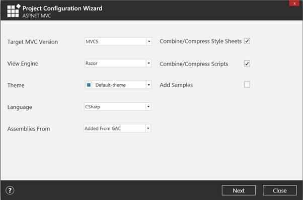

In the Wizard, choose the required project configuration settings from the provided options. Since you need to create a MVC5 application, therefore select **Target** **MVC** **Version** as **MVC5** and keep the **Razor** option as default selection for **View** **Engine**. Also make appropriate selection for **Theme** to be applied for the Syncfusion controls, on which **Language** the application to be created, (**Assemblies** **From**) where the assemblies are needed to be referred either from GAC or installed location. Also specify, whether or not to Combine/Compress the StyleSheets and Scripts in your project.

By default, **Add** **Samples** option in the wizard is unchecked, therefore if you need the sample for a particular control with its specific features to be automatically generated in your application, then you need to **check** that option. Here, we have kept it unchecked and are using the control code manually in the **index.cshtml** page.

Once the appropriate selection is done, now click on **Next**, which will navigate to the next window containing the list of Syncfusion MVC controls and its important features list.

Choose the required control name from the controls list and then click on **Create**, as shown below –

Now you can notice in the **References**, **Scripts** and **Content** folder of your application that all the required assemblies, scripts and CSS files are located into your project and also gets configured automatically in the **web.config** file. The script and CSS reference has also been automatically referred in the **_Layout.cshtml** page.

The new Syncfusion MVC application is created successfully and now add the below **DatePicker** code in the **Index.cshtml** file present within **~/Views/Home** folder.



    @Html.EJ().DatePicker("MyFirstDatePicker")



Simply build and run the project by pressing F5, so that you can now see the output similar to the below screenshot in your web browser,

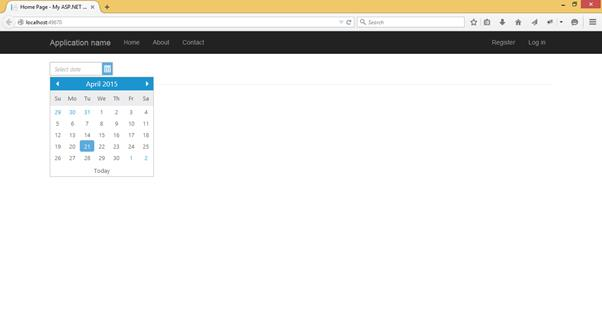

Thus the **DatePicker** control is rendered successfully with its default appearance.

### Through Syncfusion NuGet Packages

Since **MVC5** is the default version available within the **Visual** **Studio** **2013**, therefore the application won’t be labeled separately as MVC 5 in the **New** **Project** template. You need to simply select the **ASP.NET** **Web** **application** in the **New** **Project** dialog and choose **MVC** in the next step.

#### Creation of First MVC application

Start the Visual Studio 2013. Create a new MVC application by selecting **File** -> **New** -> **Project** and provide it with some meaningful name as shown below,

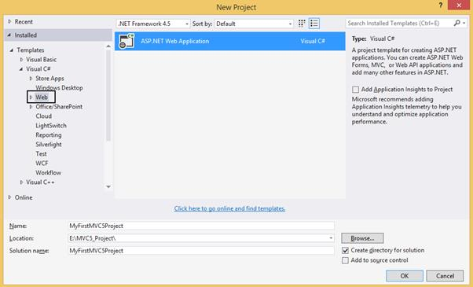

In the next step, it will prompt you for the **Template** selection. Select **MVC** template and Click **OK**, so that the core references and folders required for MVC application will be added into your project.

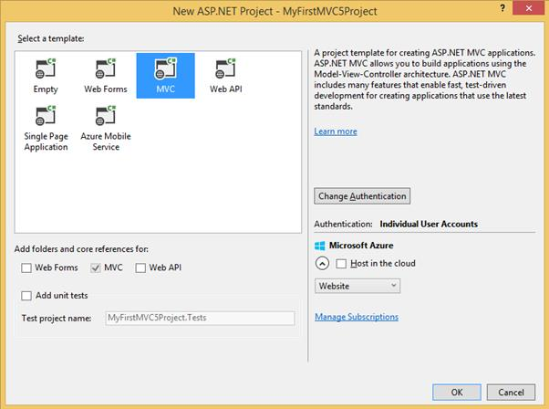

The above two steps allows you to create your initial MVC5 project successfully. Now you can build and run your application by pressing Ctrl+F5, which shows something similar to the following screenshot in your web browser,

#### Configuring Syncfusion NuGet Packages

The steps to download and configure the required Syncfusion NuGet Packages in Visual Studio 2013 are as follows.

Download the Syncfusion NuGet Packages for **ASP.NET** **MVC** & **JavaScript** from [here](http://nuget.syncfusion.com/login) and save it in your system. The downloaded file is a zip formatted file, therefore unzip the folders and copy only the below specified packages present within it. Create a new folder namely **Nuget** **Packages** in any of the particular location in your system and place the below specified files into it,

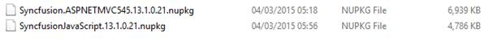

N> For rendering Syncfusion MVC components within the MVC application, the script and stylesheet references are mandatory. Therefore it is necessary to download **Syncfusion** **Nuget** **Packages** for both ASP.NET MVC and JavaScript.

In Visual Studio, navigate to **Tools** -> **Nuget** **Package** **Manager** -> **Package** **Manager** **Settings**, the **Options** pop-up will appear on the screen as below,

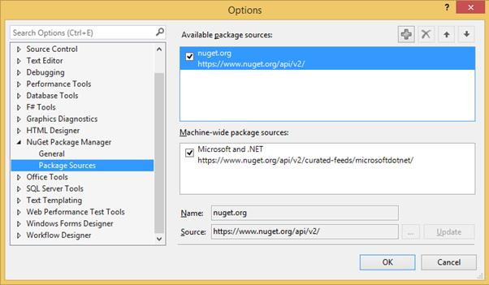

Select **Nuget** **Package** **Manager** -> **Package** **Sources** in the above pop-up and click on the 
button at the top to add new package source to the project. Now the pop-up will appear as below after clicking on the **Add** icon,

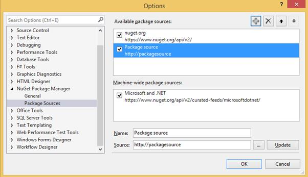

To add the required packages into your project, navigate to the location where the above specified collection of Syncfusion NuGet packages are located (namely, within the **Nuget** **Packages** folder) in your system, by clicking on the 
button and provide it with a unique name (Syncfusion NuGet Packages) as shown in the below image. Click on the **Update** button now and the new package name get listed in the **Available** **package** **sources** list as shown below and then click **OK**.

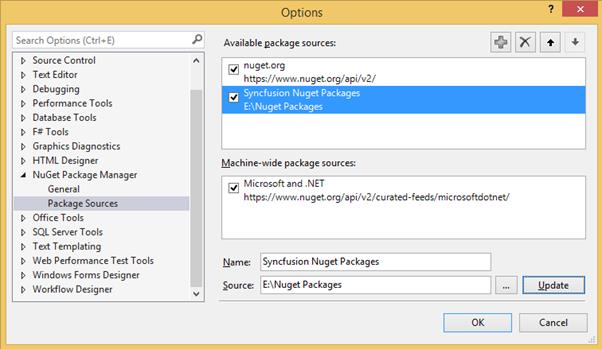

N> The **Source** textbox in the above image denotes the location of the Syncfusion NuGet packages in your machine and the **Name** section, allows you to provide a unique name which we will refer in the package installation section later.

The configuration part of Syncfusion NuGet packages ends here and now it is necessary to proceed with its installation.

#### Installing NuGet into your project

Right click on your project in the solution explorer and select **Manage** **Nuget** **Packages** options from the sub-menu that pop-up on the screen. Select the **Syncfusion** **Nuget** **Packages** within the **Online** tab, which will display the list of available packages in it, as shown below.

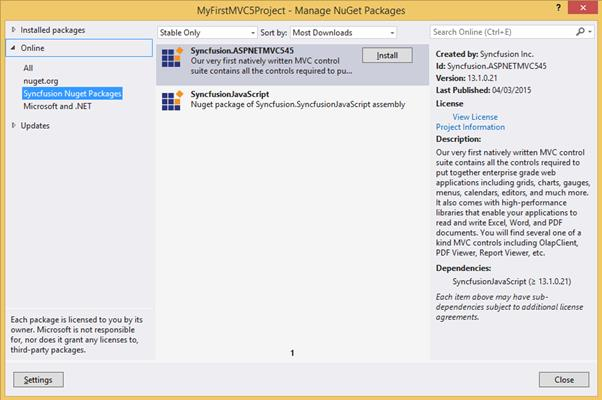

Install the **Syncfusion.ASPNETMVC545** (based on your target MVC application version (MVC5) and the .NET Framework (4.5) used in the sample application) package now, which automatically installs the **SyncfusionJavaScript** package together.

The below image depicts that the NuGet Packages for **JavaScript** and **ASP.NET** **MVC** (with MVC5 & .NET Framework version 4.5) has been successfully installed into your project.

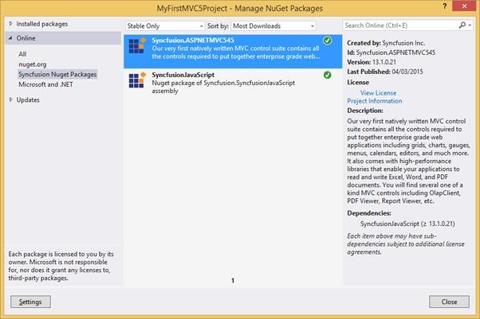

Once the package installation is completed, all the required assembly references, scripts and CSS files will be automatically added to your application. Also, it configures the **web.config** file automatically. The remaining changes that you need to do in your application are as follows. 

#### Unobtrusive Setting in Web.config file

The **Unobtrusive** setting is enabled in your application’s web.config file by default, while initial creation. You need to change its value to **false** in your application as shown below,



<appSettings>
    <add key="webpages:Version" value="3.0.0.0" />
    <add key="webpages:Enabled" value="false" />
    <add key="ClientValidationEnabled" value="true" />
    <add key="UnobtrusiveJavaScriptEnabled" value="false" />
</appSettings>



If suppose, you require the **Unobtrusive** to set to **true** in your application, then you need to include the **ej.unobtrusive.min.js** file as a reference to your application.

#### Adding Script Manager to ~/Views/Shared/_Layout.cshtml

Since, the Unobtrusive setting in the web.config file is disabled now, therefore it is necessary to add the script manager in your application to render the controls properly. 

You need to add the script manager code in the **_Layout.cshtml** file present within the **~/Views/Shared** folder of your application. Add it before the closing body tag in the _Layout.cshtml file.



<body>
    … 
    … 
    @RenderSection("scripts", required: false) 
    @Html.EJ().ScriptManager()
</body>



N> The main reason for referring the Script manager in _Layout file is that, it can be referred as common by all the View files present within your application. If **unobtrusive** is set to true in the application, then the script manager can be excluded, as the control is initialized using HTML5 attributes.

#### Adding reference to the required StyleSheets

Since the stylesheets are automatically loaded into the Content folder of your application, include the below specified reference to the **ej.web.all.min.css** file in the **~/Views/Shared/_Layout.cshtml** file, within the head section – as this file contains the styles applied for all the Syncfusion MVC controls.



<head>
    <meta charset="utf-8" />
    <title>@ViewBag.Title - My ASP.NET MVC Application</title>
    <meta name="viewport" content="width=device-width, initial-scale=1.0" /> 
    … 
    …
    <link href="@Url.Content("~/Content/ej/web/default-theme/ej.web.all.min.css")" rel="stylesheet" />
</head>



#### Adding reference to the required JavaScript files

It is mandatory to include the reference to the required JavaScript files in your project, so as to render the Syncfusion MVC controls properly. This should be done within the **_Layout.cshtml** file, as we did previously for CSS files. 

Add the below script references in the **~/Views/Shared/_Layout.cshtml** file, within the head section,



<head>
    <meta charset="utf-8" />
    <title>@ViewBag.Title - My ASP.NET MVC Application</title>
    … 
    …
    <link href="@Url.Content("~/Content/ej/web/default-theme/ej.web.all.min.css")" rel="stylesheet" />
</head>

<body>
    … 
    …
    
    
    
    
    @Html.EJ().ScriptManager() 
    @RenderSection("scripts", required: false)
</body>



N> The order of the reference to the script files made in the above section should be maintained in the same manner as mentioned above.

I> Since the **jquery-1.10.2.min.js** file is referred explicitly in the application, therefore make sure that your application doesn’t refer to any other jQuery versions multiple times, which will cause the script error. Make sure that the jQuery scripts are not again referred through bundles in **_Layout.cshtml** file. 

#### Adding Syncfusion MVC control

After performing the above steps, now you can add the control code as mentioned below in the **Index.cshtml** file present within **~/Views/Home** folder.



    @Html.EJ().DatePicker("MyFirstDatePicker")



Simply build and run the project by pressing F5, so that you can now see the output similar to the below screenshot.

### Manual Integration of Syncfusion MVC components into new/existing MVC applications

Here, the MVC 5 application is created using Visual Studio 2013 to depict the required screenshots.

#### Creation of new MVC Application

If you are in need of adding our components into a new MVC5 Application, then follow the below steps,

Start the Visual Studio 2013. Create a new MVC application by selecting **File** -> **New** -> **Project** and provide it with some meaningful name as shown below,

In the next step, it will prompt you for the **Template** selection. Select **MVC** template and Click **OK**, so that the core references and folders required for MVC application will be added into your project.

The above two steps allows you to create your initial MVC5 project successfully. Now you can build and run your application by pressing Ctrl+F5, which shows something similar to the following screenshot in your web browser,

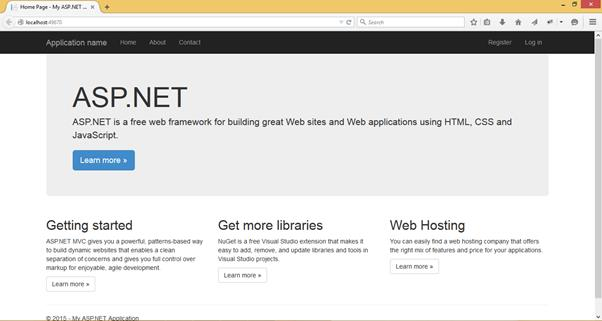

You have successfully created your first simple MVC5 application and now it is time to add some other essential things to your application, so that you can make use of our Syncfusion controls into it.

#### For existing applications

In case, if you want to manually integrate the Syncfusion MVC components into your existing MVC5 application, then just open your existing project in Visual Studio by **File** -> **Open** -> **Project/Solution** and follow the below specified steps in it.

#### Assembly Reference

Refer the following three assemblies in your newly created/ existing MVC application, which will allow you to make use of any of the Syncfusion MVC controls within it.

* Syncfusion.EJ
* Syncfusion.EJ.Mvc

The reference to the Syncfusion assemblies can be added to your MVC application in either of the following ways, 

* Referring from GAC
* Referring from the installed location

##### Referring from GAC

Once you have installed the Essential Studio package in your system, the Syncfusion assemblies are automatically registered in the GAC. You can easily add the reference assemblies to your project by choosing **Add** **Reference** option as shown below,

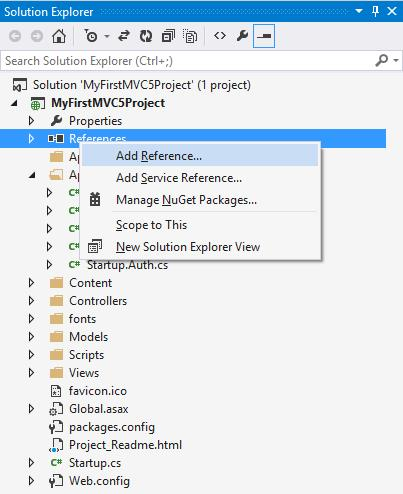

Now the **Reference** **Manager** pop-up will appear on the screen. In that pop-up, select the required assemblies from the **Extensions** tab as below, by choosing the appropriate versions (**{{ site.45esreleaseversion }}** version for **Syncfusion.EJ** assembly and **{{ site.mvc5releaseversion }}** version for **Syncfusion.EJ.Mvc**). The version to be chosen for the reference assemblies is based on the Framework and the MVC versions used in the application.

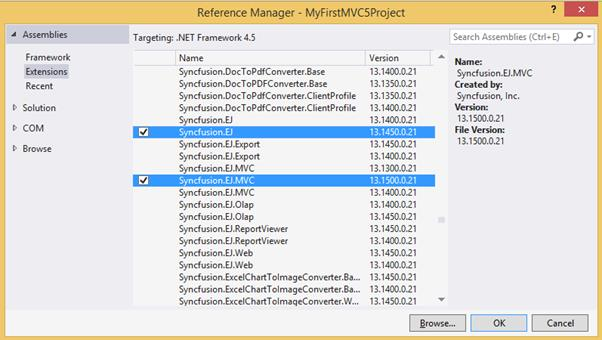

##### Steps for adding reference assemblies from the installed location

Add the reference assemblies to your project by choosing **Add** **Reference** option as shown below,

Now the **Reference** **Manager** pop-up will appear on the screen. Select the **Browse** tab in it and navigate to the installed location of the Syncfusion Essential Studio package in your system. (As depicted in the below image.)

`(installed location)\Syncfusion\Essential Studio\{{ site.releaseversion }}\precompiledassemblies\{{ site.releaseversion }}`

_**For** **example**, If you have installed the Essential Studio package within **C:\Program Files (x86),** then navigate to the below location,_ 
`C:\Program Files (x86)\Syncfusion\Essential Studio\{{ site.releaseversion }}\precompiledassemblies\{{ site.releaseversion }}`

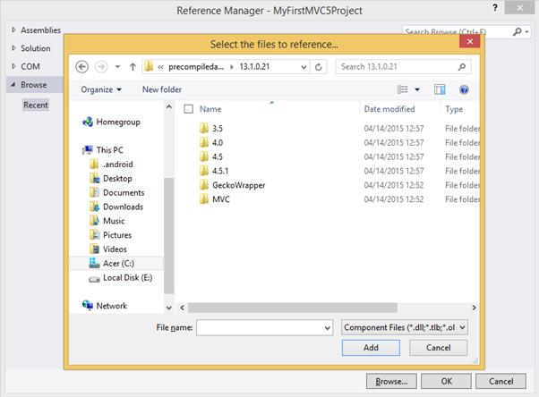

N> In the above image, the **MVC** folder contains all the assemblies required for the MVC controls differentiated under the different MVC version category (**MVC3**, **MVC4**, **MVC5**). **Syncfusion.EJ.Mvc** **dll** is available within this folder.

The other folders **3.5**, **4.0**, **4.5**, **4.5.1** in the above image denotes the .NET Framework versions that your application uses. Based on your application’s Framework version used, you can choose assemblies from it. The other common assembly **Syncfusion.EJ** is available within these folders.

Now add the **Syncfusion.EJ.Mvc** Assembly to your application from the below specified location, (since you are working on the MVC 5 application, therefore navigate further into the folder MVC\MVC5, from the previously mentioned location – refer the below images)

`(installed location)\Syncfusion\Essential Studio\{{ site.releaseversion }}\precompiledassemblies\{{ site.releaseversion }}\MVC\MVC5`

_**For** **example**, If you have installed the Essential Studio package within **C:\Program Files (x86),** then navigate to the below location,_ 
`C:\Program Files (x86)\Syncfusion\Essential Studio\{{ site.releaseversion }}\precompiledassemblies\{{ site.releaseversion }}\MVC\MVC5`

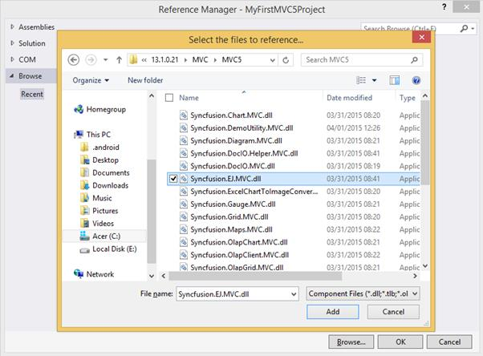

Now you need to add the **Syncfusion.EJ** assembly to your application from the below specified location, (since MVC5 assemblies (System.Web.Mvc,System.Web.Razor etc) uses the .NET Framework version 4.5 for compilation purpose we also need to refer the same Framework to avoid assembly conflict issues, therefore navigate to the folder **4.5** and select the above base assemblies, in the previously mentioned location – refer the below images)

`(installed location)\Syncfusion\Essential Studio\{{ site.releaseversion }}\precompiledassemblies\{{ site.releaseversion }}\4.5`

_**For** **example**, If you have installed the Essential Studio package within **C:\Program Files (x86),** then navigate to the below location,_ 
`C:\Program Files (x86)\Syncfusion\Essential Studio\{{ site.releaseversion }}\precompiledassemblies\{{ site.releaseversion }}\4.5`

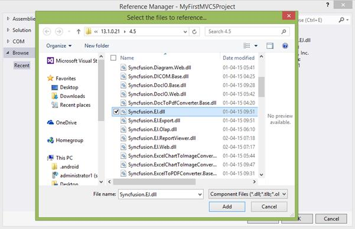

Once the assembly selection is done, click **OK** to add the selected references to your project. You can view the assembly references added to your application, in the solution explorer as shown below,

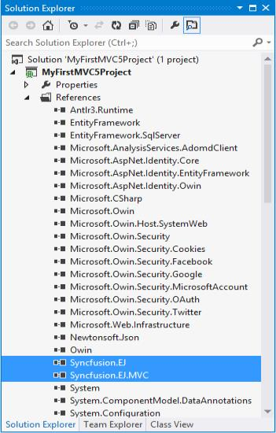

#### Registering Syncfusion Assemblies within the Application’s Root Web.config

In your application’s root web.config file, add the below assembly information within the <**assemblies**> tag.



<system.web>
    <compilation debug="true" targetFramework="4.5">
        <assemblies>
            <add assembly="Syncfusion.EJ, Version={{ site.45esreleaseversion }}, Culture=neutral, PublicKeyToken=3d67ed1f87d44c89" />
            <add assembly="Syncfusion.EJ.Mvc, Version={{ site.mvc5releaseversion }}, Culture=neutral, PublicKeyToken=3d67ed1f87d44c89" />
        </assemblies>
    </compilation>
    <authentication mode="Forms">
    …
</system.web>



#### Registering namespaces within Web.config

Now you need to register the below mentioned two namespaces in the **web.config** file present within the **Views** folder as well as the **Root** directory of your application.

* Syncfusion.JavaScript
* Syncfusion.MVC.EJ



<namespaces>
    <add namespace="System.Web.Mvc" />
    <add namespace="System.Web.Mvc.Ajax" />
    <add namespace="System.Web.Mvc.Html" />
    <add namespace="System.Web.Optimization" />
    <add namespace="System.Web.Routing" />
    <add namespace="Syncfusion.JavaScript" />
    <add namespace="Syncfusion.MVC.EJ" />
</namespaces>



#### Unobtrusive Setting in Web.config file

The **Unobtrusive** setting is enabled in your application’s web.config file by default, while initial creation. You need to change its value to **false** in your application as shown below,



<appSettings>
    <add key="webpages:Version" value="3.0.0.0" />
    <add key="webpages:Enabled" value="false" />
    <add key="ClientValidationEnabled" value="true" />
    <add key="UnobtrusiveJavaScriptEnabled" value="false" />
</appSettings>



If suppose, you require the Unobtrusive to set to true in your application, then you need to include the **ej.unobtrusive.js** file as a reference to your application. We’ll see about this in a detailed section later.

#### Adding Script Manager to ~/Views/Shared/_Layout.cshtml

Since, the Unobtrusive setting in the web.config file is disabled now, therefore it is necessary to add the script manager in your application to render the controls properly. You need to add the script manager code in the **_Layout.cshtml** file present within the **~/Views/Shared** folder of your application. Add it before the closing body tag in the _Layout.cshtml file.



<body>
    … 
    … 
    @RenderSection("scripts", required: false) 
    @Html.EJ().ScriptManager()
</body>



N> The main reason for referring the Script manager in _Layout file is that, it can be referred as common by all the View files present within your application. If **unobtrusive** is set to true in the application, then the script manager can be excluded, as the control is initialized using HTML5 attributes.

#### Adding the required StyleSheets

To render the Syncfusion MVC controls with its unique style and theme, it is necessary to refer the required CSS files into your application. You need to copy all the required CSS files into your application from the following location,

`(installed location)\Syncfusion\Essential Studio\{{ site.releaseversion }}\JavaScript\assets\css\web`

_**For** **example**, If you have installed the Essential Studio package within **C:\Program Files (x86),** then navigate to the below location,_
`C:\Program Files (x86)\Syncfusion\Essential Studio\{{ site.releaseversion }}\JavaScript\assets\css\web`

When you navigate to the above location, you can find the files shown in the below image, which you need to copy entirely and paste it into your root application. 

Before pasting it into your application, create a folder named `ej/web` within the `Content` folder of your application and place all the copied files into it as shown below,

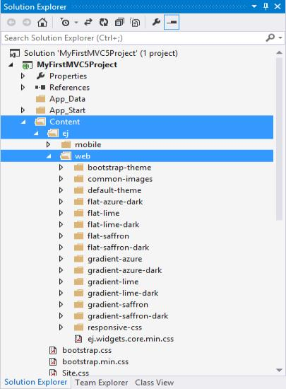

N> The **common-images** folder is needed to be copied into your application mandatorily, as it includes all the common font icons and other images required for the control to render.

Once the stylesheets are added in your application, include the below specified reference to the **ej.web.all.min.css** file in the **~/Views/Shared/_Layout.cshtml** file, within the head section – as this file contains the styles applied for all the Syncfusion MVC controls.



<head>
    <meta charset="utf-8" />
    <title>@ViewBag.Title - My ASP.NET MVC Application</title>
    <meta name="viewport" content="width=device-width" /> 
    … 
    …
    <link href="@Url.Content("~/Content/ej/web/default-theme/ej.web.all.min.css")" rel="stylesheet" />
</head>



#### Adding the required JavaScript files

Adding the required JavaScript files into your application plays an important role, without which the Syncfusion controls cannot be created. It requires the following mandatory common script files,

* jQuery-1.10.2.min.js 
* jquery.easing.1.3.min.js
* jsrender.min.js

Apart from the above common scripts, it is also necessary to refer the **ej.web.all.min.js** file in your application, which contains all JavaScript components scripts in minified format.

You need to copy the above specified 4 external script files into your application from the following location,

`(installed location)\ Syncfusion\Essential Studio\{{ site.releaseversion }}\JavaScript\assets\external` 

_**For** **example**, If you have installed the Essential Studio package within **C:\Program Files (x86),** then navigate to the below location,_
`C:\Program Files (x86)\Syncfusion\Essential Studio\{{ site.releaseversion }}\JavaScript\assets\external`

When you navigate to the above location, you can find the common script files as shown in the below image, where you need to copy only the required script files and paste it into the **Scripts** folder of your root application. 

Now navigate to the below location and copy the **ej.web.all.min.js** file from the listed files.

`(installed location)\ Syncfusion\Essential Studio\{{ site.releaseversion }}\JavaScript\assets\scripts\web`

_**For** **example**, If you have installed the Essential Studio package within **C:\Program Files (x86),** then navigate to the below location,_
`C:\Program Files (x86)\Syncfusion\Essential Studio\{{ site.releaseversion }}\JavaScript\assets\scripts\web`

Now, create a folder named `ej` within the `Scripts` folder of your application and place the copied file **ej.web.all.min.js** file into it as shown below,

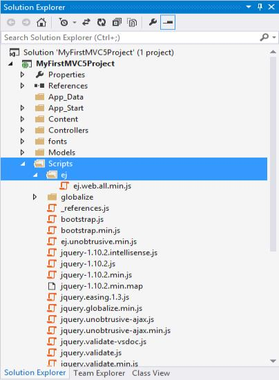

Once the scripts are added in your application, now it is necessary to include the reference to it in your project. This should be done within the _Layout.cshtml file, as we did previously for CSS files. 

Add the below script references in the **~/Views/Shared/_Layout.cshtml** file, within the head section,



<head>
    <meta charset="utf-8" />
    <title>@ViewBag.Title - My ASP.NET MVC Application</title>
    … 
    …
    <link href="@Url.Content("~/Content/ej/web/default-theme/ej.web.all.min.css")" rel="stylesheet" />
</head>

<body>
    … 
    …
    
    
    
    
    @Html.EJ().ScriptManager() 
    @RenderSection("scripts", required: false)
</body>



N> The order of the reference to the script files made in the above section should be maintained in the same manner as mentioned above.

I> Since the **jquery-1.10.2.min.js** file is referred explicitly in the application, therefore make sure that your application doesn’t refer to any other jQuery versions multiple times, which will cause the script error. Make sure that the jQuery scripts are not again referred through bundles in **_Layout.cshtml** file.

#### CDN Link reference

If you want to refer the CDN links instead of the direct script and CSS references in your application, then you need to make use of the below references in the _Layout.cshtml file,



<head>
    <meta charset="utf-8" />
    <title>@ViewBag.Title - My ASP.NET MVC Application</title>
    … 
    …
    <link href="http://cdn.syncfusion.com/{{ site.releaseversion }}/js/web/flat-azure/ej.web.all.min.css" rel="stylesheet" />
</head>

<body>
    … 
    …
    
    
    
    
    @Html.EJ().ScriptManager() 
    @RenderSection("scripts", required: false)
</body>



#### Adding Syncfusion MVC control

All the required settings are added successfully to your application and finally, now it is time to add our Syncfusion control into it. To do so, we are going to showcase initially, how to add the **DatePicker** control into your application. It is so simple, as you just need to place the following code within the **Index.cshtml** (removing all the unwanted content within it) file, which is present within the **~/Views/Home** folder.



    @Html.EJ().DatePicker("MyFirstDatePicker")



Now build and run the application by pressing F5, you can see something similar to the below screenshot in your web browser,

The DatePicker is rendered with its default appearance. You can then use its various properties to set its value and also make use of its available events to trigger when necessary.

## ASP.NET MVC6 and RC1 Configuration

This document briefly explains how to configure the ASP.NET MVC6 to your local machine.

### Prerequisites

The following prerequisites are necessary to work on ASP.NET MVC6. So please make sure to have these on your system

*  Download [Visual Studio 2015](https://www.microsoft.com/en-us/download/details.aspx?id=49989) Update 1.

*  Download [Microsoft ASP.NET Web Tools 2015 (RC1)](https://www.microsoft.com/en-us/download/details.aspx?id=49959).

### Configuration steps

Refer the following steps to configure ASP.NET MVC6 on your system

*  Open the [GitHub ASP.NET](https://github.com/aspnet/home) page that guides you to configure the ASP.NET MVC6.

*  From that page you have to copy the below mentioned command for Upgrading **DNVM**.



@powershell -NoProfile -ExecutionPolicy unrestricted -Command "&{$Branch='dev';$wc=New-Object System.Net.WebClient;$wc.Proxy=[System.Net.WebRequest]::DefaultWebProxy;$wc.Proxy.Credentials=[System.Net.CredentialCache]::DefaultNetworkCredentials;Invoke-Expression ($wc.DownloadString('https://raw.githubusercontent.com/aspnet/Home/dev/dnvminstall.ps1'))}"



*  Run this command in command prompt in [Administrator mode](https://technet.microsoft.com/en-in/library/cc947813(v=ws.10).aspx),which will download the **DNVM (.NET Version Manager)**script as mentioned in the below screenshotand place it in your user profile. The DNVM works manipulate from this installed path.

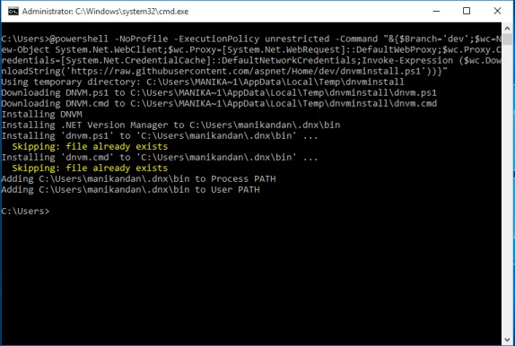

*  Now you can check the existing location of **DNVM** by executing the following command in a prompt window.



**C:\Users> where dnvm**



*  After the DNVM installation, execute the following mentioned command in the prompt window to know about the current DNVM version.



**C:\Users> dnvm**



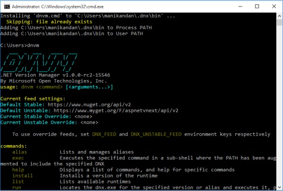

*  Download the **DNX (.NET Execution Environment)** to your local machine with the help of already installed **DNVM** by executing the following command as given below.



**C:\Users> dnvm upgrade**



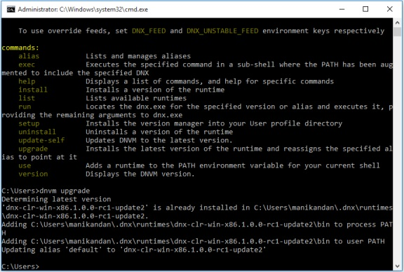

*  After this installation is completed, please run the below mentioned command. It will list out the DNX version installed in your local machine. In which, the default selected version is marked with asterisk (*****) symbol.



**C:\Users> dnvm list**



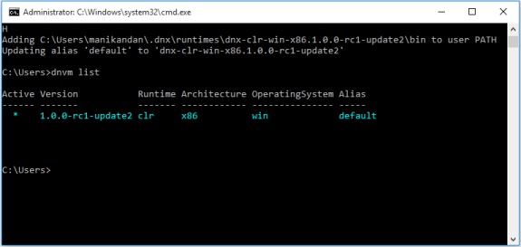

*  If, the asterisk symbol is not marked to any specific installed DNX version. You need to update the default one to latest DNX version by execute the following command in prompt window.



**C:\Users> dnvm use 1.0.0-rc1-update2 -p**



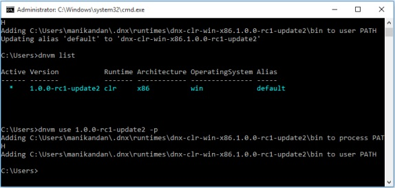

*  Then execute the **dnvm list** command to identify the modified active DNX version.



**C:\Users> dnvm list**



*  Once again, please ensure whether the changes are got reflected in your local machine by checking the **default.txt** file available in the following location. This should contain the version same as the default active version that you have selected.



**C:\Users\{user name}\.dnx\alias**



## Deploying ASP.NET MVC6 Sample

The following steps helps to know how to run the ASP.NET MVC6 sample.

*  Open the **Visual Studio 2015**.

*  Select **File - > New Project**.

*  Choose **Templates -> Visual C# -> ASP.NET Web Application**.

*  Specify the name and location for the project.

*  Select the **Web Application** option from an **ASP.NET 5 Template**.

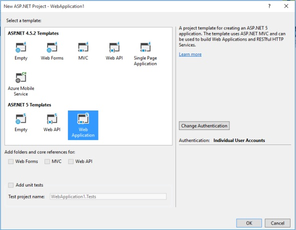

* Click OK to create the ASP.NET MVC6 application.

* In Solution Explorer window, right click the project name and choose the “**Properties**” option.

* In that Property window, open the application tab and choose the latest DNX version (list out the existing configured version) from the Solution SDK DNX Version combo box, then save the project.

* Select the **Tools -> NuGet Package Manager -> Package Manger Settings -> Package Manager**.

* In this Package Sources window, you need to add the MVC6 related online feed link and click OK button to complete the configuration. (This online feed will helps to download an unavailable packages in local machine that may be used in your application)

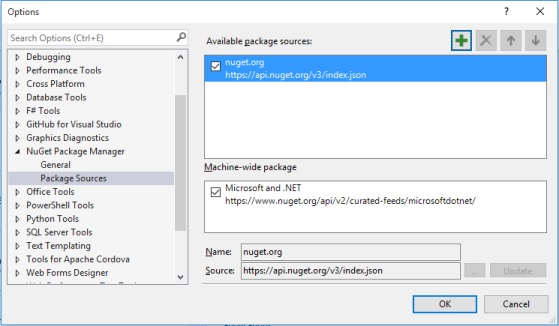

* Then press F5 or click the **IIS Express** option to deploy and run your web application project.

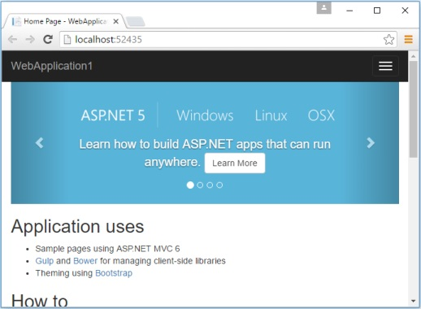

## Deploying Syncfusion Components in ASP.NET MVC6

After your successful ASP.NET MVC6configuration to your local machine and Visual Studio 2015, Please refer the below steps to deploy our Syncfusion components in ASP.NET MVC6Web applications.Before follow the below guidelines,please make sure that you have installed our latest [Essential Studio ASP.NET MVC](http://www.syncfusion.com/downloads/aspnetmvc) setup in your machine.

* Open the **Visual Studio 2015**.

* Select **File - > New Project**.

* Choose **Templates -> Visual C# -> ASP.NET Web Application**.

* Specify the name and location for the project.

* Select the Web Application option from an ASP.NET 5 Template.

* Click OK to create the Web Application project.

* Right click the project name from the solution explorer window then choose the properties option.

* In the application tab of property window, choose the “**1.0.0-rc1-update2**” from the Solution SDK DNX Version combo box.

* Open the **project.json** file from the solution explorer window and type our **Syncfusion NuGet** Packages as mentioned below,

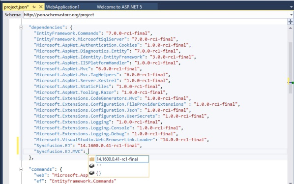

* After this NuGet package references, save the **project.json** file to include the two Syncfusion packages to your application.

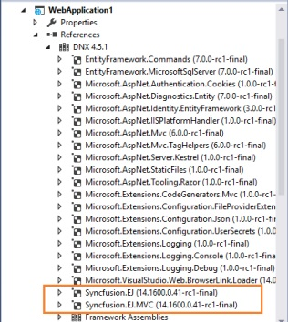

* Now open **_viewImports.cshtml** file from the views folder and add the following namespace for our components references and Tag Helper support.



@using Syncfusion.JavaScript

@addTagHelper "*, Syncfusion.EJ"



* To render the Syncfusion MVC controls with its unique style and theme, it is necessary to refer the required CSS files into your application. You need to copy all the required CSS files into your application from the following location,

`(installed location)\Syncfusion\Essential Studio\{{ site.releaseversion }}\MVC\samples\web\content`

_**For** **example**, If you have installed the Essential Studio package within **C:\Program Files (x86),** then navigate to the below location,_
`C:\Program Files (x86)\Syncfusion\Essential Studio\{{ site.releaseversion }}\MVC\samples\web\content`

When you navigate to the above location, you can find the folder “**ejthemes**” shown in the below image, which you need to copy entirely and paste it into your root application.

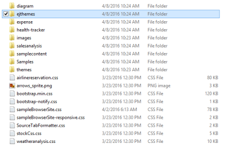

Before pasting it into your application, you need to traversal within the **wwwroot\css** folder of your application and place all the copied files into it as shown below,

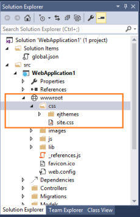

To refer the below CSS stylesheet in your application in **layout.cshtml** page to render our components properly.



<html>
<head>
    <link href="@Url.Content("~/css/ejthemes/default-theme/ej.widgets.all.min.css")" rel="stylesheet"/>
</head>
</html>



* Adding the required JavaScript files into your application plays an important role, without which the Syncfusion controls cannot be created. It requires the following mandatory common script files,

    *   jQuery-1.10.2.min.js

    *   jquery.easing.1.3.min.js

    *   jsrender.min.js

Apart from the above common scripts, it is also necessary to refer the **ej.web.all.min.js** file in your application, which contains all JavaScript components scripts in minified format.

You need to copy the above specified 4 external script files into your application from the following location,

`(installed location)\Syncfusion\Essential Studio\{{ site.releaseversion }}\MVC\samples\web\content`

_**For example**, If you have installed the Essential Studio package within **C:\Program Files (x86),** then navigate to the below location,_
`C:\Program Files (x86)\Syncfusion\Essential Studio\{{ site.releaseversion }}\MVC\samples\web\scripts`

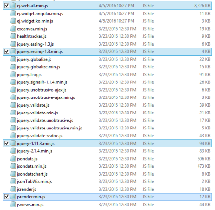

Before pasting it into your application, now you need to traversal within the **wwwroot** folder and create a folder named “**scripts**” of your application and place all the copied files into it as shown below,

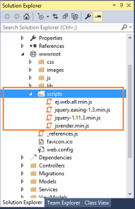

Refer the below mandatory Script files in the **layout.cshtml** page to render our components properly. 



<head>
    <link href="@Url.Content("~/css/ejthemes/flat-saffron/ej.widgets.all.min.css")" rel="stylesheet"/>
    
    
    
    
</head>



> Also completely remove the already referred scripts and themes within the **environment** tag. The order of the reference to the script files made in the above section should be maintained in the same manner as mentioned above.

I> Since the **jquery-1.11.3.min.js** file is referred explicitly in the application, therefore make sure that your application doesn’t refer to any other jQuery versions multiple times, which will cause the script error. Make sure that the jQuery scripts are not again referred through bundles in **_Layout.cshtml** file.

* Then add **ScriptManager** to end of the body tag in the **layout.cshtml** page. The ScriptManager used to place our control initialization script in the page. 



<**ej-script-manager**></**ej-script-manager**> 



* After the all configuration completion, open your view page to render our Syncfusion components with ASP.NET MVC6 Tag Helper syntax.



<**ej-rating** id="DefaultRating" **value**="3" />



* Finally compile your project, after successful compilation then press F5 key to deploy your project.

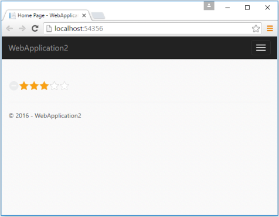

## Integration of Syncfusion MVC components into an existing MVC Application using Project Conversion Wizard

In order to achieve the conversion of normal MVC application into Syncfusion MVC application, it is mandatory that you need to install the MVC extension in your machine as mentioned in the **Project** **Template** topic. To add the Syncfusion MVC controls into an existing ASP.NET MVC application, refer the below steps,

Open your existing MVC application from **File** -> **Open** -> **Project/Solution** and right click on your project in the Solution Explorer.

In the context menu that pops up, select the option **Syncfusion** **VS** **Extensions** -> **Convert** **to** **Syncfusion** **MVC** **Application**. Now the **Project** **Conversion** **Wizard** pops up as shown below,

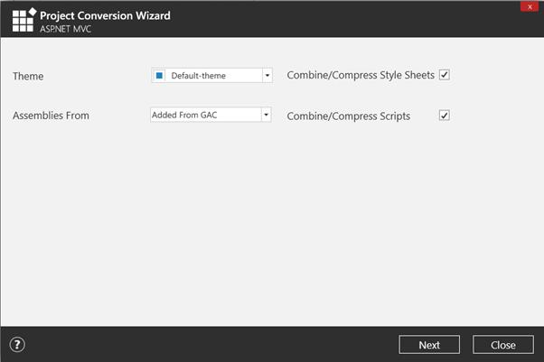

Make appropriate selection in it and click **Next** button, which again opens the next options to be chosen as shown below,

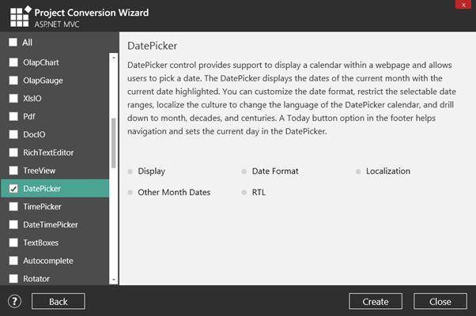

Select your required control in it and click **Create**, so that all the required assemblies, scripts & CSS references needed to render the control will get automatically added to your existing project and also the configurations in web.config will also be done automatically. 

Ensure whether the **Unobtrusive** setting is enabled in your application’s web.config file. If it is enabled, then you need to change its value to **false** in your application as shown below,



<appSettings>
    <add key="ClientValidationEnabled" value="true" />
    <add key="UnobtrusiveJavaScriptEnabled" value="false" />
</appSettings>



N> If suppose, you require the Unobtrusive to set to **true** in your application, then you need to include the **ej.unobtrusive.min.js** file as a reference to your application.

Since, the Unobtrusive setting in the web.config file is disabled now, therefore it is necessary to add the script manager in your application to render the controls properly. Add the below script manager code in the **_Layout.cshtml** file present within the **~/Views/Shared** folder of your application as shown below,



<body>
    … 
    … 
    @RenderSection("scripts", required: false) 
    @Html.EJ().ScriptManager()
</body>



N> The main reason for referring the Script manager in _Layout file is that, it can be referred as common by all the View files present within your application. If **unobtrusive** is set to true in the application, then the script manager can be excluded, as the control is initialized using HTML5 attributes.

In the next step, the script and CSS files has to be explicitly referred in the head section of the **_Layout.cshtml** page of your existing application as shown below,



<head>
    <meta charset="utf-8" />
    <title>@ViewBag.Title - My ASP.NET MVC Application</title>
    … 
    …
    <link href="@Url.Content("~/Content/ej/web/default-theme/ej.web.all.min.css")" rel="stylesheet" />
</head>

<body>
    … 
    …
    
    
    
    
    @Html.EJ().ScriptManager() 
    @RenderSection("scripts", required: false)
</body>



N> The order of the reference to the script files made in the above section should be maintained in the same manner as mentioned above.

I> Since the **jquery-1.10.2.min.js** file is referred explicitly in the application, therefore make sure that your application doesn’t refer to any other jQuery versions multiple times, which will cause the script error. Make sure that the jQuery scripts are not again referred through bundles in **_Layout.cshtml** file.

Now you can add the below **DatePicker** code in the **Index.cshtml** file present within **~/Views/Home** folder.



    @Html.EJ().DatePicker("MyFirstDatePicker")



Simply build and run the project by pressing F5, so that you can now see the output similar to the below screenshot in your web browser,

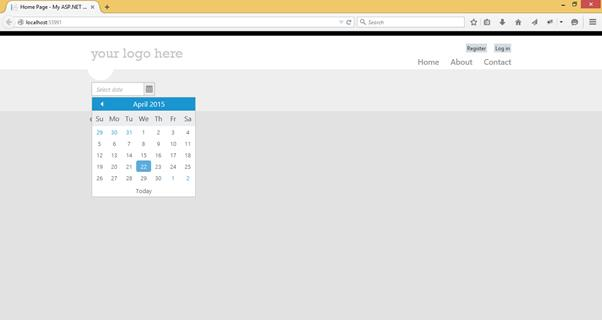

Thus the **DatePicker** control is rendered successfully with its default appearance.

## Upgrading Syncfusion MVC Project to newer Syncfusion Essential Studio Version using MVC Project Migration Wizard

The existing Syncfusion MVC project can be migrated to the newer Essential Studio versions using **MVC** **Project** **Migration** **Wizard**. In order to achieve this, it is mandatory that you need to install the MVC extension in your machine as mentioned in the **Project** **Template** topic. Follow the below steps to upgrade your existing Syncfusion MVC project to newer versions,

Open your existing **Syncfusion** **MVC** **Project** (For example, the MVC Project created with the older Syncfusion version 12.4.0.24) from **File** -> **Open** -> **Project/Solution** and right click on your project in the Solution Explorer.

In the context menu that pops up, select the option **Syncfusion** **VS** **Extensions** -> **Migrate** **the** **Project** **to** **Another** **Version** as shown in the below option,

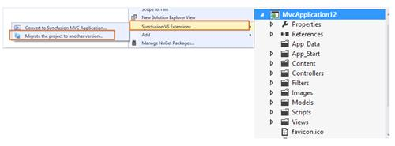

Now the Migration window titled **MVC** **Project** **Migration** **wizard** will gets opened as shown below, to choose the required Syncfusion version which is installed in your machine and click **Migrate** button.

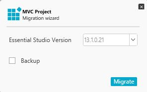

The option **Backup** in the above window will copy the original project (with older version) into the **Backup** folder of the same project location where the newly migrated project is placed.

Now the corresponding Syncfusion assembly version references, CSS, Script files and also the web.config version changes will be added and reflected automatically in the newly migrated project. You can simply build and run your migrated project by pressing **F5**.

N> i. Since we are migrating the older **Syncfusion** **MVC** **project** here, therefore we assume that all the required script and CSS references are already configured in the _Layout.cshtml page of your old project.
N> ii. Also, we assume that the Unobtrusive setting is set to **false** and also other assembly configurations & namespace reference are already present within the web.config file.
N> iii. Also, ensure the presence of **ScriptManager** code in the _Layout.cshtml page of your old project. 

In case, if the above specified settings are not present in your MVC project, then include in into the project by following the steps mentioned in the **Project** **Conversion** **Wizard** topic.

## To Enable Unobtrusive option in your Application

We have already seen that the unobtrusive option is enabled by default during the initial MVC application creation. When this option is set to **true** in the web.config file, the control usually renders with the HTML5 attributes and also the reference to the **ej.unobtrusive.js** file needs to be included in the application.

If you explicitly set this option to **false**, then the control rendering takes place through scripts, which requires the usage of script manager in your application.

Normally, the unobtrusive option is set in the application’s root web.config file as shown below,



<appSettings>
    <add key="UnobtrusiveJavaScriptEnabled" value="true" />
</appSettings>



To include the **ej.unobtrusive.min.js** file in your application, with unobtrusive option set to true in the web.config - refer the following steps,

Navigate to the below specified installed location,

`(installed location)\ Syncfusion\Essential Studio\{{ site.releaseversion }}\JavaScript\assets\scripts\common`

_**For** **example**, If you have installed the Essential Studio package within **C:\Program Files (x86),** then navigate to the below location,_ 
`C:\Program Files (x86)\Syncfusion\Essential Studio\{{ site.releaseversion }}\JavaScript\assets\scripts\common`

Copy the **ej.unobtrusive.min.js** file from that location as shown in the below image and paste it into the `ej/web` folder present within the `Scripts` folder of your application.

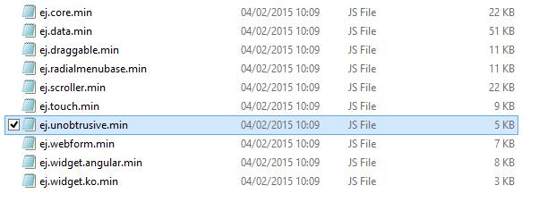

Include the reference to the added **ej.unobtrusive.min.js** file in the **_Layout.cshtml** page as shown below,



<head>
    <meta charset="utf-8" />
    <title>@ViewBag.Title - My ASP.NET MVC Application</title>
    … 
    …
    <link href="@Url.Content("~/Content/ej/web/default-theme/ej.web.all.min.css")" rel="stylesheet" />
</head>

<body>
    … 
    …
    
    
    
    
    
    @Html.EJ().ScriptManager() 
    @RenderSection("scripts", required: false)
</body>



N> The **ej.unobtrusive.min.js** script reference should be included after the reference of **ej.web.all.min.js** file in _Layout.cshtml file. The order should be maintained the same as we have specified above.

