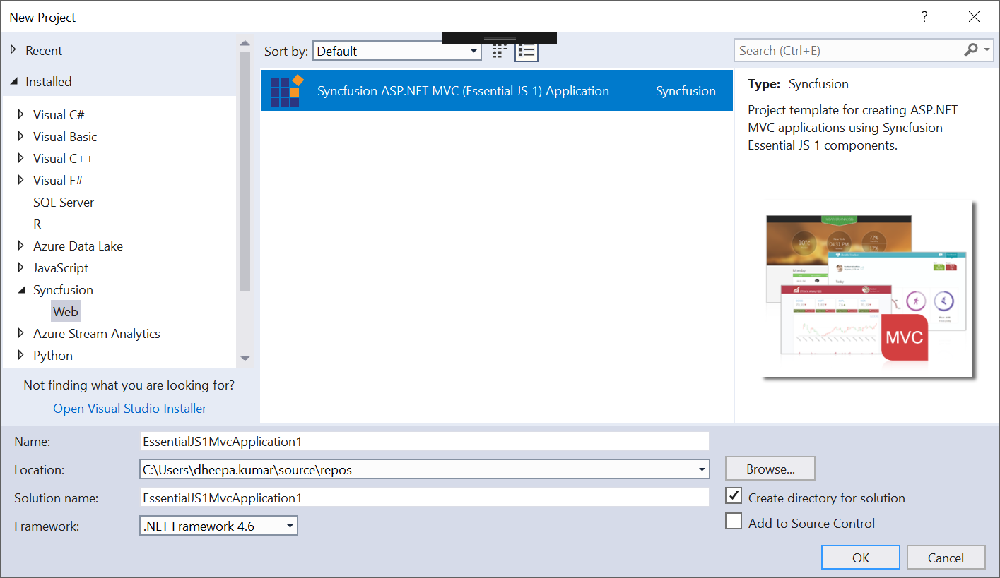
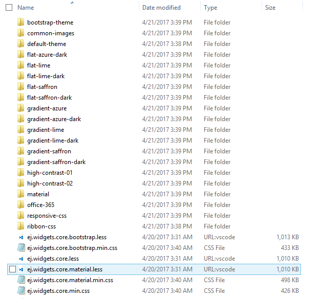

# Getting Started

> Starting with v16.2.0.x, if you reference Syncfusion assemblies from trial setup or from the NuGet feed, you also have to include a license key in your projects. Please refer to this [link](https://help.syncfusion.com/common/essential-studio/licensing/license-key) to know about registering Syncfusion license key in your ASP.NET MVC application to use our components.

This section describes how to configure the Syncfusion ASP.NET MVC components into the ASP.NET MVC applications. There are four ways for embedding our controls into ASP.NET application:

1. Through Syncfusion Project Template
3. Through Syncfusion Project Conversion
3. Through Syncfusion NuGet Packages
4. Through Manual Integration into the new/existing Application

The procedures that are followed in manual integration process are entirely automated, when we create an application using Syncfusion Project template.

The similar steps are followed for integrating the Syncfusion controls into MVC 3, MVC 4, MVC 5, and MVC6 applications, the only thing that makes it a little bit different is the reference assemblies version chosen for each of the target MVC application.

## Through Syncfusion Project Template

Syncfusion provides the Visual Studio Project Templates for the Syncfusion ASP.NET MVC platform to create a Syncfusion MVC application.

The **Project** **Configuration** **Wizard** automates the process of configuring the required Syncfusion assemblies, scripts and their styles within the newly created application. Lets look onto these topics in detail in the following sections.

1. In Visual Studio, create a New **Syncfusion** **ASP.NET** **MVC** **Application** project from **Syncfusion** **Project** **Template** that you can see in the **New** **Project** pop-up as shown in the following image. Name it as SyncfusionMvcApplication1 and click **OK**.

	

2. Then it opens **Project** **Configuration** **Wizard** as shown below. In this Wizard, select **Target** **MVC** **Version** as **MVC5** and keep the **other** options as default. Click **Next**.

	
	
3. Next window will be shown with the list of Syncfusion MVC controls. Choose the required controls and then click **Create**.

	
	
4. Now you can notice the **Syncfusion** **MVC** **5** **References**, **Scripts** and **Styles** are configured into Scripts and Content folders. Also it configures the **web.config** and **_Layout.cshtml** files.

	

5. Then, Syncfusion licensing registration required message box will be shown as follow, if you are installed the trial setup or NuGet packages since Syncfusion introduced the licensing system from 2018 Volume 2 (v16.2.0.41) Essential Studio release. Please navigate to the [help topic](https://help.syncfusion.com/common/essential-studio/licensing/license-key#how-to-generate-syncfusion-license-key) which is shown in the licensing message box to generate and register the Syncfusion license key to your project. Refer to this [blog](https://blog.syncfusion.com/post/Whats-New-in-2018-Volume-2-Licensing-Changes-in-the-1620x-Version-of-Essential-Studio.aspx) post for understanding the licensing changes introduced in Essential Studio.

	
	
6. Now you can add the control **DatePicker** in the **Index.cshtml** file present within **~/Views/Home** folder.

   ~~~ cshtml
		
	@Html.EJ().DatePicker("MyFirstDatepicker")

   ~~~

7. Compile and execute the application. You can able to see the following output in the browser.

	
	
For more information about Project Configuration Templates and their options details, please visit [here](http://help.syncfusion.com/extension/aspnet-mvc-extension/syncfusion-project-templates)

N> Ensure whether your project has only a single reference to jQuery. Because, multiple reference to jQuery in same project will throws console error and control will not be rendered. For more details refer to the KB [here](https://www.syncfusion.com/kb/9197/resolving-jquery-multiple-references-error)

## Through Syncfusion Project Conversion

Syncfusion Project Conversion is a Visual Studio add-in that converts an existing ASP.NET MVC Project into a Syncfusion ASP.NET MVC Project by adding the required assemblies and resource files.

The following steps help you use the Syncfusion Project Conversion in the existing ASP.NET MVC (Web) Project.

1. Open an existing Microsoft MVC Project or create a new Microsoft MVC Project.
2. Right-click on Project and select Syncfusion VS Extensions and choose the Convert to Syncfusion MVC (Web) Application. Refer to the following screenshot for more information.

   

3. Project Conversion Wizard opens so that you can configure the project.

   

   The following configurations are used in the Project Conversion Wizard.
   
   **Assemblies From:**

   Choose the assembly location:

	1. Added From GAC: Refer the assemblies from the Global Assembly Cache
	2. Added from Installed Location: Refer the assemblies from the Syncfusion Installed locations.
    3. Add Referenced Assemblies to Solution: Copy and refer to the assemblies from project's solution file lib directory.

   
    
   **Choose the Theme:**
   
   The master page of project will be updated based on the selected theme. The Theme Preview section shows the controls preview before convert into a Syncfusion project.
   
   
   
   **Choose CDN Support:**

   The master page of the project will be updated based on the required Syncfusion CDN links.
   
   
   
   **Choose Copy Global Resources:**
    
   The localization culture files will be shipped into Scripts\ej\i18n directory of the project.
   
   

4. Choose the required controls from Components section and Click the **Convert** button to convert it into a Syncfusion Project.

   
   
5. The **Project Backup** dialog will be opened. If Yes is clicked, it will backup the current project before converting it to Syncfusion project. If No is clicked it will convert the project to Syncfusion project without backup.
   
   

6. The required Syncfusion Reference Assemblies, Scripts and CSS are included in the MVC Project. Refer to the following screenshots for more information.

   

   

   

## Through Syncfusion NuGet Packages

To add our Syncfusion MVC controls into the new ASP.NET MVC5 application by making use of the **Syncfusion** **Nuget** **Packages**, refer to the following steps.

1. The steps to download and configure the required **Syncfusion** **NuGet** **Packages** in Visual Studio is mentioned [here](http://help.syncfusion.com/aspnetmvc/installation-and-deployment#configuring-syncfusion-nuget-packages-in-visual-studio)

2. Once Configured the Packages source, search and install the **Syncfusion.AspNet.Mvc5** from **Package** **Manager** **console** by using following commands.

   **PM>Install-Package Syncfusion.AspNet.Mvc5**
   
   
   
3. While initial creation, by default, the **Unobtrusive** setting is enabled in your applications web.config file. You need to change its value to **false** in your application as shown in the following:

   ~~~ cshtml

	<appSettings>
		<add key="ClientValidationEnabled" value="true" />
		<add key="UnobtrusiveJavaScriptEnabled" value="false" />
	</appSettings>

   ~~~
	  
4. You need to add the script manager code in the **_Layout.cshtml** file present within the **~/Views/Shared** folder of your application. Add it before the closing body tag in the _Layout.cshtml file.

   ~~~ cshtml
	<body>
        @RenderSection("scripts", required: false)
        @Html.EJ().ScriptManager()
    </body>

   ~~~		
	  
	
   N>The main reason for referring the Script manager in _Layout file is that, it can be referred as common by all the View files present within your application. If **unobtrusive** is set to true in the application, the script manager can be excluded, as the control is initialized using HTML5 attributes. Also for control rendering, you need to include **ej.unobtrusive.min.js** file along with ej.web.all.min.js in **_Layout.cshtml** page. Refer to the [unobtrusive section](https://help.syncfusion.com/aspnetmvc/unobtrusive).

5. Syncfusion specific stylesheets are loaded into the **Content** folder of your application, include the below specified theme reference **(bootstrap-theme/ej.web.all.min.css)** file in the **~/Views/Shared/_Layout.cshtml** file, within the head section as this file contains the default theme styles applied for all the Syncfusion MVC controls.

   ~~~ cshtml
   
	<head>
	    <title>@ViewBag.Title</title>
	    @Styles.Render("~/Content/ej/web/bootstrap-theme/ej.web.all.min.css")
	</head>

   ~~~			

6. It is mandatory to include the reference to the required JavaScript files in your **_Layout.cshtml**, so as to render the Syncfusion MVC controls properly. 	 
   
   ~~~ cshtml
   
	<head>
		<meta charset="utf-8" />
		<title>@ViewBag.Title - My ASP.NET MVC Application</title>
		@Styles.Render("~/Content/ej/web/bootstrap-theme/ej.web.all.min.css")
	</head>

	<body>
		@Scripts.Render("~/bundles/jquery")
		@Scripts.Render("~/bundles/bootstrap")  
		@Scripts.Render("~/Scripts/jsrender.min.js")
		@Scripts.Render("~/Scripts/ej/web/ej.web.all.min.js")  
		@RenderSection("scripts", required: false)
		@Html.EJ().ScriptManager();
	</body>

   ~~~	
   
	The order of the reference to the script files made in the above section should be maintained in the same manner as mentioned above.
   
	If your application contains duplicate/multiple references to the jQuery files, remove it as the explicit reference to the **jquery-1.10.2.min.js** script file that is added to the application as specified above.

7. Now you can add the control **DatePicker** in the **Index.cshtml** file present within **~/Views/Home** folder.
	
   ~~~ cshtml
   
    @Html.EJ().DatePicker("MyFirstDatepicker")

   ~~~	

8. Compile and execute the application. You can able to see the below output in the browser.

	

For more details - [View](https://help.syncfusion.com/extension/syncfusion-nuget-packages/overview)

## Manual Integration

This topic mainly focuses on how to integrate the Syncfusion ASP.NET MVC controls manually into the newly created/existing ASP.NET MVC application. The procedure for making use of any of our ASP.NET MVC controls within the ASP.NET MVC application are explained in the following.

### Creation of First ASP.NET MVC Application

Follow the below steps to create a normal ASP.NET MVC application.

1.	Start the Visual Studio. Create a new MVC application by selecting File -> New -> Project and save it with a meaningful name as shown in the following.

2. Build and run your application by pressing Ctrl+F5.

It is time to add some other essential things to your application that allows you to make use of our Syncfusion ASP.NET MVC controls. For that, follow steps explained in the Existing Application section.

### For Existing Applications

To add our Syncfusion ASP.NET MVC controls to your existing application, open your existing application and proceed with the following steps.

#### Adding the required StyleSheets

To render the Syncfusion ASP.NET MVC controls with its unique style and theme, it is necessary to refer to the required CSS files into your application. Copy all the required CSS files into your application from the following location.

N> <installed location>\Syncfusion\Essential Studio\{{ site.releaseversion }}\JavaScript\assets\css\web
N> For example, If you have installed the Essential Studio within C:\Program Files (x86), then navigate to the below location,
N> C:\Program Files (x86)\Syncfusion\Essential Studio\{{ site.releaseversion }}\JavaScript\assets\css\web

Navigate to above mentioned location, find the files as shown in the below image. Copy entirely and paste it into your root application.

Before pasting it into your application, create a folder structure with names ej/web within the Content folder of your application and place all the copied files into it as shown in the following.

Solution Explorer - Project with CSS files copied into the Content folder
{:.caption}

N> The common-images folder is needed to be copied into your application mandatorily, as it includes all the common font icons and other images required for the control to render.

Once the CSS files are added in your application, include the reference to "ej.web.all.min.css" file in the _Layout.cshtml page, within the head section.



<link href="~/Content/ej/web/default-theme/ej.web.all.min.css" rel="stylesheet" />



### Adding the required JavaScript files

Adding the required JavaScript files into your application plays an important role, without that the Syncfusion controls cannot be created. It requires the following mandatory common script files.
•	jquery.min.js ( 1.7.1 and later versions)
•	jsrender.min.js

N> jQuery-2.1.4, jQuery-3.0.0 support has been given from ejVersion 13.2.0.29, 14.3.0.49 onwards respectively. 

•	ej.globalize.min.js library avails as built-in within ej.web.all.min.js file, therefore it is not necessary to externally refer it in your application (applicable for version 13.4.0.53 and higher). For version lower than 13.4.0.53, refer jQuery.globalize.min.js along with ej.web.all.min.js  

Apart from the above common scripts, it is also necessary to refer the ej.web.all.min.js file in your application that plays a major role in control creation.

The dependencies are available in the following locations of your machine. Please copy these files from location given.

<table>
<tr>
<th>Files</th>
<th>Location</th>
</tr>
<tr>
<td>jquery-1.10.2.min.js jsrender.min.js</td>
<td>&lt;Syncfusion Installed Location&gt;\Essential Studio\{{ site.releaseversion }}\JavaScript\assets\external</td>
</tr>
<tr>
<td>ej.web.all.min.js</td>
<td>&lt;Syncfusion Installed Location&gt;\Essential Studio\{{ site.releaseversion }}\JavaScript\assets\scripts\web</td>
</tr>
</table>

N> Example for "Syncfusion Installed location" is "C:\Program Files (x86)\Syncfusion"

Now, create a folder named `ej`, under the Scripts folder of your application and place the copied files ej.web.all.min.js into it as shown in the following.

Solution Explorer - Script files copied into the Scripts folder of the project
{:.caption}

Once the scripts are added in your application, now it is necessary to include the reference to it in your application. This should be done within the _Layout.cshtml page, as we did previously for CSS files.
Add the following script references in the _Layout.cshtml file within the head section.



	<link href="Content/ej/web/default-theme/ej.web.all.min.css" rel="stylesheet" />
	
	
	



While initial creation, by default, the **Unobtrusive** setting is enabled in your applications web.config file. You need to change its value to **false** in your application as shown in the following.


 
	<appSettings>
		<add key="ClientValidationEnabled" value="true" />
		<add key="UnobtrusiveJavaScriptEnabled" value="false" />
	</appSettings>


	  
You need to add the script manager code in the **_Layout.cshtml** file present within the **~/Views/Shared** folder of your application. Add it before the closing body tag in the _Layout.cshtml file.

 
   
    <body>
        @RenderSection("scripts", required: false)
        @Html.EJ().ScriptManager()
    </body>

 	
  	  
	
N>The main reason for referring the Script manager in _Layout file is that, it can be referred as common by all the View files present within your application. If **unobtrusive** is set to true in the application, the script manager can be excluded, as the control is initialized using HTML5 attributes. Also for control rendering, you need to include **ej.unobtrusive.min.js** file along with ej.web.all.min.js in **_Layout.cshtml** page. Refer to the [unobtrusive section](https://help.syncfusion.com/aspnetmvc/unobtrusive).

### CDN Link reference

If you want to refer the CDN links instead of the direct script and CSS references in your application, you need to make use of the following references in the _Layout.cshtml page.



<head>

    <meta charset="utf-8" />

    <title><%: Page.Title %> - My ASP.NET Application</title>

    <link href="http://cdn.syncfusion.com/{{ site.releaseversion }}/js/web/default-theme/ej.web.all.min.css" rel="stylesheet" />

    

    

    

    

     

</head>    



### Assembly Reference

Refer the following assemblies in your newly created ASP.NET MVC application that allows you to use any of the Syncfusion ASP.NET MVC controls within it.

* Syncfusion.EJ
* Syncfusion.EJ.MVC

The reference to the Syncfusion assemblies can be added to your application in either of the following ways.
-	Referring from GAC
-	Referring from the installed location

#### Referring from GAC

1.	Once you have installed the Essential Studio package in your system, the Syncfusion assemblies are automatically registered in the GAC. You can easily add the reference assemblies to your project by choosing Add Reference option.

2.	Now the Reference Manager pop-up will appear on the screen. In that pop-up, select the required assemblies from the Extensions tab as below, by choosing the appropriate versions (13.1450.0.21). The version to be chosen for the reference assemblies is based on the Framework used in the application.

Reference Manager Pop-up
{:.caption}

#### Referring from the installed location

1.	Add the reference assemblies to your project by choosing Add Reference option,

2.	Now the Reference Manager pop-up will appear on the screen. Select the Browse tab in it and navigate to the installed location of the Syncfusion Essential Studio package in your system. (As depicted in the below image.)

N> <installed location>\Syncfusion\Essential Studio\{{ site.releaseversion }}\precompiledassemblies\14.4.0.15
N> For example, If you have installed the Essential Studio package within C:\Program Files (x86), then navigate to the following location:
N> C:\Program Files (x86)\Syncfusion\Essential Studio\{{ site.releaseversion }}\precompiledassemblies\14.4.0.15

Reference Manager Pop-up with Browse button clicked
{:.caption}

N> In the above image, the folders 3.5, 4.0, 4.5, 4.5.1 denotes the .NET Framework version. Based on the Framework version used in your application, you can choose assemblies from the appropriate folders. The Syncfusion.EJ.MVC and other core assemblies like Syncfusion.Core, Syncfusion.EJ are available within these folders.

3.	Add the Syncfusion.EJ, Syncfusion.EJ.MVC, and Syncfusion.Core assemblies to your application from the following specified location.

N> <installed location>\Syncfusion\Essential Studio\{{ site.releaseversion }}\precompiledassemblies\{{ site.releaseversion }}\4.5  
For example, If you have installed the Essential Studio package within C:\Program Files (x86), then navigate to the below location,  
C:\Program Files (x86)\Syncfusion\Essential Studio\{{ site.releaseversion }}\precompiledassemblies\{{ site.releaseversion }}\4.5

N> Syncfusion.Core dependency has been removed from 13.2.0.29 and it is not required to refer this assembly when you are using 13.2.0.29 and later versions.    

4.	Once the assembly selection is done, click OK to add the selected references to your project. You can view the assembly references added to your application, in the solution explorer as shown in the following.

Selected Assemblies added to the Project reference
{:.caption}

### Registering Syncfusion Assemblies within the Web.config

In your application’s web.config file, add the below assembly information within the <assemblies> tag.



<system.web>
    <compilation debug="true" targetFramework="4.5">
          <assemblies>

            <add assembly="Syncfusion.EJ, Version=15.4450.0.20, Culture=neutral, PublicKeyToken=3d67ed1f87d44c89" />
            <add assembly="Syncfusion.EJ.Mvc, Version=15.4500.0.20, Culture=neutral, PublicKeyToken=3d67ed1f87d44c89" />

          </assemblies>
    </compilation>
    <authentication mode="Forms">
   …
</system.web>



1.	Add the below DatePicker code in your view page as shown in the following.



   @Html.EJ().DatePicker("DatePick").DateFormat("MM/dd/yyyy").ShowOtherMonths(false).EnableRTL(false).Locale("en-US")



N> Add the DatePicker code within the Content section, by removing the unwanted code within it.

2. Finally build and run the project by pressing F5, so that you can now see the output similar to the following screenshot in your web browser.

DatePicker control displaying on the web browser
{:.caption}

Thus the DatePicker control is rendered successfully with its default appearance. You can then use its various properties to set its value and also make use of its available events to trigger when necessary.

## Version Compatibility with respect to Framework

The `Syncfusion.EJ.MVC` assembly supports only till framework 4.5, so the dependent `Syncfusion.EJ` assembly will also be installed in that version even if the framework chosen is 4.6 or above. Find the supported MVC versions for the target framework in the following table.

<table>
<tr>
<th>MVC Version</th>
<th>Assembly</th>
<th>Version</th>
<th>Example Version</th>
</tr>
<tr>
<td>MVC 3</td>
<td>Syncfusion.EJ   Syncfusion.EJ.Mvc </td>
<td>XX.X400.X.XX    XX.X300.X.XX </td>
<td>16.4400.0.52   16.4300.0.52 </td>
</tr>
<tr><td>MVC 4</td>
<td>Syncfusion.EJ   Syncfusion.EJ.Mvc </td>
<td>XX.X400.X.XX    XX.X400.X.XX   </td>
<td>16.4400.0.52   16.4400.0.52 </td>
</tr>
<tr><td>MVC 5</td>
<td>Syncfusion.EJ   Syncfusion.EJ.Mvc </td>
<td>XX.X450.X.XX      XX.X500.X.XX   </td>
<td>16.4400.0.52   16.4500.0.52 </td>
</tr>
</table>

N> For Framework 4.6 and above, support has been provided in ASP.NET Core. So, the assembly version “XX.X460.X.XX” cannot be used in MVC platform.