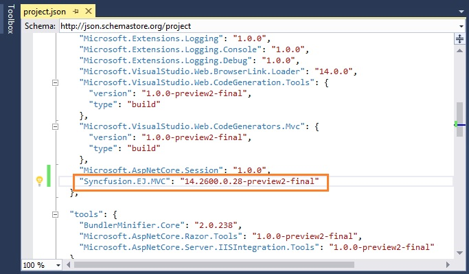
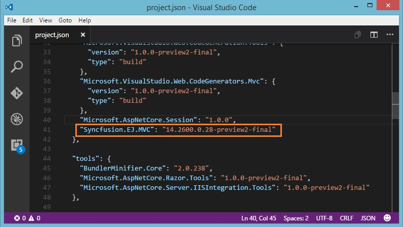

# Getting Started

The similar steps are followed for integrating the Syncfusion controls into MVC 3, MVC 4 , MVC 5 & MVC6 applications, the only thing that makes it a little bit different is the reference assemblies version chosen for each of the target MVC application. 

There are two ways for embedding our controls into ASP.NET MVC application:

1. Through NuGet Packages
2. Integration using Project Template

The procedure that are followed in manual integration process is entirely automated, when we create an application using Syncfusion Project template.

## Through NuGet Packages

To add our Syncfusion MVC controls into the new ASP.NET MVC5 application by making use of the **Syncfusion** **Nuget** **Packages**, refer the following steps 

1. The steps to download and configure the required **Syncfusion** **NuGet** **Packages** in Visual Studio is mentioned [here](http://help.syncfusion.com/aspnetmvc/installation-and-deployment#configuring-syncfusion-nuget-packages-in-visual-studio)

2. Once Configured the Packages source, search and install the **Syncfusion.AspNet.Mvc5** from **Package** **Manager** **console** using following commands

   **PM>Install-Package Syncfusion.AspNet.Mvc5**
   
   
   
3. The **Unobtrusive** setting is enabled in your applications web.config file by default, while initial creation. You need to change its value to **false** in your application as shown below,   

   ~~~ cshtml

	<appSettings>
		<add key="ClientValidationEnabled" value="true" />
		<add key="UnobtrusiveJavaScriptEnabled" value="false" />
	</appSettings>

   ~~~
	  
4. You need to add the script manager code in the **_Layout.cshtml** file present within the **~/Views/Shared** folder of your application. Add it before the closing body tag in the _Layout.cshtml file

   ~~~ cshtml
	</body>
        @RenderSection("scripts", required: false)
        @Html.EJ().ScriptManager()
    </body>

   ~~~		
	  
	
   N>The main reason for referring the Script manager in _Layout file is that, it can be referred as common by all the View files present within your application. If **unobtrusive** is set to true in the application, then the script manager can be excluded, as the control is initialized using HTML5 attributes. 

5. Syncfusion specific stylesheets are loaded into the **Content** folder of your application, include the below specified theme reference **(default-theme/ej.web.all.min.css)** file in the **~/Views/Shared/_Layout.cshtml** file, within the head section as this file contains the default theme styles applied for all the Syncfusion MVC controls.  

   ~~~ cshtml
   
	<head>
	    <title>@ViewBag.Title</title>
	    @Styles.Render("~/Content/ej/web/bootstrap-theme/ej.web.all.min.css")    
	</head>

   ~~~			

6. It is mandatory to include the reference to the required JavaScript files in your **_Layout.cshtml**, so as to render the Syncfusion MVC controls properly. 	 
   
   ~~~ cshtml
   
	<head>
		<meta charset="utf-8" />
		<title>@ViewBag.Title - My ASP.NET MVC Application</title>
		@Styles.Render("~/Content/ej/web/bootstrap-theme/ej.web.all.min.css")
	</head>

	<body>
		@Scripts.Render("~/bundles/jquery")
		@Scripts.Render("~/bundles/bootstrap")  
		@Scripts.Render("~/Scripts/jquery.easing.1.3.js")
		@Scripts.Render("~/Scripts/jsrender.min.js")
		@Scripts.Render("~/Scripts/ej/web/ej.web.all.min.js")  
		@RenderSection("scripts", required: false)
		@Html.EJ().ScriptManager();
	</body>

   ~~~	
   
	The order of the reference to the script files made in the above section should be maintained in the same manner as mentioned above.  
   
	If your application contains duplicate/multiple references to the jQuery files, remove it as the explicit reference to the **jquery-1.10.2.min.js** script file is added to the application as specified above.  

7. Now you can add the control **DatePicker** in the **Index.cshtml** file present within **~/Views/Home** folder.   
	
   ~~~ cshtml
   
    @Html.EJ().DatePicker("MyFirstDatepicker")

   ~~~	

8. Compile and execute the application. You can able to see the below output in the browser.	

	

## Using Project Template

The **Project** **Configuration** **Wizard** automates the process of configuring the required Syncfusion assemblies, scripts and their styles within the newly created application. Lets look onto these topics in detail in the below sections.

1. In the Visual Studio 2010, create a New **Syncfusion** **ASP.NET** **MVC** **Application** project from **Syncfusion** **Project** **Template** that you can see in the **New** **Project** pop-up as shown in the below image. Name it as SyncfusionMvcApplication1 and click **OK**

	

2. Then it opens **Project** **Configuration** **Wizard** as shown below. In this Wizard, select **Target** **MVC** **Version** as **MVC3** and keep the **other** options as default. Click **Next**.

	
	
3. Next window containing the list of Syncfusion MVC controls will be shown. Choose the required controls and then click **Create**.

	
	
4. Now you can notice the **Syncfusion** **MVC** **5** **References**, **Scripts** and **Styles** are configured into Scripts and Content folders. Also it configures the **web.config** and **_Layout.cshtml** files

	
	
5. Now you can add the control **DatePicker** in the **Index.cshtml** file present within **~/Views/Home** folder.

   ~~~ cshtml
		
	@Html.EJ().DatePicker("MyFirstDatepicker")

   ~~~

6. Compile and execute the application. You can able to see the below output in the browser.

	
	
For more information about Project Configuration Templates and their options details, please visit [here](http://help.syncfusion.com/extension/aspnet-mvc-extension/syncfusion-project-templates)

## ASP.NET Core 1.0 Application 

### Using Visual Studio

#### System Requirements:

To work with ASP.NET Core 1.0, you need to make sure is whether you have installed the following software on your machine

* Visual Studio 2015 [Update 2](http://download.microsoft.com/download/c/8/6/c868d99e-f6cb-4b6f-955e-4571614e6fdb/vs2015.2.exe) and above.

* DotNetCore [1.0](https://go.microsoft.com/fwlink/?LinkId=817245).

#### Configure Syncfusion Components in ASP.NET Core Application:

The following steps helps to create a ASP.NET Core web application to configure our components.

*  Open Visual Studio 2015 to create **ASP.NET Core web application**.

   

*  After project creation, open your **project.json** file to add our Syncfusion assembly packages.

   
   
*  In the Solution Explorer window, click the **"Show All Files"** button.

   
   
*  Open **Bower.json** file to include the following necessary packages.   

   

*  After Bower packages installation the scripts and CSS files are loaded into the **wwwroot -> lib** folder as shown below

   
   
*  Now open **_viewImports.cshtml** file from the views folder and add the following namespace for components references and Tag Helper support.   
   
   ~~~ cshtml
  
	@using Syncfusion.JavaScript
	@addTagHelper "*, Syncfusion.EJ"
 
   ~~~

*  Refer the necessary scripts and CSS files in your **layout.cshtml** page from **lib -> syncfusion-javascript** folder.   

   ~~~ cshtml
   
	<html>
	<head>    
		<environment names="Development">
			<link rel="stylesheet" href="~/lib/bootstrap/dist/css/bootstrap.css" />
			<link rel="stylesheet" href="~/css/site.css" />
			<link href="~/lib/syncfusion-javascript/Content/ej/web/bootstrap-theme/ej.web.all.min.css" rel="stylesheet" />
			<link href="~/lib/syncfusion-javascript/Content/ej/web/responsive-css/ej.responsive.css" rel="stylesheet" />
		</environment>   
	</head>
	<body>

		<environment names="Development">
			
			
			
			
			
			
		</environment> 
			
	</body>
	</html>

   ~~~

*  Add **ScriptManager** to the bottom of the **layout.cshtml** page. The **ScriptManager** used to place our control initialization script in the page.

   ~~~ cshtml
   
    <ej-script-manager></ej-script-manager>
	
   ~~~

*  Now open your view page to render our Syncfusion components in Tag Helper syntax.   
   
   ~~~ cshtml
   
	<ej-date-picker id="datepicker" value="@DateTime.Now"></ej-date-picker>
	
   ~~~

*  Finally compile your project, after successful compilation then press F5 key to deploy your project.   

   

### Using Command Prompt with Visual Studio Code

#### System Requirements:

* Visual Studio [Code](https://code.visualstudio.com/#)
* DotNetCore [1.0](https://go.microsoft.com/fwlink/?LinkId=817245)

The following steps helps to create a ASP.NET Core web application to configure our components.

* Create a new folder in your local directory.
* Open the command prompt from your local directory with administrator mode.
* In the command prompt we have an options to develop a below listed types of projects. The default type as console application. If you want to create any other specific type project, need to specify the **-****t** (template) key in command before the project type name. To know more about the project options and its syntax declarations refer the [.NET](https://docs.microsoft.com/en-us/dotnet/articles/core/tools/dotnet-new#) link.



    *   console

    *   web

    *   lib

    *   xunittest



* Then run the below mentioned command to create a new web application. After command execution the project will be created within your folder.


dotnet new -t web



#### Configure Syncfusion Components in ASP.NET Core Application

* Open Visual Studio Code and open your ASP.NET folder using **Open -> Folder** menu. Now your project folder is loaded in Visual Studio Code application.

* Now open your **bower.json** JSON file and add the necessary packages to load our script and CSS. Instead of that need to install the Bower extension in your Visual Studio code.

* In **bower.json** file specify our Syncfusion packages with our latest version.

* Open quick window (Ctrl + p) to run the “bower install” command to installed our Scripts and CSS to your application **wwwroot - > lib** folder.

> Recommended to install the “**Bower package watcher**” extension will helps to load the packages whenever save the **bower.json** file.

* Now open your **project.json** file to specify our assembly packages.

* Open **“_viewimports.cshtml**” file from the views folder and add the following namespace for components references and Tag Helper support.

   
  
	@using Syncfusion.JavaScript
	@addTagHelper "*, Syncfusion.EJ"
 
   

* open command prompt window with administrator rights and navigate to your project folder then execute the following command to restore the packages specified in your **project.json** file.


dotnet restore



* Now refer the necessary scripts and CSS files in your **_layout.cshtml** page.


[Layout.cshtml]

<html>

<head>

<environment names="Development">

<link rel="stylesheet" href="~/lib/bootstrap/dist/css/bootstrap.css" />

<link rel="stylesheet" href="~/css/site.css" />

<link href="~/lib/syncfusion-javascript/Content/ej/web/bootstrap-theme/ej.web.all.min.css" rel="stylesheet" />

<link href="~/lib/syncfusion-javascript/Content/ej/web/responsive-css/ej.responsive.css" rel="stylesheet" />

</environment>

</head>

<body>

<environment names="Development">

</environment>

</body>

</html>



* Add **ScriptManager** to the bottom of the **layout.cshtml** page. The **ScriptManager** used to place our control initialization script in the page.

   
   
    <ej-script-manager></ej-script-manager>
	
   

* Now open your view page to render our Syncfusion components in Tag Helper syntax.

   
   
	<ej-date-picker id="datepicker" value="@DateTime.Now"></ej-date-picker>
	
   

* Finally press F5 key to deploy your project.

### Using Yeoman with Visual Studio Code:

#### System Requirements:

* Visual Studio [Code](https://code.visualstudio.com/#)
* DotNetCore [1.0](https://go.microsoft.com/fwlink/?LinkId=817245)

To create an ASP.NET Core 1.0 application, we will use the [**yeoman**](http://yeoman.io/#) tool. This is a scaffolding tool for Modern web apps and helps us to quick start a new web project. 

Since **Visual Studio Code** uses folder structure for storing files of application, we will create a folder of the name **ASP.NET**

* Install Node from [https://nodejs.org/](https://nodejs.org/#)
* Open the Command prompt window in Administrator mode and execute the below mentioned command to install the **Yeoman** tool in your local machine by using **npm**.



npm install -g yo



* After installing **Yo** you need to install the ASP.NET generator, gulp and Bower.



npm install -g yo generator-aspnet gulp bower



* Once Yeoman generator installed successfully, run the below command to invoke a ASP.NET Core project creation wizard.



yo aspnet



* From the list of available projects, select the **Web Application Basic [ without Membership and Authorization ]** by using arrow keys.

* And then provide the project name or simply press the enter key to create the project with default name.

#### Configure Syncfusion Components in ASP.NET Core Application

* Open Visual Studio Code and open your ASP.NET folder using **Open -> Folder** menu. Now your project folder is loaded in Visual Studio Code application.

* Now open your **bower.json** JSON file and add the necessary packages to load our script and CSS. Instead of that need to install the Bower extension in your Visual Studio code.

* In **bower.json** file specify our Syncfusion packages with our latest version.

* Open quick window (Ctrl + p) to run the “**bower install**” command to installed our Scripts and CSS to your application **wwwroot -> lib** folder.

> Recommended to install the “**Bower package watcher**” extension will helps to load the packages whenever save the **bower.json** file.

* Now open your **project.json** file to specify our assembly packages.

* Open **“_viewimports.cshtml**” file from the views folder and add the following namespace for components references and Tag Helper support.

   
  
	@using Syncfusion.JavaScript
	@addTagHelper "*, Syncfusion.EJ"
 
   

* open command prompt window with administrator rights and navigate to your project folder then execute the following command to restore the packages specified in your **project.json** file.



dotnet restore



* Now refer the necessary scripts and CSS files in your **_layout.cshtml** page.


[Layout.cshtml]

<html>

<head>

<environment names="Development">

<link rel="stylesheet" href="~/lib/bootstrap/dist/css/bootstrap.css" />

<link rel="stylesheet" href="~/css/site.css" />

<link href="~/lib/syncfusion-javascript/Content/ej/web/bootstrap-theme/ej.web.all.min.css" rel="stylesheet" />

<link href="~/lib/syncfusion-javascript/Content/ej/web/responsive-css/ej.responsive.css" rel="stylesheet" />

</environment>

</head>

<body>

<environment names="Development">

</environment>

</body>

</html>



* Add **ScriptManager** to the bottom of the **layout.cshtml** page. The **ScriptManager** used to place our control initialization script in the page.

   
   
    <ej-script-manager></ej-script-manager>
	
   

* Now open your view page to render our Syncfusion components in Tag Helper syntax.

   
   
	<ej-date-picker id="datepicker" value="@DateTime.Now"></ej-date-picker>
	
   

* Finally press F5 key to deploy your project.

## Convert to Syncfusion Project

Project conversion wizard helps to convert the existing MVC application into Syncfusion MVC application.  Please find the Steps for conversion from below:

1. Open your existing application in Visual Studio and right click on your project in the solution explorer. In the context Menu , find & select the **Syncfusion** **VS** **Extension** **->** **Convert** **to** **Syncfusion** **MVc** **(Web)** **Application**

	

2. It opens the **Project** **Conversion** **wizard** as shown below. In this wizard, select your components (here the components are grouped based on usage) from the left panel. Click **Convert**.

	

3. It will prompt the **Project Backup** dialog to save your current project (with older version) into **Backup** folder of the same project location. Click **Yes** and continue

	

4. Now you can notice the **Syncfusion MVC assembly references, Scripts and Styles** are configured into your existing application. Also it configures the webconfig files. 

	

5. Since we are converting our earlier working application, we need to configure the **_Layout.cshtml** file or **your active layout** file manually.Include the **Syncfusion theme (default-theme/ej.web.all.min.css) & Script file** references into your **_Layout.cshtml** file as shown below

   ~~~ cshtml
   
	<head>
		<meta charset="utf-8" />
		<title>@ViewBag.Title - My ASP.NET MVC Application</title>
		… …
		@Styles.Render("~/Content/ej/web/bootstrap-theme/ej.web.all.min.css")
    </head>

	<body>
		… …
		@Scripts.Render("~/bundles/jquery")
		@Scripts.Render("~/bundles/bootstrap")  
		@Scripts.Render("~/Scripts/jquery.easing.1.3.min.js")
		@Scripts.Render("~/Scripts/jsrender.min.js")
		@Scripts.Render("~/Scripts/ej/ej.web.all.min.js")  
		@RenderSection("scripts", required: false)
		@Html.EJ().ScriptManager();
	</body>
		
   ~~~		

6. Change the **Unobtrusive** setting value to **false** in your application as shown below, 

   ~~~ cshtml
   
	<appSettings>
		<add key="ClientValidationEnabled" value="true" />
		<add key="UnobtrusiveJavaScriptEnabled" value="false" />
	</appSettings>

   ~~~	   
   
7. Now you can add the Syncfusion control into your target cshtml file.  

   ~~~ cshtml
   
	@Html.EJ().DatePicker("MyFirstDatepicker")
		
   ~~~   
   
8. Compile and execute the application. You can able to see the below output in the browser.   
   
   
   
   
   
## Migrate Syncfusion Project into another version

The Migrate Wizard helps to upgrade/downgrade the Syncfusion Project into another version. This is solutions for developer who has multiple version of Essential Studio and want to upgrade/downgrade the project without manually corrections in the csproj, web.config, Content & Scripts. The wizard automated the manual migration steps, so you can switch between difference versions by simple below steps   
   
1. Open your existing application in Visual Studio and right click on your project in the solution explorer. In the context Menu , find & select the **Syncfusion VS Extension -> Migrate the Project to Another Version**   
   
   
   
2. Now the migration window opened as shown below. The Essential Studio version dropdown populated with Syncfusion which is installed in your machine. You can choose the required version and click **Migrate** button to downgrade/upgrade purpose.  
   
	
   
3. It will prompt the **Project Backup** dialog to save your current project (with older version) into **Backup** folder of the same project location.    
   
    
   
4. Now the corresponding Syncfusion assembly references, Styles, Scripts and webconfig entries are replaced based on the selected Syncfusion version.   