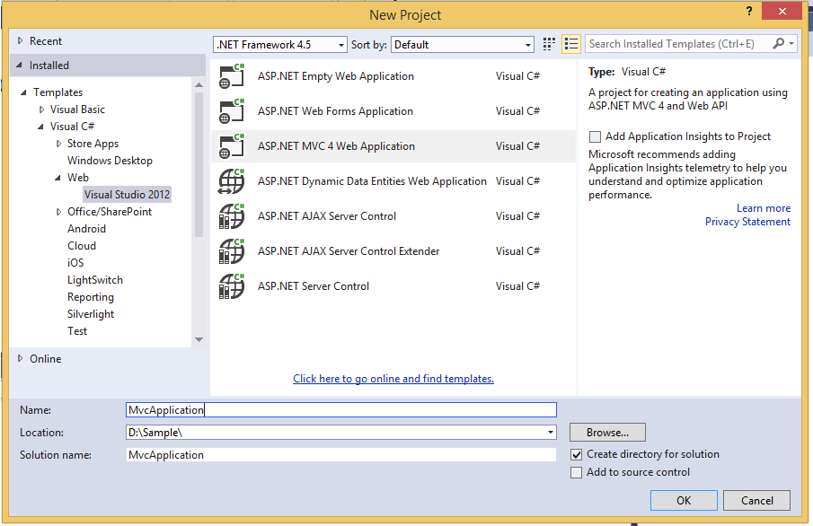
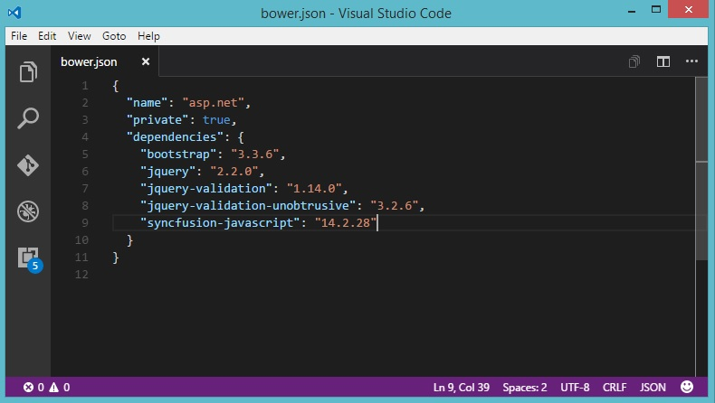

# Getting Started

This section describes how to configure the Syncfusion ASP.NET MVC components into the ASP.NET MVC applications. There are three ways for embedding our controls into ASP.NET application:

1. Using Syncfusion Project Template
2. Through Syncfusion NuGet Packages
3. Through Manual Integration into the new/existing Application

The procedures that are followed in manual integration process is entirely automated, when we create an application using Syncfusion Project template.

The similar steps are followed for integrating the Syncfusion controls into MVC 3, MVC 4 , MVC 5 & MVC6 applications, the only thing that makes it a little bit different is the reference assemblies version chosen for each of the target MVC application. 

## Through NuGet Packages

To add our Syncfusion MVC controls into the new ASP.NET MVC5 application by making use of the **Syncfusion** **Nuget** **Packages**, refer the following steps 

1. The steps to download and configure the required **Syncfusion** **NuGet** **Packages** in Visual Studio is mentioned [here](http://help.syncfusion.com/aspnetmvc/installation-and-deployment#configuring-syncfusion-nuget-packages-in-visual-studio)

2. Once Configured the Packages source, search and install the **Syncfusion.AspNet.Mvc5** from **Package** **Manager** **console** using following commands

   **PM>Install-Package Syncfusion.AspNet.Mvc5**
   
   
   
3. The **Unobtrusive** setting is enabled in your applications web.config file by default, while initial creation. You need to change its value to **false** in your application as shown below,   

   ~~~ cshtml

	<appSettings>
		<add key="ClientValidationEnabled" value="true" />
		<add key="UnobtrusiveJavaScriptEnabled" value="false" />
	</appSettings>

   ~~~
	  
4. You need to add the script manager code in the **_Layout.cshtml** file present within the **~/Views/Shared** folder of your application. Add it before the closing body tag in the _Layout.cshtml file

   ~~~ cshtml
	</body>
        @RenderSection("scripts", required: false)
        @Html.EJ().ScriptManager()
    </body>

   ~~~		
	  
	
   N>The main reason for referring the Script manager in _Layout file is that, it can be referred as common by all the View files present within your application. If **unobtrusive** is set to true in the application, then the script manager can be excluded, as the control is initialized using HTML5 attributes. Also for control rendering, you need to include **ej.unobtrusive.min.js** file along with ej.web.all.min.js in **_Layout.cshtml** page. Refer to the [unobtrusive section](https://help.syncfusion.com/aspnetmvc/unobtrusive) 

5. Syncfusion specific stylesheets are loaded into the **Content** folder of your application, include the below specified theme reference **(default-theme/ej.web.all.min.css)** file in the **~/Views/Shared/_Layout.cshtml** file, within the head section as this file contains the default theme styles applied for all the Syncfusion MVC controls.  

   ~~~ cshtml
   
	<head>
	    <title>@ViewBag.Title</title>
	    @Styles.Render("~/Content/ej/web/bootstrap-theme/ej.web.all.min.css")    
	</head>

   ~~~			

6. It is mandatory to include the reference to the required JavaScript files in your **_Layout.cshtml**, so as to render the Syncfusion MVC controls properly. 	 
   
   ~~~ cshtml
   
	<head>
		<meta charset="utf-8" />
		<title>@ViewBag.Title - My ASP.NET MVC Application</title>
		@Styles.Render("~/Content/ej/web/bootstrap-theme/ej.web.all.min.css")
	</head>

	<body>
		@Scripts.Render("~/bundles/jquery")
		@Scripts.Render("~/bundles/bootstrap")  
		@Scripts.Render("~/Scripts/jsrender.min.js")
		@Scripts.Render("~/Scripts/ej/web/ej.web.all.min.js")  
		@RenderSection("scripts", required: false)
		@Html.EJ().ScriptManager();
	</body>

   ~~~	
   
	The order of the reference to the script files made in the above section should be maintained in the same manner as mentioned above.  
   
	If your application contains duplicate/multiple references to the jQuery files, remove it as the explicit reference to the **jquery-1.10.2.min.js** script file is added to the application as specified above.  

7. Now you can add the control **DatePicker** in the **Index.cshtml** file present within **~/Views/Home** folder.   
	
   ~~~ cshtml
   
    @Html.EJ().DatePicker("MyFirstDatepicker")

   ~~~	

8. Compile and execute the application. You can able to see the below output in the browser.	

	

For more details - [View](https://help.syncfusion.com/extension/syncfusion-nuget-packages/overview)

## Using Project Template

Syncfusion provides the Visual Studio Project Templates for the Syncfusion ASP.NET MVC platform to create a Syncfusion MVC application.

The **Project** **Configuration** **Wizard** automates the process of configuring the required Syncfusion assemblies, scripts and their styles within the newly created application. Lets look onto these topics in detail in the below sections.

1. In the Visual Studio 2010, create a New **Syncfusion** **ASP.NET** **MVC** **Application** project from **Syncfusion** **Project** **Template** that you can see in the **New** **Project** pop-up as shown in the below image. Name it as SyncfusionMvcApplication1 and click **OK**

	

2. Then it opens **Project** **Configuration** **Wizard** as shown below. In this Wizard, select **Target** **MVC** **Version** as **MVC3** and keep the **other** options as default. Click **Next**.

	
	
3. Next window containing the list of Syncfusion MVC controls will be shown. Choose the required controls and then click **Create**.

	
	
4. Now you can notice the **Syncfusion** **MVC** **5** **References**, **Scripts** and **Styles** are configured into Scripts and Content folders. Also it configures the **web.config** and **_Layout.cshtml** files

	
	
5. Now you can add the control **DatePicker** in the **Index.cshtml** file present within **~/Views/Home** folder.

   ~~~ cshtml
		
	@Html.EJ().DatePicker("MyFirstDatepicker")

   ~~~

6. Compile and execute the application. You can able to see the below output in the browser.

	
	
For more information about Project Configuration Templates and their options details, please visit [here](http://help.syncfusion.com/extension/aspnet-mvc-extension/syncfusion-project-templates)

## Manual Integration

This topic mainly focuses on how to integrate the Syncfusion ASP.NET MVC controls manually into the newly created/existing ASP.NET MVC application. Let’s look onto the procedure for making use of any of our ASP.NET MVC controls within the ASP.NET MVC application. 

### Creation of First ASP.NET MVC Application

Follow the below steps to create a normal ASP.NET MVC application,

1.	Start the Visual Studio. Create a new MVC application by selecting File -> New -> Project and save it with a meaningful name as shown below,

2.	Now your initial ASP.NET MVC application is created successfully. Now you can build and run your application by pressing Ctrl+F5.

It’s time to add some other essential things to your application that allows you to make use of our Syncfusion ASP.NET MVC controls into it.

### For Existing Applications

If you want to add our Syncfusion ASP.NET MVC controls into your existing application, then you just need to open your existing application and proceed with the following steps.

#### Adding the required StyleSheets

To render the Syncfusion ASP.NET MVC controls with its unique style and theme, it is necessary to refer the required CSS files into your application. You need to copy all the required css files into your application from the following location,

N> <installed location>\Syncfusion\Essential Studio\13.1.0.21\JavaScript\assets\css\web
N> For example, If you have installed the Essential Studio within C:\Program Files (x86), then navigate to the below location,
N> C:\Program Files (x86)\Syncfusion\Essential Studio\13.1.0.21\JavaScript\assets\css\web

When you navigate to the above location, you can find the files shown in the below image, which you need to copy entirely and paste it into your root application. 

Before pasting it into your application, create a folder structure with names ej/web within the Content folder of your application and place all the copied files into it as shown below,

Solution Explorer - Project with CSS files copied into the Content folder
{:.caption}

N> The common-images folder is needed to be copied into your application mandatorily, as it includes all the common font icons and other images required for the control to render.

Once the CSS files are added in your application, include the reference to "ej.web.all.min.css" file in the _Layout.cshtml page, within the head section.



<link href="~/Content/ej/web/default-theme/ej.web.all.min.css" rel="stylesheet" />



### Adding the required JavaScript files

Adding the required JavaScript files into your application plays an important role, without which the Syncfusion controls cannot be created. It requires the following mandatory common script files,

* jquery-1.10.2.min.js 
* jquery.easing.1.3.min.js
* jquery.globalize.min.js
* jsrender.min.js

Apart from the above common scripts, it is also necessary to refer the ej.web.all.min.js file in your application, which plays a major role in control creation.

The dependencies are available in the following locations of your machine. Please copy these files from location given

<table>
<tr>
<th>Files</th>
<th>Location</th>
</tr>
<tr>
<td>jquery-1.10.2.min.js jsrender.min.js</td>
<td>&lt;Syncfusion Installed Location&gt;\Essential Studio\13.1.0.21\JavaScript\assets\external</td>
</tr>
<tr>
<td>ej.web.all.min.js</td>
<td>&lt;Syncfusion Installed Location&gt;\Essential Studio\13.1.0.21\JavaScript\assets\scripts\web</td>
</tr>
<tr>
<td>ej.webform.min.js</td>
<td>&lt;Syncfusion Installed Location&gt;\Essential Studio\13.1.0.21\JavaScript\assets\scripts\common</td>
</tr>
</table>

N> Example for "Syncfusion Installed location" is "C:\Program Files (x86)\Syncfusion"

Now, create a folder named `ej`, under the Scripts folder of your application and place the copied files ej.web.all.min.js into it as shown below,

Solution Explorer - Script files copied into the Scripts folder of the project
{:.caption}

Once the scripts are added in your application, now it is necessary to include the reference to it in your application. This should be done within the Site.Master file, as we did previously for CSS files. 
Add the below script references in the _Layout.cshtml file within the head section,



	<link href="Content/ej/web/default-theme/ej.web.all.min.css" rel="stylesheet" />
	
	
	



### CDN Link reference

If you want to refer the CDN links instead of the direct script and CSS references in your application, then you need to make use of the below references in the Site.Master file,



<head>

    <meta charset="utf-8" />

    <title><%: Page.Title %> - My ASP.NET Application</title>

    <link href="http://cdn.syncfusion.com/13.1.0.21/js/web/flat-azure/ej.web.all.min.css" rel="stylesheet" />

    

    

    

    

     

    

</head>    



### Assembly Reference

Refer the following assemblies in your newly created ASP.NET application, which allows you to use any of the Syncfusion ASP.NET controls within it.

* Syncfusion.EJ
* Syncfusion.EJ.Web

The reference to the Syncfusion assemblies can be added to your application in either of the following ways, 
-	Referring from GAC
-	Referring from the installed location

#### Referring from GAC

1.	Once you have installed the Essential Studio package in your system, the Syncfusion assemblies are automatically registered in the GAC. You can easily add the reference assemblies to your project by choosing Add Reference option.

2.	Now the Reference Manager pop-up will appear on the screen. In that pop-up, select the required assemblies from the Extensions tab as below, by choosing the appropriate versions (13.1450.0.21). The version to be chosen for the reference assemblies is based on the Framework used in the application.

Reference Manager Pop-up
{:.caption}

#### Referring from the installed location

1.	Add the reference assemblies to your project by choosing Add Reference option,

2.	Now the Reference Manager pop-up will appear on the screen. Select the Browse tab in it and navigate to the installed location of the Syncfusion Essential Studio package in your system. (As depicted in the below image.)

N> <installed location>\Syncfusion\Essential Studio\14.4.0.15\precompiledassemblies\14.4.0.15
N> For example, If you have installed the Essential Studio package within C:\Program Files (x86), then navigate to the below location,
N> C:\Program Files (x86)\Syncfusion\Essential Studio\14.4.0.15\precompiledassemblies\14.4.0.15

Reference Manager Pop-up with Browse button clicked
{:.caption}

N> In the above image, the folders 3.5, 4.0, 4.5, 4.5.1 denotes the .NET Framework version. Based on the Framework version used in your application, you can choose assemblies from the appropriate folders. The Syncfusion.EJ.Web and other core assemblies like Syncfusion.Core, Syncfusion.EJ are available within these folders.

3.	Add the Syncfusion.EJ, Syncfusion.EJ.MVC and Syncfusion.Core assemblies to your application from the below specified location,

N> <installed location>\Syncfusion\Essential Studio\14.4.0.15\precompiledassemblies\14.4.0.15\4.5  
For example, If you have installed the Essential Studio package within C:\Program Files (x86), then navigate to the below location,  
C:\Program Files (x86)\Syncfusion\Essential Studio\14.4.0.15\precompiledassemblies\14.4.0.15\4.5

4.	Once the assembly selection is done, click OK to add the selected references to your project. You can view the assembly references added to your application, in the solution explorer as shown below,

Selected Assemblies added to the Project reference
{:.caption}

### Registering Syncfusion Assemblies within the Web.config

In your application’s web.config file, add the below assembly information within the <assemblies> tag.



<system.web>
    <compilation debug="true" targetFramework="4.5">
          <assemblies>

            <add assembly="Syncfusion.EJ, Version=14.4450.0.15, Culture=neutral, PublicKeyToken=3d67ed1f87d44c89" />
            <add assembly="Syncfusion.EJ.Mvc, Version=14.4500.0.15, Culture=neutral, PublicKeyToken=3d67ed1f87d44c89" />

          </assemblies>
    </compilation>
    <authentication mode="Forms">
   …
</system.web>



1.	Add the below DatePicker code as shown below in your view page,



   @Html.EJ().DatePicker("DatePick").DateFormat("MM/dd/yyyy").ShowOtherMonths(false).EnableRTL(false).Locale("en-US")



N> Add the DatePicker code within the Content section, by removing the unwanted code within it.

2. Finally build and run the project by pressing F5, so that you can now see the output similar to the below screenshot in your web browser,

DatePicker control displaying on the web browser
{:.caption}

Thus the DatePicker control is rendered successfully with its default appearance. You can then use its various properties to set its value and also make use of its available events to trigger when necessary.

## ASP.NET Core 1.0 Application 

### Using Visual Studio

#### System Requirements:

To work with ASP.NET Core 1.0, you need to make sure is whether you have installed the following software on your machine

* Visual Studio 2015 [Update 3](https://go.microsoft.com/fwlink/?LinkId=691129).

* DotNetCore 1.0

#### Configure Syncfusion Components in ASP.NET Core Application:

The following steps helps to create a ASP.NET Core web application to configure our components.

*  Open Visual Studio 2015 to create **ASP.NET Core web application**.

   

*  After project creation, open your **project.json** file to add our Syncfusion assembly packages.

   
   
*  In the Solution Explorer window, click the **"Show All Files"** button.

   
   
*  Open **bower.json** file to include the following necessary packages.   

   

*  After Bower packages installation the scripts and CSS files are loaded into the **wwwroot -> lib** folder as shown below

   
   
*  Now open **_viewImports.cshtml** file from the views folder and add the following namespace for components references and Tag Helper support.   
   
   ~~~ cshtml
  
	@using Syncfusion.JavaScript
	@addTagHelper "*, Syncfusion.EJ"
 
   ~~~

*  Refer the necessary scripts and CSS files in your **layout.cshtml** page from **lib -> syncfusion-javascript** folder.   

   ~~~ cshtml
   
	<html>
	<head>    
		<environment names="Development">
			<link rel="stylesheet" href="~/lib/bootstrap/dist/css/bootstrap.css" />
			<link rel="stylesheet" href="~/css/site.css" />
			<link href="~/lib/syncfusion-javascript/Content/ej/web/bootstrap-theme/ej.web.all.min.css" rel="stylesheet" />
			<link href="~/lib/syncfusion-javascript/Content/ej/web/responsive-css/ej.responsive.css" rel="stylesheet" />
		</environment>   
	</head>
	<body>

		<environment names="Development">
			
			
			
			
			
		</environment> 
			
	</body>
	</html>

   ~~~

*  Add **ScriptManager** to the bottom of the **layout.cshtml** page. The **ScriptManager** used to place our control initialization script in the page.

   ~~~ cshtml
   
    <ej-script-manager></ej-script-manager>
	
   ~~~

*  Now open your view page to render our Syncfusion components in Tag Helper syntax.   
   
   ~~~ cshtml
   
	<ej-date-picker id="datepicker" value="@DateTime.Now"></ej-date-picker>
	
   ~~~

*  Finally compile your project, after successful compilation then press F5 key to deploy your project.   

   

### Using Command Prompt with Visual Studio Code

#### System Requirements:

* Visual Studio [Code](https://code.visualstudio.com/#)
* DotNetCore 1.0

The following steps helps to create a ASP.NET Core web application to configure our components.

* Create a new folder in your local directory.
* Open the command prompt from your local directory with administrator mode.
* In the command prompt we have an options to develop a below listed types of projects. The default type as console application. If you want to create any other specific type project, need to specify the **-****t** (template) key in command before the project type name. To know more about the project options and its syntax declarations refer the [.NET](https://docs.microsoft.com/en-us/dotnet/articles/core/tools/dotnet-new#) link.



    *   console

    *   web

    *   lib

    *   xunittest



* Then run the below mentioned command to create a new web application. After command execution the project will be created within your folder.


dotnet new -t web



#### Configure Syncfusion Components in ASP.NET Core Application

* Open Visual Studio Code and open your ASP.NET folder using **Open -> Folder** menu. Now your project folder is loaded in Visual Studio Code application.

* Now open your **bower.json** JSON file and add the necessary packages to load our script and CSS. Instead of that need to install the Bower extension in your Visual Studio code.

* In **bower.json** file specify our Syncfusion packages with our latest version.

* Open quick window (Ctrl + p) to run the `bower install` command to install our scripts and CSS to your application **wwwroot - > lib** folder.

> Recommended to install the “**Bower package watcher**” extension will helps to load the packages whenever save the **bower.json** file.

* Now open your **project.json** file to specify our assembly packages.

* Open **“_viewimports.cshtml**” file from the views folder and add the following namespace for components references and Tag Helper support.

   
  
	@using Syncfusion.JavaScript
	@addTagHelper "*, Syncfusion.EJ"
 
   

* open command prompt window with administrator rights and navigate to your project folder then execute the following command to restore the packages specified in your **project.json** file.


dotnet restore



* Now refer the necessary scripts and CSS files in your **_layout.cshtml** page.


[Layout.cshtml]

<html>

<head>

<environment names="Development">

<link rel="stylesheet" href="~/lib/bootstrap/dist/css/bootstrap.css" />

<link rel="stylesheet" href="~/css/site.css" />

<link href="~/lib/syncfusion-javascript/Content/ej/web/bootstrap-theme/ej.web.all.min.css" rel="stylesheet" />

<link href="~/lib/syncfusion-javascript/Content/ej/web/responsive-css/ej.responsive.css" rel="stylesheet" />

</environment>

</head>

<body>

<environment names="Development">

</environment>

</body>

</html>



* Add **ScriptManager** to the bottom of the **layout.cshtml** page. The **ScriptManager** used to place our control initialization script in the page.

   
   
    <ej-script-manager></ej-script-manager>
	
   

* Now open your view page to render our Syncfusion components in Tag Helper syntax.

   
   
	<ej-date-picker id="datepicker" value="@DateTime.Now"></ej-date-picker>
	
   

* Finally press F5 key to deploy your project.

### Using Yeoman with Visual Studio Code:

#### System Requirements:

* Visual Studio [Code](https://code.visualstudio.com/#)
* DotNetCore 1.0

To create an ASP.NET Core 1.0 application, we will use the [**yeoman**](http://yeoman.io/#) tool. This is a scaffolding tool for Modern web apps and helps us to quick start a new web project. 

Since **Visual Studio Code** uses folder structure for storing files of application, we will create a folder of the name **ASP.NET**

* Install Node from [https://nodejs.org/](https://nodejs.org/#)
* Open the Command prompt window in Administrator mode and execute the below mentioned command to install the **Yeoman** tool in your local machine by using **npm**.



npm install -g yo



* After installing **Yo** you need to install the ASP.NET generator, gulp and Bower.



npm install -g yo generator-aspnet gulp bower



* Once Yeoman generator installed successfully, run the below command to invoke a ASP.NET Core project creation wizard.



yo aspnet



* From the list of available projects, select the **Web Application Basic [ without Membership and Authorization ]** by using arrow keys.

* And then provide the project name or simply press the enter key to create the project with default name.

#### Configure Syncfusion Components in ASP.NET Core Application

* Open Visual Studio Code and open your ASP.NET folder using **Open -> Folder** menu. Now your project folder is loaded in Visual Studio Code application.

* Now open your **bower.json** JSON file and add the necessary packages to load our script and CSS. Instead of that need to install the Bower extension in your Visual Studio code.

* In **bower.json** file specify our Syncfusion packages with our latest version.

* Open quick window (Ctrl + p) to run the `bower install` command to install our scripts and CSS to your application **wwwroot -> lib** folder.

> Recommended to install the “**Bower package watcher**” extension will helps to load the packages whenever save the **bower.json** file.

* Now open your **project.json** file to specify our assembly packages.

* Open **“_viewimports.cshtml**” file from the views folder and add the following namespace for components references and Tag Helper support.

   
  
	@using Syncfusion.JavaScript
	@addTagHelper "*, Syncfusion.EJ"
 
   

* open command prompt window with administrator rights and navigate to your project folder then execute the following command to restore the packages specified in your **project.json** file.



dotnet restore



* Now refer the necessary scripts and CSS files in your **_layout.cshtml** page.


[Layout.cshtml]

<html>

<head>

<environment names="Development">

<link rel="stylesheet" href="~/lib/bootstrap/dist/css/bootstrap.css" />

<link rel="stylesheet" href="~/css/site.css" />

<link href="~/lib/syncfusion-javascript/Content/ej/web/bootstrap-theme/ej.web.all.min.css" rel="stylesheet" />

<link href="~/lib/syncfusion-javascript/Content/ej/web/responsive-css/ej.responsive.css" rel="stylesheet" />

</environment>

</head>

<body>

<environment names="Development">

</environment>

</body>

</html>



* Add **ScriptManager** to the bottom of the **layout.cshtml** page. The **ScriptManager** used to place our control initialization script in the page.

   
   
    <ej-script-manager></ej-script-manager>
	
   

* Now open your view page to render our Syncfusion components in Tag Helper syntax.

   
   
	<ej-date-picker id="datepicker" value="@DateTime.Now"></ej-date-picker>
	
   

* Finally press F5 key to deploy your project.

