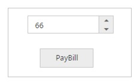
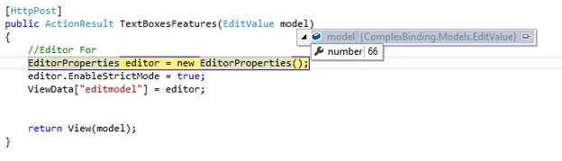
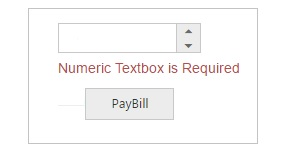
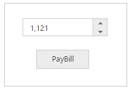
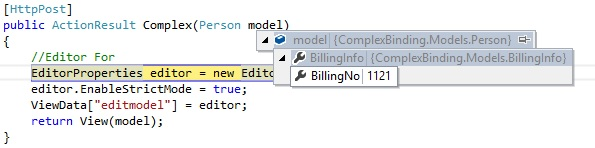

# Strongly-Typed HTML Helper

The Syncfusion editor controls supports strongly typed HTML helpers represented by lambda expressions that have model or template passed into the view. The Extension method is used to get a value from the model.

The Strongly-Typed HTML helper (i.e., NumericTextBox) takes lambda as a parameter that tells the helper with element of the model to use in the typed view. 

Strongly typed views are used for rendering specific types of model objects, instead of using the general ViewData structure.

The following list of controls supports Strongly-Typed HTML Helper
•	Autocomplete.
•	Checkbox and Radio Button
•	DatePicker.
•	DateTimePicker
•	DropDownList
•	Mask Edit.
•	Numeric, Currency, and Percentage Textbox.
•	RichTextEditor
•	TimePicker

The following steps explain how to use the strongly typed helpers to create a NumericTextBox

The NumericTextBox control supports strongly typed HTML helpers which uses lambda expression to refer models or view models passed to a view template. These helpers allow you to define the value of the NumericTextBoxFor from the model. 

Add a class named “EditorValue” in the Models folder and replace the code with the following code:



    public class EditorValue
    {
        public int number { set; get; }
        public EditorValue(int num)
        {
            number = num;
        }
        public EditorValue (){}
    }
    


Create an action method that renders NumericTextBox on the view page, and passes the model to be bound to the view page.



    using Syncfusion.JavaScript.Models;
    using MVCSampleBrowser.Models;
    public ActionResult EditorFor()
    {
        //Editor For
        EditorProperties editor = new EditorProperties();
        editor.EnableStrictMode = true;
        ViewData["editmodel"] = editor;
        return View(new EditorValue(66));
    }
    


In View, invoke the strongly typed NumericTextBoxFor helper with the lambda expression to set the default value.



    @model MVCSampleBrowser.Models.EditorValue
    @using (Html.BeginForm())
    {
        @Html.EJ().NumericTextBoxFor(model => model.number, (Syncfusion.JavaScript.Models.EditorProperties)ViewData["editmodel"])
        @Html.EJ().Button("btn").Size(ButtonSize.Small).Text("PayBill").Type(ButtonType.Submit)
    }



The following steps explain how to get the values by using the Scaffolding methods in Post back.

1. Create an action method, FormPost that handles the Post request and processes the data. 
In the action method, you can pass the model as the parameter. That model has the NumericTexBox’s value.



    [HttpPost]
    public ActionResult EditorFor(EditorValue model)
    {
        //Editor For
        EditorProperties editor = new EditorProperties();
        editor.EnableStrictMode = true;
        ViewData["editmodel"] = editor;
        return View(model);
    }



Upon clicking to the button the Post method will be triggered. In that, the selected value will be obtained as follows.

## Client Side Validation

With the client-side validation, the input data is checked as soon as they are submitted, so there is no postback to the server and there is no page refresh.

By default, client-side validation becomes enabled. But it’s can easily enable or disable by the writing of the following app setting code snippet in the web.config file.



    <appSettings>
        <add key="ClientValidationEnabled" value="true" />
        <add key="UnobtrusiveJavaScriptEnabled" value="true" />
    </appSettings>



N> Can enable client side validation for specific view only by adding Html.EnableClientValidation(true) at the top in view page.

After setting the value as true, refer to the jQuery validation script file in the _Layout page as shown in the following code example.



    
    
    



The jQuery validation plug-in takes advantage of the Data Annotation attributes defined in the model. 

Step 1: Add the below namespace to “EditorValue” model.



    using System.ComponentModel.DataAnnotations;
    


Data Annotations allow us to decorate model classes with metadata. This metadata describes a set of rules that are used to validate a property. 

We’ll use the following Data Annotation attributes for the Numeric Textbox.
Required – Indicates that the property is a required field.

Step 2: Next, Update the number property of the “EditorValue” class as “Required Field” by adding the following line



    using System.ComponentModel.DataAnnotations;
    public class EditorValue
    {
        [Required(ErrorMessage = "Numeric Textbox is Required")]
        public int number { set; get; }
        
        public EditorValue(int num)
        {
            number = num;
        }
    }



Step 3: Modify the view page as follows



    @model ComplexBinding.Models.EditorValue       
    @using (Html.BeginForm())
    {
        @Html.ValidationSummary(true)
        @Html.EJ().NumericTextBoxFor(model => model.number, (Syncfusion.JavaScript.Models.EditorProperties)ViewData["editmodel"])
        @Html.ValidationMessageFor(model => model.number)
        @Html.EJ().Button("btn").Size(ButtonSize.Small).Text("PayBill").Type(ButtonType.Submit)
    }
    


## Server Side Validation

In the server-side validation, the page must be submitted via a postback to be validated on the server and if the model data is not valid, then the server sends a response back to the client.

The best way to validate a model by using Data Annotations which has a set of attributes and classes defined in the System.ComponentModel.DataAnnotations assembly.

Step 1: Add the below namespace to “EditorValue” model.



    using System.ComponentModel.DataAnnotations;
    


Data Annotations allow us to decorate model classes with metadata. This metadata describes a set of rules that are used to validate a property. 

We’ll use the following Data Annotation attributes for the Numeric Textbox.
Required – Indicates that the property is a required field.

Step 2: Next, Update the number property of the “EditorValue” class as “Required Field” by adding the following line



    using System.ComponentModel.DataAnnotations;
    public class EditorValue
    {
        [Required(ErrorMessage = "Numeric Textbox is Required")]
        public int number { set; get; }
        
        public EditorValue(int num)
        {
            number = num;
        }
    }



Step 3: Modify the view page as follows



    @model ComplexBinding.Models.EditorValue       
    @using (Html.BeginForm())
    {
        @Html.ValidationSummary(true)
        @Html.EJ().NumericTextBoxFor(model => model.number, (Syncfusion.JavaScript.Models.EditorProperties)ViewData["editmodel"])
        @Html.ValidationMessageFor(model => model.number)
        @Html.EJ().Button("btn").Size(ButtonSize.Small).Text("PayBill").Type(ButtonType.Submit)
    }
    


When you press the “PayBill” button on this page then it will post the data to the server and the code written with in EditorFor action will validate the NumericTextBox value by checking ModelState.IsValid property. If NumericTextBox value is not selected, then ModelState.IsValid will return false and display error message.

## Complex Model Binding

The lambda expressions are quite powerful, allowing you to build quite complex edit models and have model binding put everything back together again. A complex view model type such as:



    public class Person
    {
        public string Name { get; set; }
        public BillingInfo BillingInfo { get; set; }
        public Person(BillingInfo info){
            BillingInfo = info;
        }
        public Person() { }
    }

    public class BillingInfo
    {
        public int BillingNo { get; set; }
        public BillingInfo(int no)
        {
            BillingNo = no;
        }
        public BillingInfo() { }
    }
    


Create an action method that renders NumericTextbox on the view page, and passes the model to be bound to the view page.



    using ComplexBinding.Models;
    using Syncfusion.JavaScript.Models;
    public ActionResult Complex()
    {
        //Editor For
        EditorProperties editor = new EditorProperties();
        editor.EnableStrictMode = true;
        ViewData["editmodel"] = editor;
        return View(new Person(new BillingInfo(1121)));
    }        



In View, invoke the strongly typed NumericTextBoxFor helper with the lambda expression to set the default value.



    @model ComplexBinding.Models.Person
    @using (Html.BeginForm())
    {
        @Html.EJ().NumericTextBoxFor(x => x.BillingInfo.BillingNo, (Syncfusion.JavaScript.Models.EditorProperties)ViewData["editmodel"])
        @Html.EJ().Button("btn").Size(ButtonSize.Small).Text("PayBill").Type(ButtonType.Submit)
    }



When the form is submitted, it will perform an Http Post request to the controller. The action with the HttpPost attribute will handle the request.



    [HttpPost]
    public ActionResult Complex(Person model)
    {
        //Editor For
        EditorProperties editor = new EditorProperties();
        editor.EnableStrictMode = true;
        ViewData["editmodel"] = editor;
        return View(model);
    }



In code behind, the selected value of NumericTextBox will be obtained as follows

